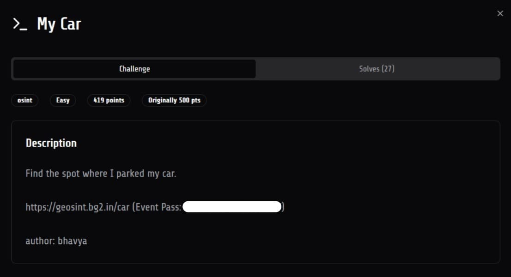
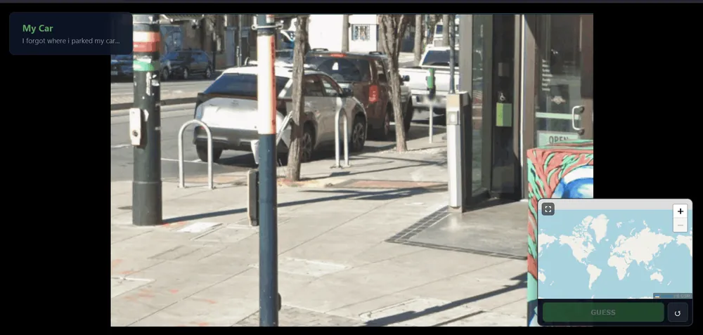
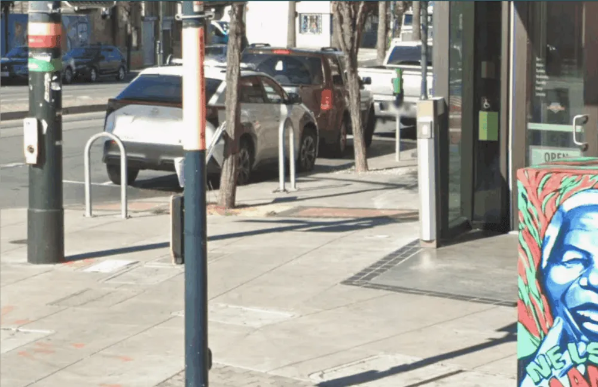
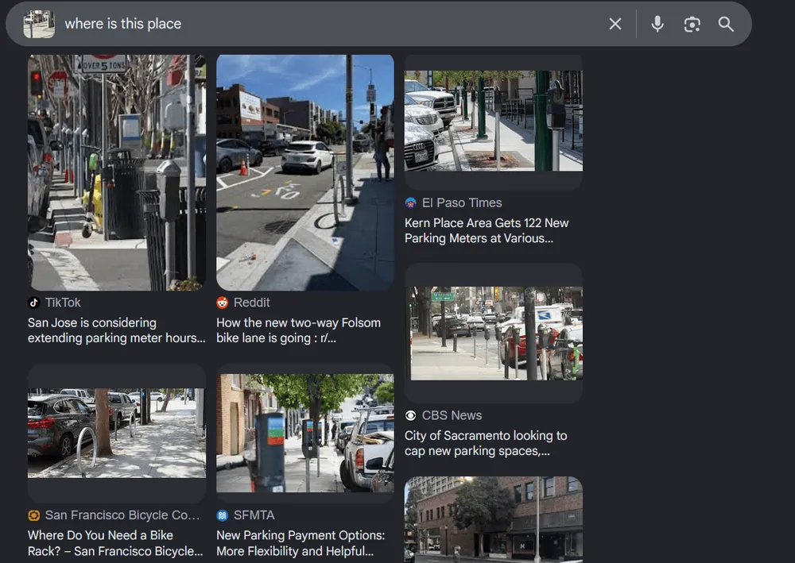
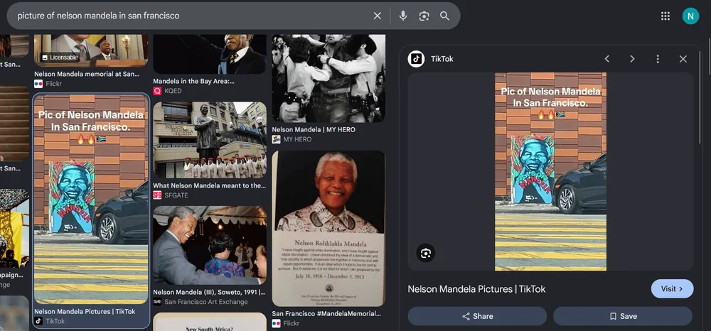
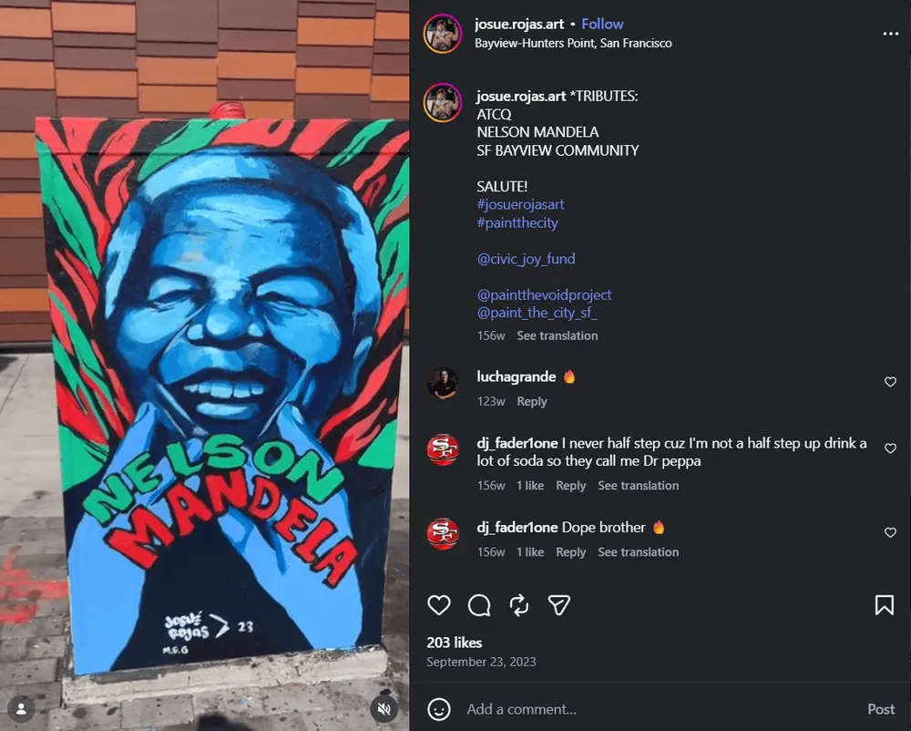
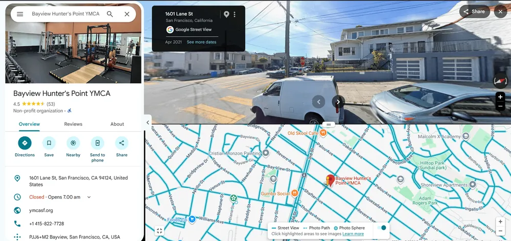
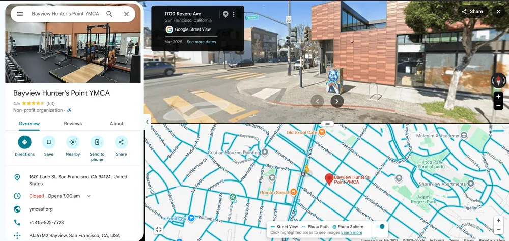

# [My Car]

* **CTF Name:** 07CTF 2026
* **Category:** OSINT
* **Difficulty:** Easy
* **Writeup Author:** Nakata Christian (n4ct) - TCP1P
* **Date:** September 19, 2026

---

## Challenge Description

---

## 1. Solve Steps

### Step 1: Initial Triage

We're given a static image where we can see something on the bottom right corner but it's blocked by the openstreetmap so we can't see the full image.

After opened the image in a new tab, we can see that "something" is actually like a box with Nelson Mandela portrait in front of a store on a right turn right beside a pole which I think is a traffic light.

### Step 2: Finding the Location

The Nelson Mandela box is a big clue. We can start by using Google Lens to find the box.

As we can see, there are a lot of `San Jose` and `San Francisco` results. So we can assume that this place is in either `San Jose` or `San Francisco`. From the same result, we can see 1 result that say `Folsom St` so this will be my starting point.

### Step 3: Finding the Exact Location

Start from Folsom St, I check every corner of the street but can't find the box anywhere. So I took a step back and search "picture of nelson mandela in san francisco" and VOILA I got this TikTok video showing the exact same picture of Nelson Mandela.

But unfortunately, idk why, somehow when I click the link to TikTok, It went to `discovery` in TikTok and I can't find the video. So I used another way which is to use the TikTok video thumbnail to search more posts about this Nelson Mandela picture and found an Instagram account posted the exact same picture of Nelson Mandela and on the location of the post, it said `Bayview-Hunter Points, San Francisco`. 

In Google Maps, I searched for `Bayview Hunter's Point` and got this result.

Checking around on `Revere Ave`, I found the exact location not far from the previous GMaps drop point. Pinpoint the location in the OpenStreetMap's map in the OSINT platform will give the flag. The coordinate is `37.7323532,-122.3913587`.

Flag: Unfortunately, I forgot to save the flag and now I can't submit to the platform anymore idk why it always said `invalid request` or `invalid proof of work`.