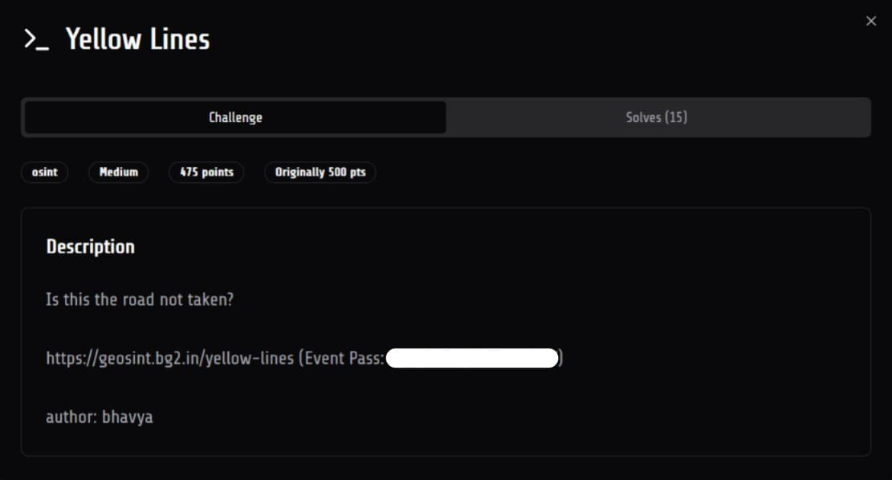
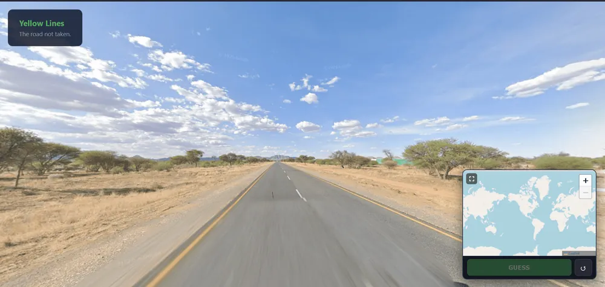
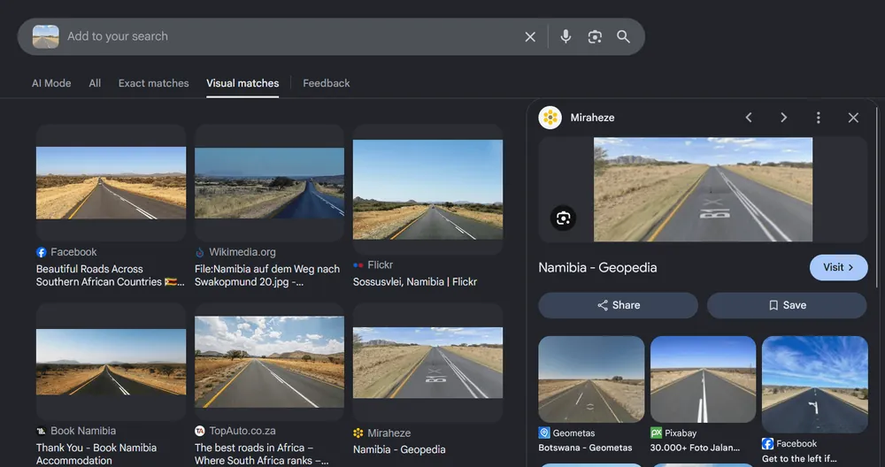
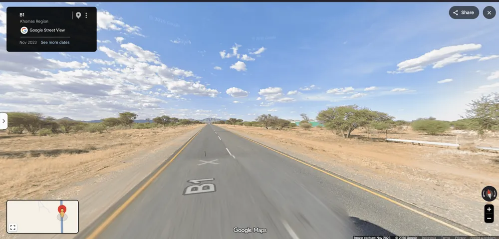

# [Yellow Lines]

* **CTF Name:** 07CTF 2026
* **Category:** OSINT
* **Difficulty:** Medium
* **Writeup Author:** Nakata Christian (n4ct) - TCP1P
* **Date:** September 20, 2026

---

## Challenge Description

---

## 1. Solve Steps

### Step 1: Initial Triage

We're given a 360-map showing a mountain in like a savanna-like environment something green on the right side of the road.

### Step 2: Finding the Location

First, let's do a full reverse image search using Google Lens.

Here, we got a lot of `Namibia` and `South Africa` results. Let's go with Namibia first because one of the result look very similar to the 360 map.

On this image, the road name is `B1` and `B1` is a roadname in Namibia so we can assure that this 360 map location is indeed in Namibia. Also this image has a very similar mountain on the left side of the road.

Follow this road and eventually, we will see the mountain and the green thing. The coordinate is `-23.0850794,17.1043003`. Pinpoint the location in the OSINT platform and we will get the flag

Flag: `07CTF{c0uld_b3_4_c00l_r04d_tr1p!}`