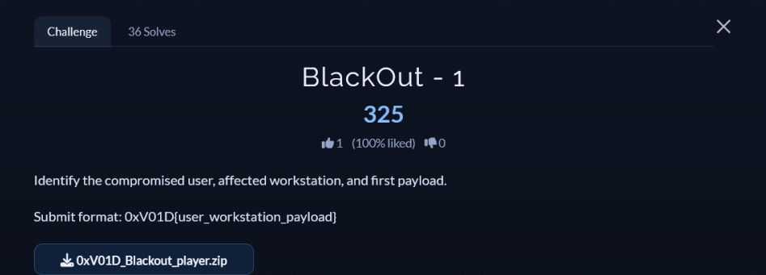

# [BlackOut-1]

* **CTF Name:** 0xV01D CTF 2026 v2
* **Category:** Forensics
* **Difficulty:** 100 points
* **Writeup Author:** Nakata Christian (n4ct) - TCP1P
* **Date:** August 15, 2026

---

## Challenge Description



---

## 1. Solve Steps

### Step 1: Clue Analysis

We're given two text files named `CASE_BRIEF.txt` and `STAGE_PROMPTS.txt`, and a folder named `evidence` which contains so many files. Our goal is to identify the compromised user, affected workstation, and the first payload.

### Step 2: Identifying the Target Host and User

First, let's check `CASE_BRIEF.txt` to get the initial context.

```bash
$ cat CASE_BRIEF.txt   
Case: VOID-2026-0814
Host: NOVA-FIN-044
User: THRYVE\nova0x

A finance workstation produced a ransom note without an obvious encrypted-file set.
You have endpoint telemetry, filesystem artifacts, memory strings, network logs, and
two encrypted blobs recovered from the suspect host.

Recover the attack chain and submit the stage flags.
Flag format: 0xV01D{...}
```

From the case brief, we obtain:
**Compromised User:** `nova0x`
**Workstation:** `NOVA-FIN-044`

### Step 3: Identifying the First Payload

In a Windows incident investigation, initial access is usually marked by the user interactions within the GUI, spawning new processes when a user opens a file in directories such as `Downloads` or `Desktop`.

To reconstruct the process lineage, I checked the `Windows Security Event ID 4688` (Process Creation) logs located at `evidence/Endpoint/Security/Security_4688.csv`.

```bash
$ grep -iE "nova0x" evidence/Endpoint/Security/Security_4688.csv
2026-08-14T18:09:04.000Z,C:\Windows\System32\mshta.exe,C:\Windows\explorer.exe,nova0x,mshta.exe C:\Users\nova0x\Downloads\invoice_0814.lnk
2026-08-14T18:09:26.000Z,C:\Windows\System32\WindowsPowerShell\v1.0\powershell.exe,C:\Windows\System32\mshta.exe,nova0x,powershell -nop -w hidden -ep bypass -enc ...
2026-08-14T18:11:16.000Z,C:\Windows\System32\vssadmin.exe,C:\Windows\System32\WindowsPowerShell\v1.0\powershell.exe,nova0x,vssadmin delete shadows /all /quiet
```

**Timeline Analysis:**
1. **18:09:04 UTC:** User `nova0x` executed the shortcut file `invoice_0814.lnk` from `C:\Users\nova0x\Downloads`.
2. **LOLBin Indication:** Windows Explorer (explorer.exe) executed `mshta.exe` to handle that shortcut file. This is a classic `Living off the Land Binary (LOLBin)` technique to disguise the malicious script execution.
3. **18:09:26 UTC:** `mshta.exe` then spawned a hidden `powershell.exe` process with a Base64 encoded parameter as the stager for the next payload.

This confirms that the initial file executed by the victim was `invoice_0814.lnk`.

Flag: `0xV01D{nova0x_NOVA-FIN-044_invoice_0814.lnk}`