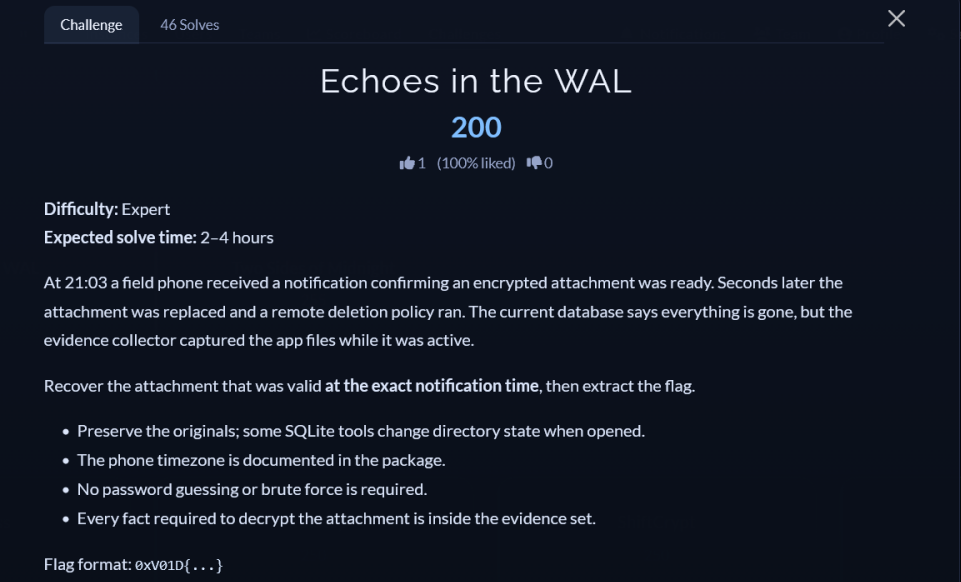

# [Echoes in the WAL]

* **CTF Name:** 0xV01D CTF 2026 v2
* **Category:** Forensics
* **Difficulty:** 200 points
* **Writeup Author:** Nakata Christian (n4ct) - TCP1P
* **Date:** August 15, 2026

---

## Challenge Description



---

## 1. Solve Steps

### Step 1: Clue Analysis

We're given some files.

```bash
$ ls
app_config.json  collection_manifest.json  device.xml  nightjar.db  nightjar.db-wal  notification_history.log
```

First of all, we have to make a backup for all this files so when we open the `nightjar.db`, it won't overwrite the `nightjar.db-wal`.

Okay so now we can work without affecting the real files. First, we need to check the device's metadata, notification logs, and app config to map the time of the incident and the encryption key.

```bash
$ cat device.xml              
<?xml version="1.0" encoding="utf-8"?>
        <device>
          <setting name="android_id" value="a91f32d06c74be18" />
          <setting name="timezone" value="Asia/Amman" />
          <setting name="clock_source" value="network" />
        </device>
```

- `android_id`: `a91f32d06c74be18` acts as the primary device identifier
- `timezone`: `Asia/Amman` (UTC+03:00). All timestamps in local logs correspond to this UTC offset

```bash
$ cat notification_history.log | grep -E "21:03|attachment"
2026-07-14T21:03:08.107+03:00 Nightjar/Sync: staging encrypted attachment [thread=17]
        2026-07-14T21:03:11.842+03:00 Nightjar/Sync: attachment ready [thread=17 revision=4 tx=47]
        2026-07-14T21:03:14.942+03:00 Nightjar/Policy: remote replacement received [thread=17]
        2026-07-14T21:03:19.442+03:00 Nightjar/Policy: retention purge completed [thread=17]
```

- At `21:03:11.842+03:00`, the valid attachment was marked as ready under `thread=17`, `revision=4`, and transaction `tx=47`.
- Shortly after (`21:03:14` and `21:03:19`), the attachment was overwritten (`remote replacement`) and deleted (`retention purge`).
- Our recovery objective is strictly the state at `revision=4` on `thread=17`.

```bash
$ cat app_config.json
{
  "package": "io.void.nightjar",
  "journal_mode": "WAL",
  "attachment_cipher": "AES-256-GCM",
  "key_material_utf8": "android_id:thread_id:revision:committed_ms",
  "key_digest": "SHA-256",
  "aad_utf8": "thread=<thread_id>;revision=<revision>",
  "nonce_storage": "attachments.nonce"
}
```

- Cipher: `AES-256-GCM`
- Key Derivation: `SHA-256(f"{android_id}:{thread_id}:{revision}:{committed_ms}".encode("utf-8"))`
- AAD (Additional Authenticated Data): `f"thread={thread_id};revision={revision}".encode("utf-8")`
- Missing Variable: We need the exact `committed_ms` integer timestamp and the raw `nonce` + `payload` BLOB for `thread=17, revision=4`, which are currently lost in the main DB but still preserved in `nightjar.db-wal`.

```bash
$ cat collection_manifest.json
{
  "app_config.json": {
    "sha256": "8b1fff0079564e74048d33e3ad330d02561e2d11c2e6f0b038d6f1633146df15",
    "size": 300
  },
  "device.xml": {
    "sha256": "66f2f3829a1c72cf4a487c0dcea25c6287acc45692dcd0af531f91fffe29250e",
    "size": 260
  },
  "nightjar.db": {
    "sha256": "911d5213f37a10c2b302486025d69669592a4b20f4639c8535834b0ece2e0300",
    "size": 24576
  },
  "nightjar.db-wal": {
    "sha256": "1d7d9210487114c64986867468eef7846f1b001414b920235c56185354b88183",
    "size": 98912
  },
  "notification_history.log": {
    "sha256": "7ca7ab0fd80d3961f20ec0a731b966d65a239d194ecc3becb59446157d31f2d5",
    "size": 377
  }
}
```

- Documents original hashes and sizes. The size of `nightjar.db-wal` (98,912 bytes) confirms there are `(98912 - 32) / (24 + 4096) = 24` historical WAL frames preserved.

### Step 2: Database Schema & WAL Strings Analysis

Running `strings` on `nightjar.db-wal` reveals the schema of the target table.

```bash
$ strings -a -t x nightjar.db-wal | grep -i -E "CREATE TABLE"
   6e1f CREATE TABLE contacts(contact_id INTEGER PRIMARY KEY, display_name TEXT NOT NULL, muted INTEGER NOT NULL)u
   6ea1 CREATE TABLE txlog(tx INTEGER PRIMARY KEY, committed_ms INTEGER NOT NULL, event TEXT NOT NULL)
   6f25 CREATE TABLE attachments(thread_id INTEGER NOT NULL, revision INTEGER NOT NULL, committed_ms INTEGER NOT NULL,
   705d CREATE TABLE threads(thread_id INTEGER PRIMARY KEY, alias TEXT NOT NULL, current_revision INTEGER NOT NULL)
  11f27 CREATE TABLE contacts(contact_id INTEGER PRIMARY KEY, display_name TEXT NOT NULL, muted INTEGER NOT NULL)u
  11fa9 CREATE TABLE txlog(tx INTEGER PRIMARY KEY, committed_ms INTEGER NOT NULL, event TEXT NOT NULL)
  1202d CREATE TABLE attachments(thread_id INTEGER NOT NULL, revision INTEGER NOT NULL, committed_ms INTEGER NOT NULL,
  12165 CREATE TABLE threads(thread_id INTEGER PRIMARY KEY, alias TEXT NOT NULL, current_revision INTEGER NOT NULL)
```

Table column layout:
1. `thread_id` (INTEGER)
2. `revision` (INTEGER)
3. `committed_ms` (INTEGER)
4. `state` (TEXT)
5. `nonce` (BLOB)
6. `payload` (BLOB - AES-GCM Ciphertext + Auth Tag)

### Step 3: Parsing SQLite WAL Frames & Decrypting Payload

Because SQLite writes transaction pages sequentially into the WAL file before checkpointing, frames containing `state=ready` for `revision=4` remain present in the raw log.

I wrote a Python script to parse the SQLite B-tree leaf table cells from the WAL frames, extract the specific row where `thread_id=17` and `revision=4`, reconstruct the encryption key, and decrypt the attachment.

```python
import struct
import hashlib
from Crypto.Cipher import AES
import re

def read_varint(data, offset):
    res = 0
    for i in range(9):
        if offset + i >= len(data):
            break
        b = data[offset + i]
        if i == 8:
            res = (res << 8) | b
            return res, offset + 9
        res = (res << 7) | (b & 0x7F)
        if (b & 0x80) == 0:
            return res, offset + i + 1
    return res, offset + 9

def parse_sqlite_record(payload_bytes):
    try:
        hdr_len, offset = read_varint(payload_bytes, 0)
        hdr_end = hdr_len
        serial_types = []
        while offset < hdr_end:
            st, offset = read_varint(payload_bytes, offset)
            serial_types.append(st)
        
        values = []
        data_offset = hdr_end
        for st in serial_types:
            if st == 0:
                values.append(None)
            elif st == 1:
                values.append(struct.unpack(">b", payload_bytes[data_offset:data_offset+1])[0])
                data_offset += 1
            elif st == 2:
                values.append(struct.unpack(">h", payload_bytes[data_offset:data_offset+2])[0])
                data_offset += 2
            elif st == 3:
                b = payload_bytes[data_offset:data_offset+3]
                values.append(int.from_bytes(b, byteorder='big', signed=True))
                data_offset += 3
            elif st == 4:
                values.append(struct.unpack(">i", payload_bytes[data_offset:data_offset+4])[0])
                data_offset += 4
            elif st == 5:
                b = payload_bytes[data_offset:data_offset+6]
                values.append(int.from_bytes(b, byteorder='big', signed=True))
                data_offset += 6
            elif st == 6:
                values.append(struct.unpack(">q", payload_bytes[data_offset:data_offset+8])[0])
                data_offset += 8
            elif st >= 12 and st % 2 == 0:
                length = (st - 12) // 2
                values.append(payload_bytes[data_offset:data_offset+length])
                data_offset += length
            elif st >= 13 and st % 2 == 1:
                length = (st - 13) // 2
                values.append(payload_bytes[data_offset:data_offset+length].decode('utf-8', errors='replace'))
                data_offset += length
            else:
                values.append(None)
        return values
    except Exception:
        return None

def extract_wal_records(wal_path):
    records = []
    with open(wal_path, "rb") as f:
        wal_data = f.read()
    
    page_size = 4096
    frame_size = 24 + page_size
    num_frames = (len(wal_data) - 32) // frame_size
    
    for i in range(num_frames):
        frame_offset = 32 + i * frame_size
        page_data = wal_data[frame_offset + 24 : frame_offset + 24 + page_size]
        for base_off in [0, 100]:
            if len(page_data) <= base_off:
                continue
            if page_data[base_off] == 0x0D:
                num_cells = struct.unpack(">H", page_data[base_off+3 : base_off+5])[0]
                cell_offsets = [struct.unpack(">H", page_data[base_off+8 + 2*j : base_off+10 + 2*j])[0] for j in range(num_cells)]
                for cell_off in cell_offsets:
                    cell_data = page_data[cell_off:]
                    payload_len, off = read_varint(cell_data, 0)
                    rowid, off = read_varint(cell_data, off)
                    payload = cell_data[off : off + payload_len]
                    parsed = parse_sqlite_record(payload)
                    if parsed and len(parsed) >= 6:
                        records.append(parsed)
    return records

android_id = "a91f32d06c74be18"
records = extract_wal_records("nightjar.db-wal")

for rec in records:
    thread_id, revision, committed_ms, state, nonce, payload = rec[:6]
    if thread_id == 17 and revision == 4 and state == "ready":
        key_material = f"{android_id}:{thread_id}:{revision}:{committed_ms}".encode("utf-8")
        key = hashlib.sha256(key_material).digest()
        ciphertext = payload[:-16]
        cipher = AES.new(key, AES.MODE_GCM, nonce=nonce)
        plaintext = cipher.decrypt(ciphertext)
        flag_match = re.search(rb"0xV01D\{[^}]+\}", plaintext)
        if flag_match:
            print(f"Flag: {flag_match.group(0).decode()}")
            break
```

**Output:**
```bash
$ python3 a.py
Flag: 0xV01D{the_wal_keeps_old_promises}
```

Flag: `0xV01D{the_wal_keeps_old_promises}`