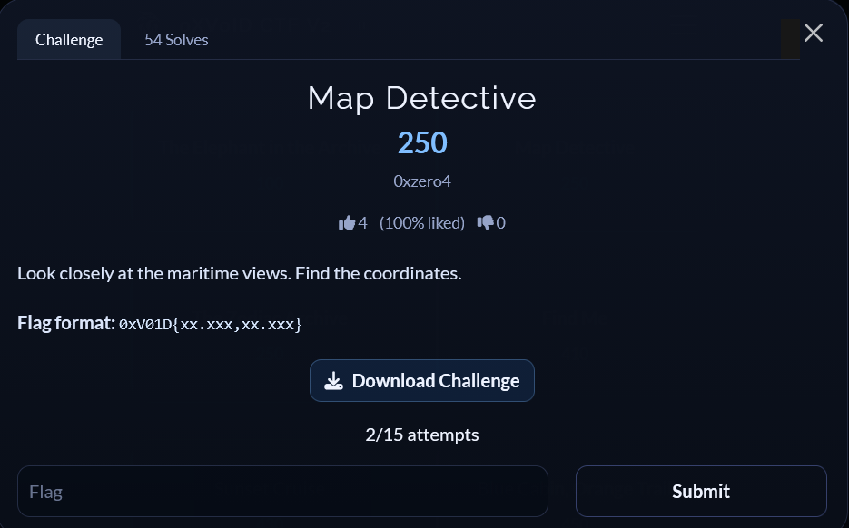
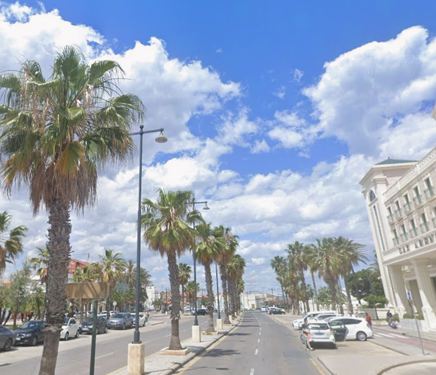
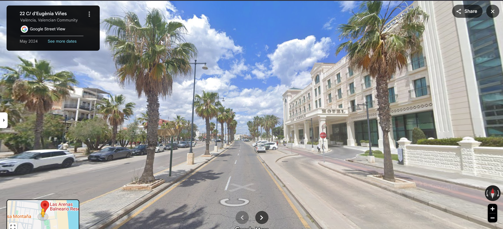

# [Map Detective]

* **CTF Name:** 0xV01D CTF 2026 v2
* **Category:** OSINT
* **Difficulty:** 250 points
* **Writeup Author:** Nakata Christian (n4ct) - TCP1P
* **Date:** August 15, 2026

---

## Challenge Description

---

## 1. Solve Steps

### Step 1: Clue Analysis

We're given an image showing two roads, a line of palm trees, and a building on the right.

### Step 2: Identifying the Building

To identify the building in the image, I cropped the building and used Google Images, which identified it as `Las Arenas Balneario Resort` in Valencia, Spain.

### Step 3: Google Maps

I moved to Google Maps to find the exact location and coordinates.

The coordinates extracted from the URL [Google Maps](https://www.google.com/maps/place/Las+Arenas+Balneario+Resort/@39.4660556,-0.3248375,3a,75y,358.13h,96.66t/data=!3m7!1e1!3m5!1sPoe-yeGuMKavs8oS0-bF6A!2e0!6shttps:%2F%2Fstreetviewpixels-pa.googleapis.com%2Fv1%2Fthumbnail%3Fcb_client%3Dmaps_sv.tactile%26w%3D900%26h%3D600%26pitch%3D-6.655341726404387%26panoid%3DPoe-yeGuMKavs8oS0-bF6A%26yaw%3D358.12888484378675!7i16384!8i8192!4m10!3m9!1s0xd604869c12e580f:0x9a8365c0f5f4f111!5m2!4m1!1i2!8m2!3d39.4664455!4d-0.3245659!10e5!16s%2Fg%2F1vfp4ztw?entry=ttu&g_ep=EgoyMDI2MDgxMi4wIKXMDSoASAFQAw%3D%3) are `39.4660556,-0.3248375` and truncating them gives the flag.

Flag: `0xV01D{39.466,-0.324}`