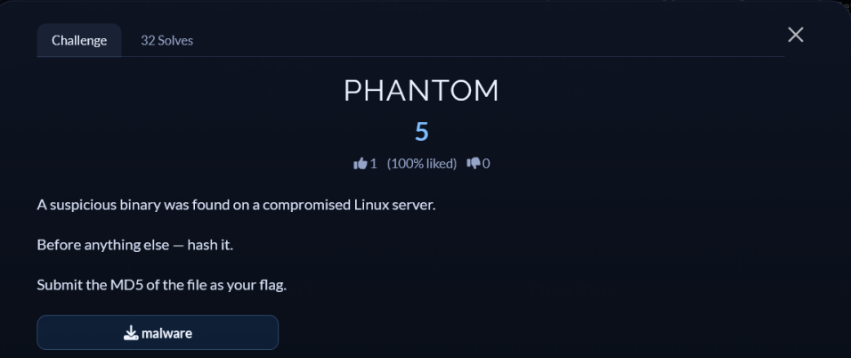
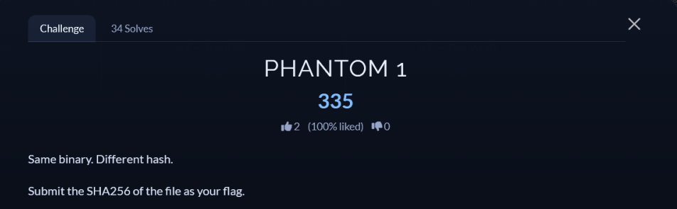

# [PHANTOM Series]

* **CTF Name:** 0xV01D CTF 2026 v2
* **Category:** Misc
* **Difficulty:** 1015 points
* **Writeup Author:** Nakata Christian (n4ct) - TCP1P
* **Date:** August 16, 2026

---

## Artifacts Overview
We're given two artifacts:
1. `malware`
2. `PHANTOM.pcap`

## 1. PHANTOM (5 points)



### Step 1: Retrieve the Flag

This one is easy, just use `md5sum` to get the MD5 of the `malware` file.

```bash
$ md5sum malware
0194e72a0452abdcb7a0d7379bb59e35  malware
```

Flag: `0194e72a0452abdcb7a0d7379bb59e35`

## 2. PHANTOM 1 (185 points)



### Step 1: Retieving the Flag

This one is also easy, just use `sha256sum` to get the SHA256 of the `malware` file.

```bash
$ sha256sum malware                                                          
2b6c969cf230ab99e3fcac492013477c33b26d7c807ec3b097c7c8d614ac967d  malware
```

Flag: `2b6c969cf230ab99e3fcac492013477c33b26d7c807ec3b097c7c8d614ac967d`

## 3. PHANTOM-2 (210 points)