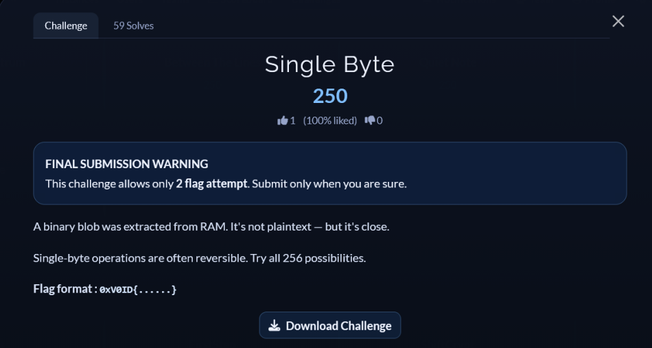

# [Single Byte]

* **CTF Name:** 0xV01D CTF 2026 v2
* **Category:** Misc
* **Difficulty:** 250 points
* **Writeup Author:** Nakata Christian (n4ct) - TCP1P
* **Date:** August 15, 2026

---

## Challenge Description



---

## 1. Solve Steps

### Step 1: Clue Analysis

We're given a file named `secret.bin` that has been encrypted.

```bash
$ cat secret.bin                                
r:r
   9:r0)q;$r7,&?
```
 The description said "single-byte operations are often reversible" and "try all 256 possibilities". This clearly indicates that the payload was encrypted using a Single-Byte XOR cipher with a keyspace of 0 - 255.

 ### Step 2: XOR-ing the File

 I wrote a script to try all 256 keys possibilities.

 **Solver Script:**
 ```python
 with open("secret.bin", "rb") as f:
    data = f.read()

for key in range(256):
    decoded = bytes([b ^ key for b in data])
    if b"0xV0ID" in decoded:
        print(f"Key: {hex(key)}")
        print(f"Flag: {decoded.decode('latin-1')}")
```

**Output:**
```bash
$ python3 a.py                                                                                                
Key: 0x42
Flag: 0xV0ID{x0r_k3y_f0und}
```

Flag: `0xV0ID{x0r_k3y_f0und}`