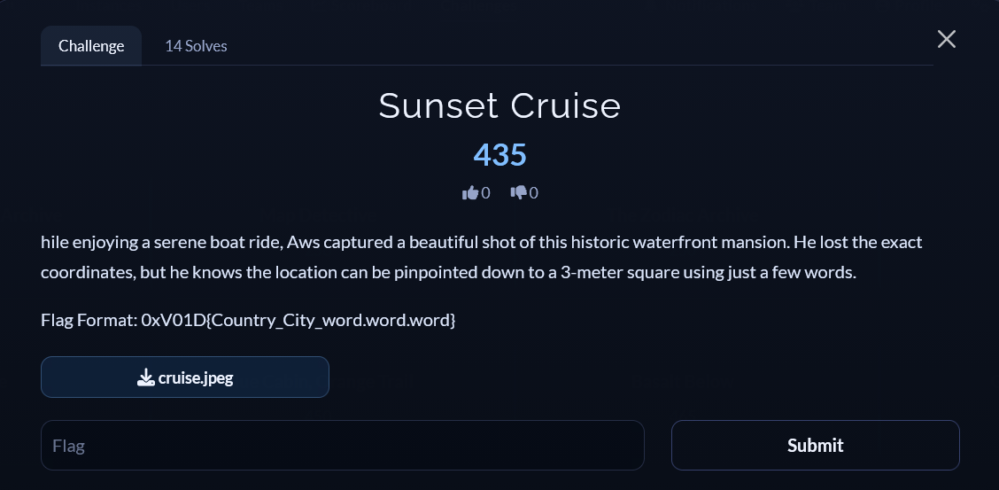
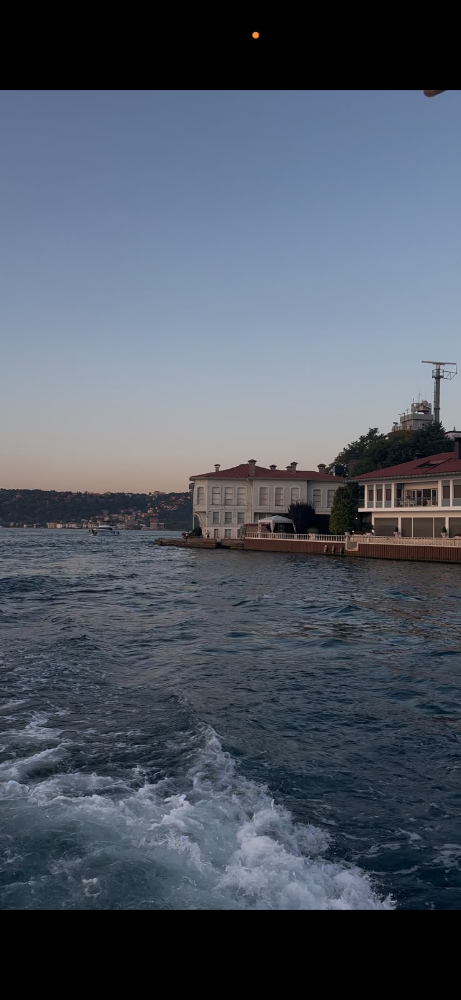
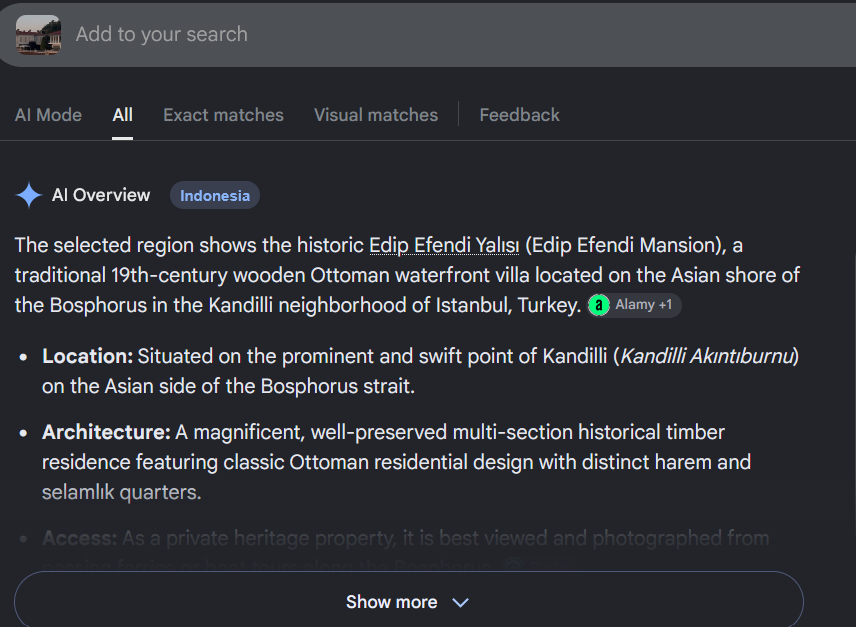
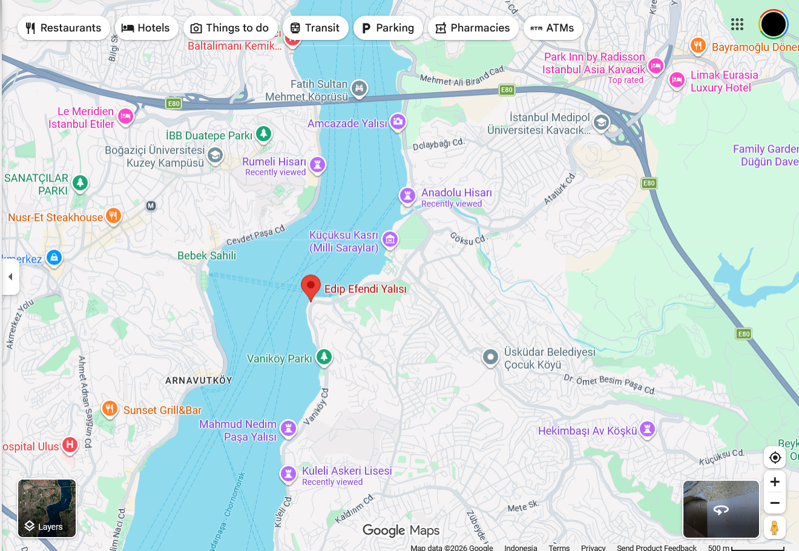
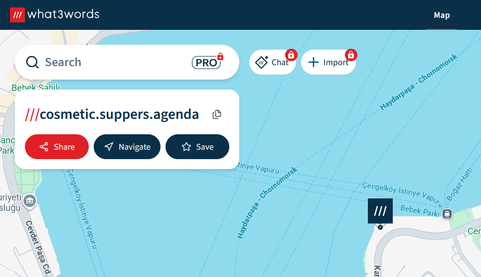

# [Sunset Cruise]

* **CTF Name:** 0xV01D CTF 2026 v2
* **Category:** OSINT
* **Difficulty:** 415 points
* **Writeup Author:** Nakata Christian (n4ct) - TCP1P
* **Date:** August 16, 2026

---

## Challenge Description

---

## 1. Solve Steps

### Step 1: Clue Analysis

We're given an image taken from a boat, showing a waterfront building along the coast.

### Step 2: Identifying the Building

To identify the building, I cropped it from the image and searched it on Google Images. The results identified the building as `Edip Efendi Yalısı`, located on the Asian shore of the Bosphorus in Istanbul, Turkey.

Here is the verified location on Google Maps:

### Step 3: The 3 Words

To obtain the 3 words for `Edip Efendi Yalısı`, I used a website called `what3words.com` and got the words: `cosmetic.suppers.agenda`.

Flag: `0xV01D{Turkey_Istanbul_cosmetic.suppers.agenda}`