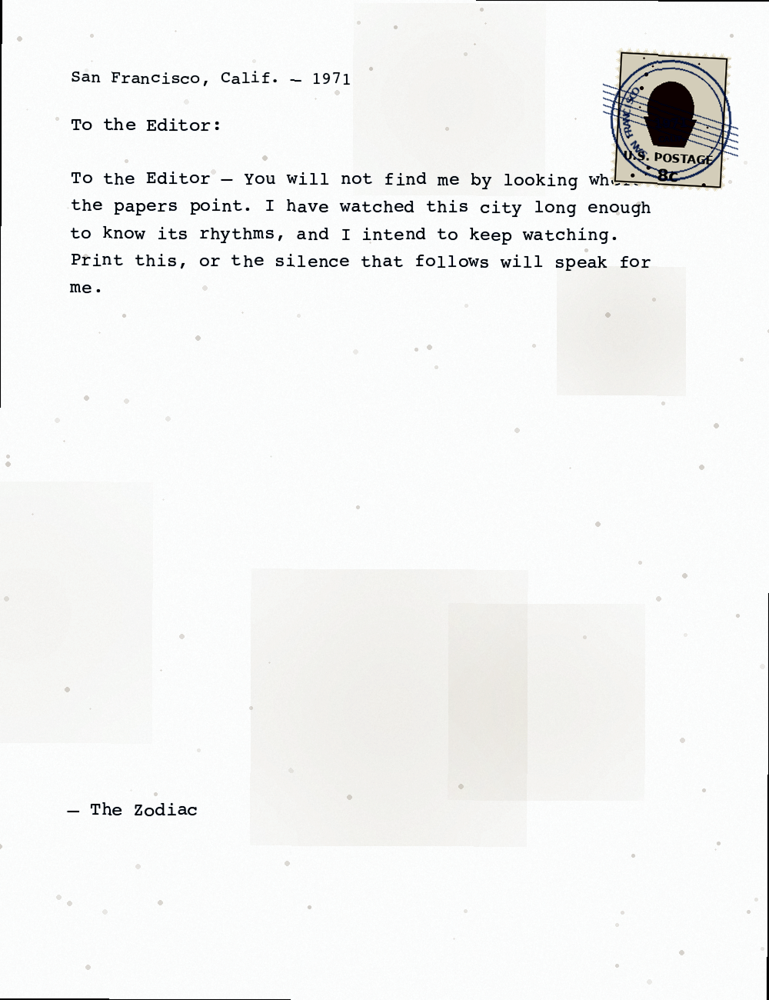
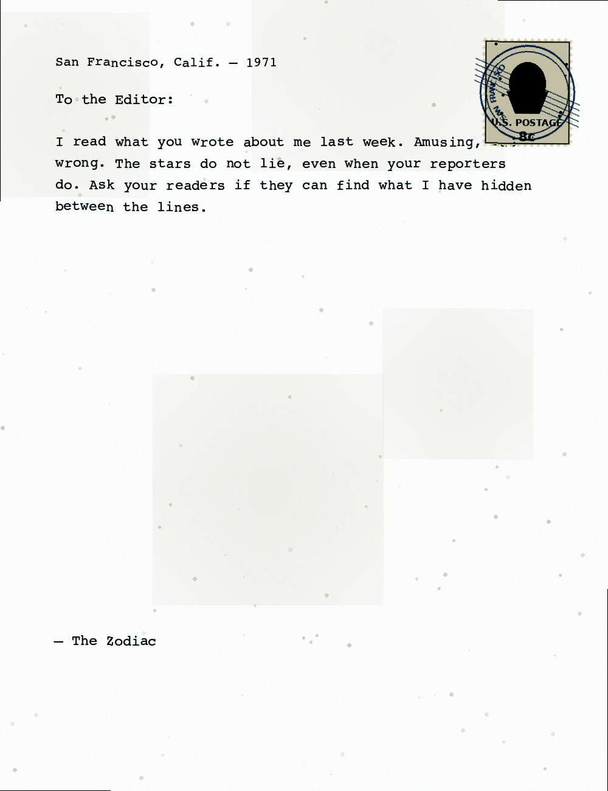
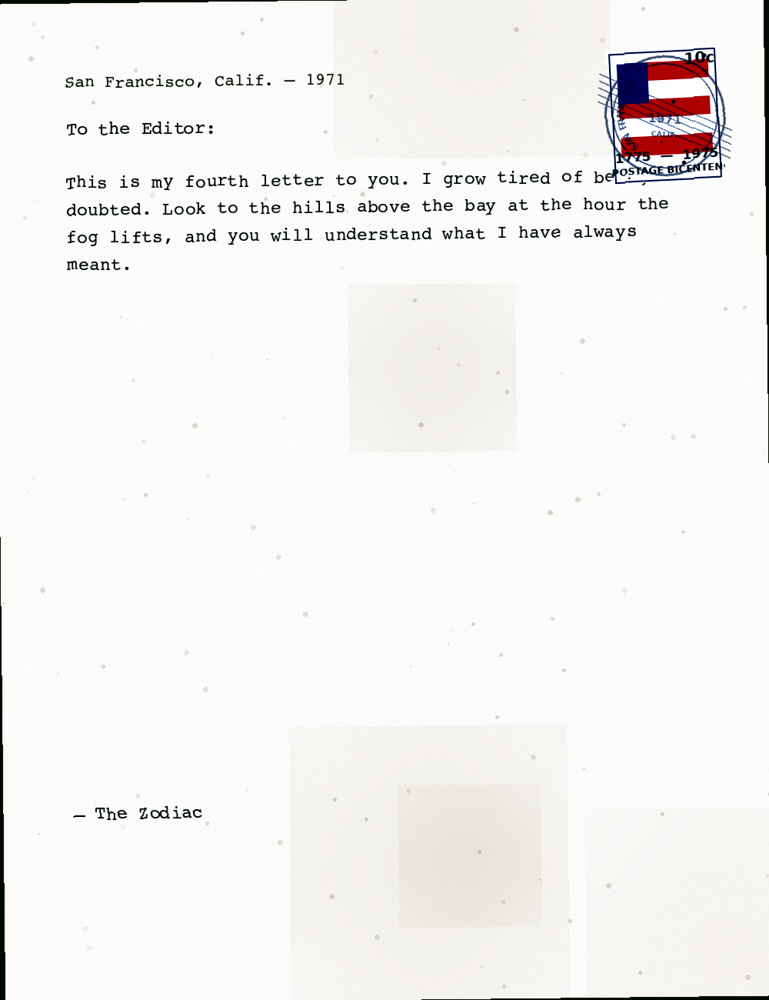
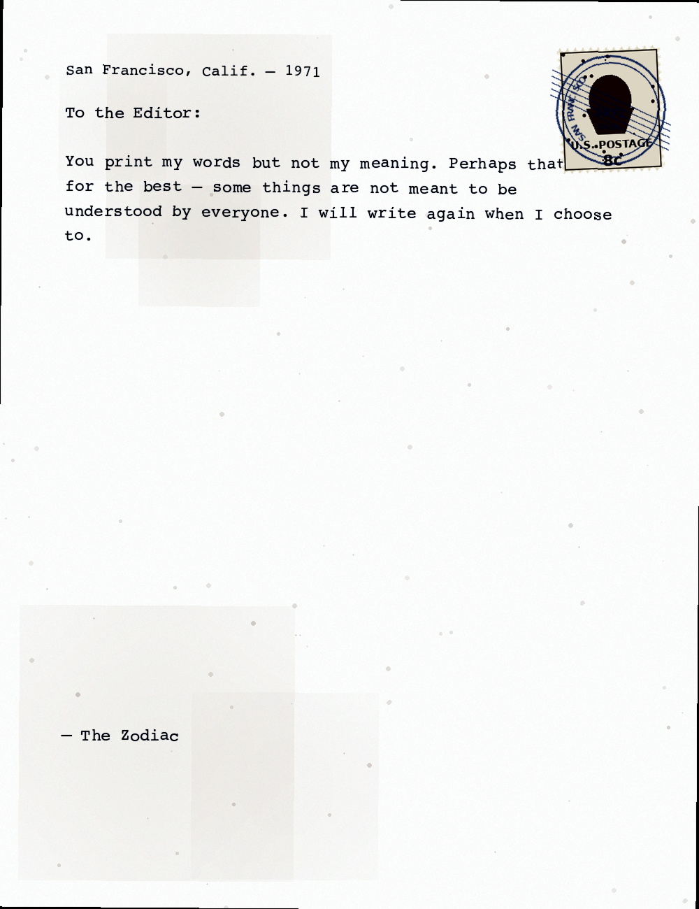
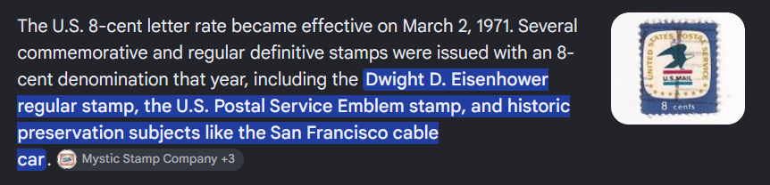
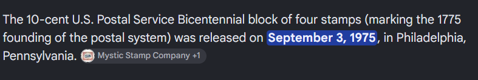

# [The Zodiac Archive]

* **CTF Name:** 0xV01D CTF 2026 v2
* **Category:** OSINT
* **Difficulty:** 250 points
* **Writeup Author:** Nakata Christian (n4ct) - TCP1P
* **Date:** August 15, 2026

---

## Challenge Description

```
A private collector claims to possess four original letters attributed to the Zodiac Killer. Although all four appear authentic, investigators believe one contains a historical inconsistency. Examine the scans, verify the historical details using publicly available sources, and identify the forged document

Flagformat : 0xV0ID{YEAR_NAME} 
```

---

## 1. Solve Steps

### Step 1: Clue Analysis

We're given 4 letters.

**letter_1**


**letter_2**


**letter_3**


**letter_4**


Our goal is to find which letter is the fake one.

### Step 2: Letter Verification

First, let's look at the stamp. `letter_1`, `letter_2`, and `letter_4` have an old 8 cents U.S. Postage stamp. These stamps are real stamps according to history.



`letter_3` has a 10 cents US `1775-1975 Bicentennial` letter stamp. This is the fake one because US 10 cents `1775-1975 Bicentennial` letter stamps were released on September 3, 1975 so it could not have been used on a letter postmarked in 1971.



Combining the release year of the stamp and the series name:

Flag: `0xV01D{1975_BICENTENNIAL}`