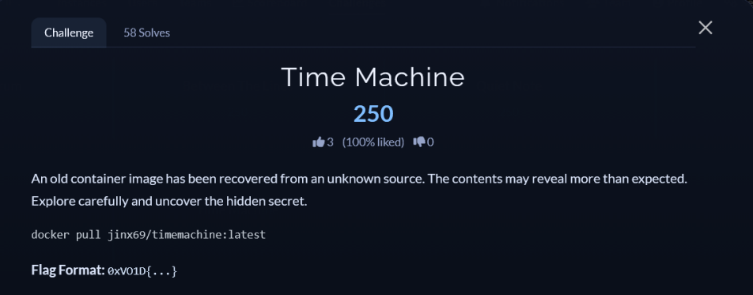

# [Time Machine]

* **CTF Name:** 0xV01D CTF 2026 v2
* **Category:** Misc
* **Difficulty:** 250 points
* **Writeup Author:** Nakata Christian (n4ct) - TCP1P
* **Date:** August 15, 2026

---

## Challenge Description



---

## 1. Solve Steps

### Step 1: Clue Analysis

We're given a docker image to pull. First, I pulled the docker image.

```bash
$ sudo docker pull jinx69/timemachine:latest
[sudo] password for n4ct: 
latest: Pulling from jinx69/timemachine
Digest: sha256:5599498451202681fb4fdfcbfffbb116aa7de4ebec89eeab629d06ea25e6a419
Status: Image is up to date for jinx69/timemachine:latest
docker.io/jinx69/timemachine:latest
```

Since the challenge's title is "Time Machine", I checked the history of this docker image and found that there is a user named `void` with the password `trave1er` and there is a file in `/opt/flag.sh` owned by `void`.

```bash
$ sudo docker history --no-trunc jinx69/timemachine:latest
IMAGE                                                                     CREATED       CREATED BY                                                                                                                        SIZE      COMMENT
sha256:0e9a77b492cc2be4f670591c59a07bb6a02dd57e7c6bf8b421f78d404c519e86   11 days ago   /bin/sh -c #(nop)  CMD ["/bin/bash"]                                                                                              0B        
<missing>                                                                 11 days ago   /bin/sh -c #(nop)  USER player                                                                                                    0B        
<missing>                                                                 11 days ago   /bin/sh -c chown void:void /opt/flag.sh &&     chmod 700 /opt/flag.sh                                                             34B       
<missing>                                                                 11 days ago   /bin/sh -c #(nop) COPY file:8c44ded4244f8ffa1b2de966312f3ff34b947b9a1a719576094c5911b39e9c8e in /opt/flag.sh                      34B       
<missing>                                                                 11 days ago   /bin/sh -c echo "The answers aren't in the present." > /home/player/notes.txt &&     chown player:player /home/player/notes.txt   35B       
<missing>                                                                 11 days ago   /bin/sh -c useradd -m player                                                                                                      10kB      
<missing>                                                                 11 days ago   /bin/sh -c useradd -m void &&     echo "Setting default credentials..." &&     echo "void:trave1er" | chpasswd                    9.71kB    
<missing>                                                                 11 days ago   /bin/sh -c apt-get update &&     apt-get install -y passwd &&     apt-get clean &&     rm -rf /var/lib/apt/lists/*                0B        
<missing>                                                                 11 days ago   /bin/sh -c #(nop)  ENV DEBIAN_FRONTEND=noninteractive                                                                             0B        
<missing>                                                                 2 weeks ago   /bin/sh -c #(nop)  CMD ["/bin/bash"]                                                                                              0B        
<missing>                                                                 2 weeks ago   /bin/sh -c #(nop) ADD file:d938ff3d4eee15d8600de84bf85eac6ecd0f20bc92dfe305dafbff0bdc974c0f in /                                  78.2MB    
<missing>                                                                 2 weeks ago   /bin/sh -c #(nop)  LABEL org.opencontainers.image.version=24.04                                                                   0B        
<missing>                                                                 2 weeks ago   /bin/sh -c #(nop)  ARG LAUNCHPAD_BUILD_ARCH                                                                                       0B        
<missing>                                                                 2 weeks ago   /bin/sh -c #(nop)  ARG RELEASE                                                                                                    0B        
```

### Step 2: Retrieving the Flag

I ran the docker with `--user root` to bypass the file permission restrictions and got the flag.

```bash
$ sudo docker run --rm --user root jinx69/timemachine:latest cat /opt/flag.sh
echo "0xVO1D{h1st0ry_n3v3r_li35}"
```

Flag: `0xVO1D{h1st0ry_n3v3r_li35}`