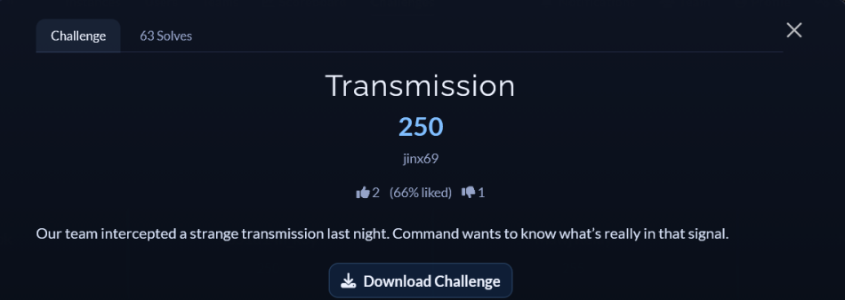
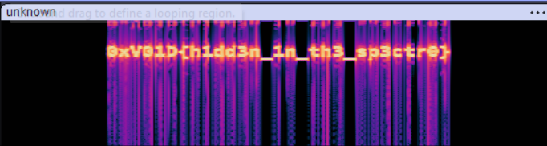

# [Transmission]

* **CTF Name:** 0xV01D CTF 2026 v2
* **Category:** Steganography
* **Difficulty:** 250 points
* **Writeup Author:** Nakata Christian (n4ct) - TCP1P
* **Date:** August 15, 2026

---

## Challenge Description



---

## 1. Solve Steps

### Step 1: Clue Analysis

We're given a zip file protected with a password. Since this is a CTF challenge, the password must be something commonly found in wordlists like rockyou.txt.

### Step 2: Crack the Password

We can use `zip2john` to extract the hash and `john` to crack the password.

```bash
$ zip2john transmission.zip > zip.hash
ver 2.0 efh 5455 efh 7875 transmission.zip/unknown.unknown PKZIP Encr: TS_chk, cmplen=240231, decmplen=529244, crc=DFD0C27E ts=52A4 cs=52a4 type=8
```

Now we have the hash and we can use `john` to crack the password

```bash
$ john --wordlist=/usr/share/wordlists/rockyou.txt zip.hash
Using default input encoding: UTF-8
Loaded 1 password hash (PKZIP [32/64])
Will run 2 OpenMP threads
Press 'q' or Ctrl-C to abort, almost any other key for status
whatever1        (transmission.zip/unknown.unknown)     
1g 0:00:00:00 DONE (2026-08-16 16:39) 5.000g/s 20480p/s 20480c/s 20480C/s 123456..oooooo
Use the "--show" option to display all of the cracked passwords reliably
Session completed.
```

Now we have the password `whatever1` and can unzip the zip file.

### Step 3: Analyzing the File

After unzipping it, we got the file `unknown.unknown`. We can use `file` to get the file type.

```bash
$ file unknown.unknown
unknown.unknown: RIFF (little-endian) data, WAVE audio, Microsoft PCM, 16 bit, mono 44100 Hz
```

Now we know this is an audio file. We can use `Audacity` to look into it.

### Step 4: Audio Analysis

In Audacity, we can switch to the spectrogram view to find the flag.



Flag: `0xV01D{h1dd3n_1n_th3_sp3ctr0}`