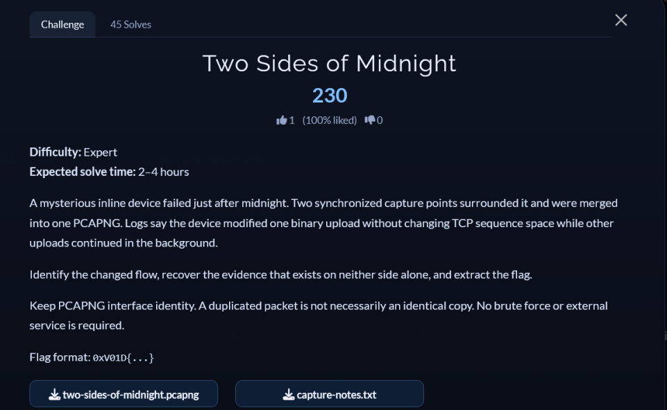

# [Two Sides of Midnight]

* **CTF Name:** 0xV01D CTF 2026 v2
* **Category:** Forensics
* **Difficulty:** 225 points
* **Writeup Author:** Nakata Christian (n4ct) - TCP1P
* **Date:** August 15, 2026

---

## Challenge Description



---

## 1. Solve Steps

### Step 1: Clue Analysis

We're given 2 files, `two-sides-of-midnight.pcapng` and `capture-notes.txt`. First, let's look into `capture-notes.txt`.

```bash
$ cat capture-notes.txt                                   
Incident INC-2714
        A failed inline appliance was bracketed by two passive taps. The exported PCAPNG merges both interfaces.
        tap-ingress is before the appliance; tap-egress is after it. Tap clocks were synchronized within 1 ms.
        The appliance is suspected of modifying one binary upload while preserving its TCP sequence space.
        Background uploads were active. The merged export may include duplicate observations and retransmissions.
```

This incident report and the challenge description gave us some information:
1. The `pcapng` contains captures from two taps: `tap-ingress` (incoming) and `tap-egress` (outgoing).
2. The appliance altered data payload bytes on-the-fly without altering TCP sequence numbers or 5-tuple socket info.
3. "Exists on neither side alone" means the hidden information does not reside in the ingress or egress stream. Instead, it is embedded in between the matched packets. Maybe it was XOR-ed.

### Step 2: Interface and Traffic Triage

Now let's check the interface metadata inside the pcapng file using `capinfos`.

```bash
$ capinfos -I two-sides-of-midnight.pcapng
File name:           two-sides-of-midnight.pcapng
Number of interfaces in file: 2
Interface #0 info:
                     Name = tap-ingress
                     Encapsulation = Ethernet (1 - ether)
                     Capture length = 65535
                     Time precision = microseconds (6)
                     Time ticks per second = 1000000
                     Time resolution = 0x06
                     Number of stat entries = 0
                     Number of packets = 33
Interface #1 info:
                     Name = tap-egress
                     Encapsulation = Ethernet (1 - ether)
                     Capture length = 65535
                     Time precision = microseconds (6)
                     Time ticks per second = 1000000
                     Time resolution = 0x06
                     Number of stat entries = 0
                     Number of packets = 33
```

- `Interface #0`: `tap-ingress` (33 packets)
- `Interface #1`: `tap-egress` (33 packets)
- Total packets is exactly 66 packets

Next, we inspect the packet streams using `tshark`:

```bash
─$ tshark -r two-sides-of-midnight.pcapng -z io,phs
Warning: program compiled against libxml 215 using older 214
    1   0.000000   10.42.0.19 → 10.42.0.8    TCP 70 49173 → 8443 [SYN] Seq=0 Win=64240 Len=0 TSval=39122010 TSecr=8821000 WS=128
    2   0.000320   10.42.0.19 → 10.42.0.8    TCP 70 [TCP Retransmission] 49173 → 8443 [SYN] Seq=0 Win=64240 Len=0 TSval=39122010 TSecr=8821000 WS=128
    3   0.002000   10.42.0.19 → 10.42.0.8    TCP 102 [TCP Previous segment not captured] 49173 → 8443 [PSH, ACK] Seq=366 Ack=1 Win=8222720 Len=32 TSval=39122105 TSecr=8821000 WS=128
    4   0.002320   10.42.0.19 → 10.42.0.8    TCP 102 [TCP Retransmission] 49173 → 8443 [PSH, ACK] Seq=366 Ack=1 Win=8222720 Len=32 TSval=39122105 TSecr=8821000 WS=128
    5   0.003700   10.42.0.19 → 10.42.0.8    TCP 143 [TCP Retransmission] 49173 → 8443 [PSH, ACK] Seq=147 Ack=1 Win=8222720 Len=73 TSval=39122102 TSecr=8821000 WS=128
    6   0.004020   10.42.0.19 → 10.42.0.8    TCP 143 [TCP Retransmission] 49173 → 8443 [PSH, ACK] Seq=147 Ack=1 Win=8222720 Len=73 TSval=39122102 TSecr=8821000 WS=128
    7   0.005000   10.42.0.21 → 10.42.0.8    TCP 131 49801 → 8443 [PSH, ACK] Seq=1 Ack=1 Win=64240 Len=61 TSval=39122500 TSecr=8821000 WS=128
    8   0.005320   10.42.0.21 → 10.42.0.8    TCP 131 [TCP Retransmission] 49801 → 8443 [PSH, ACK] Seq=1 Ack=1 Win=8222720 Len=61 TSval=39122500 TSecr=8821000 WS=128
    9   0.005400   10.42.0.19 → 10.42.0.8    TCP 143 [TCP Retransmission] 49173 → 8443 [PSH, ACK] Seq=74 Ack=1 Win=8222720 Len=73 TSval=39122101 TSecr=8821000 WS=128
   10   0.005720   10.42.0.19 → 10.42.0.8    TCP 143 [TCP Retransmission] 49173 → 8443 [PSH, ACK] Seq=74 Ack=1 Win=8222720 Len=73 TSval=39122101 TSecr=8821000 WS=128
   11   0.005900   10.42.0.19 → 10.42.0.8    TCP 143 [TCP Retransmission] 49173 → 8443 [PSH, ACK] Seq=74 Ack=1 Win=8222720 Len=73 TSval=39122101 TSecr=8821000 WS=128
   12   0.005900   10.42.0.22 → 10.42.0.7    TCP 131 51200 → 9443 [PSH, ACK] Seq=1 Ack=1 Win=64240 Len=61 TSval=39122520 TSecr=8821000 WS=128
   13   0.006220   10.42.0.19 → 10.42.0.8    TCP 143 [TCP Retransmission] 49173 → 8443 [PSH, ACK] Seq=74 Ack=1 Win=8222720 Len=73 TSval=39122101 TSecr=8821000 WS=128
   14   0.006220   10.42.0.22 → 10.42.0.7    TCP 131 [TCP Retransmission] 51200 → 9443 [PSH, ACK] Seq=1 Ack=1 Win=8222720 Len=61 TSval=39122520 TSecr=8821000 WS=128
   15   0.006800   10.42.0.33 → 10.42.0.5    SSL 131 Continuation Data
   16   0.007100   10.42.0.19 → 10.42.0.8    TCP 143 [TCP Retransmission] 49173 → 8443 [PSH, ACK] Seq=1 Ack=1 Win=8222720 Len=73 TSval=39122100 TSecr=8821000 WS=128
   17   0.007120   10.42.0.33 → 10.42.0.5    TCP 131 [TCP Retransmission] 53012 → 443 [PSH, ACK] Seq=1 Ack=1 Win=8222720 Len=61 TSval=39122540 TSecr=8821000 WS=128
   18   0.007300   10.42.0.21 → 10.42.0.8    TCP 132 49801 → 8443 [PSH, ACK] Seq=62 Ack=1 Win=8222720 Len=62 TSval=39122501 TSecr=8821000 WS=128
   19   0.007420   10.42.0.19 → 10.42.0.8    TCP 143 [TCP Retransmission] 49173 → 8443 [PSH, ACK] Seq=1 Ack=1 Win=8222720 Len=73 TSval=39122100 TSecr=8821000 WS=128
   20   0.007620   10.42.0.21 → 10.42.0.8    TCP 132 [TCP Retransmission] 49801 → 8443 [PSH, ACK] Seq=62 Ack=1 Win=8222720 Len=62 TSval=39122501 TSecr=8821000 WS=128
   21   0.008200   10.42.0.22 → 10.42.0.7    TCP 132 51200 → 9443 [PSH, ACK] Seq=62 Ack=1 Win=8222720 Len=62 TSval=39122521 TSecr=8821000 WS=128
   22   0.008520   10.42.0.22 → 10.42.0.7    TCP 132 [TCP Retransmission] 51200 → 9443 [PSH, ACK] Seq=62 Ack=1 Win=8222720 Len=62 TSval=39122521 TSecr=8821000 WS=128
   23   0.008800   10.42.0.19 → 10.42.0.8    TCP 143 [TCP Retransmission] 49173 → 8443 [PSH, ACK] Seq=293 Ack=1 Win=8222720 Len=73 TSval=39122104 TSecr=8821000 WS=128
   24   0.009100   10.42.0.33 → 10.42.0.5    SSL 132 Continuation Data
   25   0.009120   10.42.0.19 → 10.42.0.8    TCP 143 [TCP Retransmission] 49173 → 8443 [PSH, ACK] Seq=293 Ack=1 Win=8222720 Len=73 TSval=39122104 TSecr=8821000 WS=128
   26   0.009300   10.42.0.19 → 10.42.0.8    TCP 143 [TCP Retransmission] 49173 → 8443 [PSH, ACK] Seq=293 Ack=1 Win=8222720 Len=73 TSval=39122104 TSecr=8821000 WS=128
   27   0.009420   10.42.0.33 → 10.42.0.5    TCP 132 [TCP Retransmission] 53012 → 443 [PSH, ACK] Seq=62 Ack=1 Win=8222720 Len=62 TSval=39122541 TSecr=8821000 WS=128
   28   0.009600   10.42.0.21 → 10.42.0.8    TCP 133 49801 → 8443 [PSH, ACK] Seq=124 Ack=1 Win=8222720 Len=63 TSval=39122502 TSecr=8821000 WS=128
   29   0.009620   10.42.0.19 → 10.42.0.8    TCP 143 [TCP Retransmission] 49173 → 8443 [PSH, ACK] Seq=293 Ack=1 Win=8222720 Len=73 TSval=39122104 TSecr=8821000 WS=128
   30   0.009920   10.42.0.21 → 10.42.0.8    TCP 133 [TCP Retransmission] 49801 → 8443 [PSH, ACK] Seq=124 Ack=1 Win=8222720 Len=63 TSval=39122502 TSecr=8821000 WS=128
   31   0.010500   10.42.0.19 → 10.42.0.8    TCP 143 [TCP Retransmission] 49173 → 8443 [PSH, ACK] Seq=220 Ack=1 Win=8222720 Len=73 TSval=39122103 TSecr=8821000 WS=128
   32   0.010500   10.42.0.22 → 10.42.0.7    TCP 133 51200 → 9443 [PSH, ACK] Seq=124 Ack=1 Win=8222720 Len=63 TSval=39122522 TSecr=8821000 WS=128
   33   0.010820   10.42.0.19 → 10.42.0.8    TCP 143 [TCP Retransmission] 49173 → 8443 [PSH, ACK] Seq=220 Ack=1 Win=8222720 Len=73 TSval=39122103 TSecr=8821000 WS=128
   34   0.010820   10.42.0.22 → 10.42.0.7    TCP 133 [TCP Retransmission] 51200 → 9443 [PSH, ACK] Seq=124 Ack=1 Win=8222720 Len=63 TSval=39122522 TSecr=8821000 WS=128
   35   0.011400   10.42.0.33 → 10.42.0.5    SSL 133 Continuation Data
   36   0.011720   10.42.0.33 → 10.42.0.5    TCP 133 [TCP Retransmission] 53012 → 443 [PSH, ACK] Seq=124 Ack=1 Win=8222720 Len=63 TSval=39122542 TSecr=8821000 WS=128
   37   0.011900   10.42.0.21 → 10.42.0.8    TCP 131 49801 → 8443 [PSH, ACK] Seq=187 Ack=1 Win=8222720 Len=61 TSval=39122503 TSecr=8821000 WS=128
   38   0.012220   10.42.0.21 → 10.42.0.8    TCP 131 [TCP Retransmission] 49801 → 8443 [PSH, ACK] Seq=187 Ack=1 Win=8222720 Len=61 TSval=39122503 TSecr=8821000 WS=128
   39   0.012800   10.42.0.22 → 10.42.0.7    TCP 131 51200 → 9443 [PSH, ACK] Seq=187 Ack=1 Win=8222720 Len=61 TSval=39122523 TSecr=8821000 WS=128
   40   0.013120   10.42.0.22 → 10.42.0.7    TCP 131 [TCP Retransmission] 51200 → 9443 [PSH, ACK] Seq=187 Ack=1 Win=8222720 Len=61 TSval=39122523 TSecr=8821000 WS=128
   41   0.013700   10.42.0.33 → 10.42.0.5    SSL 131 Continuation Data
   42   0.014020   10.42.0.33 → 10.42.0.5    TCP 131 [TCP Retransmission] 53012 → 443 [PSH, ACK] Seq=187 Ack=1 Win=8222720 Len=61 TSval=39122543 TSecr=8821000 WS=128
   43   0.014200   10.42.0.21 → 10.42.0.8    TCP 132 49801 → 8443 [PSH, ACK] Seq=248 Ack=1 Win=8222720 Len=62 TSval=39122504 TSecr=8821000 WS=128
   44   0.014520   10.42.0.21 → 10.42.0.8    TCP 132 [TCP Retransmission] 49801 → 8443 [PSH, ACK] Seq=248 Ack=1 Win=8222720 Len=62 TSval=39122504 TSecr=8821000 WS=128
   45   0.015100   10.42.0.22 → 10.42.0.7    TCP 132 51200 → 9443 [PSH, ACK] Seq=248 Ack=1 Win=8222720 Len=62 TSval=39122524 TSecr=8821000 WS=128
   46   0.015420   10.42.0.22 → 10.42.0.7    TCP 132 [TCP Retransmission] 51200 → 9443 [PSH, ACK] Seq=248 Ack=1 Win=8222720 Len=62 TSval=39122524 TSecr=8821000 WS=128
   47   0.016000   10.42.0.33 → 10.42.0.5    SSL 132 Continuation Data
   48   0.016320   10.42.0.33 → 10.42.0.5    TCP 132 [TCP Retransmission] 53012 → 443 [PSH, ACK] Seq=248 Ack=1 Win=8222720 Len=62 TSval=39122544 TSecr=8821000 WS=128
   49   0.016500   10.42.0.21 → 10.42.0.8    TCP 133 49801 → 8443 [PSH, ACK] Seq=310 Ack=1 Win=8222720 Len=63 TSval=39122505 TSecr=8821000 WS=128
   50   0.016820   10.42.0.21 → 10.42.0.8    TCP 133 [TCP Retransmission] 49801 → 8443 [PSH, ACK] Seq=310 Ack=1 Win=8222720 Len=63 TSval=39122505 TSecr=8821000 WS=128
   51   0.017400   10.42.0.22 → 10.42.0.7    TCP 133 51200 → 9443 [PSH, ACK] Seq=310 Ack=1 Win=8222720 Len=63 TSval=39122525 TSecr=8821000 WS=128
   52   0.017720   10.42.0.22 → 10.42.0.7    TCP 133 [TCP Retransmission] 51200 → 9443 [PSH, ACK] Seq=310 Ack=1 Win=8222720 Len=63 TSval=39122525 TSecr=8821000 WS=128
   53   0.018300   10.42.0.33 → 10.42.0.5    SSL 133 Continuation Data
   54   0.018620   10.42.0.33 → 10.42.0.5    TCP 133 [TCP Retransmission] 53012 → 443 [PSH, ACK] Seq=310 Ack=1 Win=8222720 Len=63 TSval=39122545 TSecr=8821000 WS=128
   55   0.018800   10.42.0.21 → 10.42.0.8    TCP 131 49801 → 8443 [PSH, ACK] Seq=373 Ack=1 Win=8222720 Len=61 TSval=39122506 TSecr=8821000 WS=128
   56   0.019120   10.42.0.21 → 10.42.0.8    TCP 131 [TCP Retransmission] 49801 → 8443 [PSH, ACK] Seq=373 Ack=1 Win=8222720 Len=61 TSval=39122506 TSecr=8821000 WS=128
   57   0.019700   10.42.0.22 → 10.42.0.7    TCP 131 51200 → 9443 [PSH, ACK] Seq=373 Ack=1 Win=8222720 Len=61 TSval=39122526 TSecr=8821000 WS=128
   58   0.020020   10.42.0.22 → 10.42.0.7    TCP 131 [TCP Retransmission] 51200 → 9443 [PSH, ACK] Seq=373 Ack=1 Win=8222720 Len=61 TSval=39122526 TSecr=8821000 WS=128
   59   0.020600   10.42.0.33 → 10.42.0.5    SSL 131 Continuation Data
   60   0.020920   10.42.0.33 → 10.42.0.5    TCP 131 [TCP Retransmission] 53012 → 443 [PSH, ACK] Seq=373 Ack=1 Win=8222720 Len=61 TSval=39122546 TSecr=8821000 WS=128
   61   0.021100   10.42.0.21 → 10.42.0.8    TCP 132 49801 → 8443 [PSH, ACK] Seq=434 Ack=1 Win=8222720 Len=62 TSval=39122507 TSecr=8821000 WS=128
   62   0.021420   10.42.0.21 → 10.42.0.8    TCP 132 [TCP Retransmission] 49801 → 8443 [PSH, ACK] Seq=434 Ack=1 Win=8222720 Len=62 TSval=39122507 TSecr=8821000 WS=128
   63   0.022000   10.42.0.22 → 10.42.0.7    TCP 132 51200 → 9443 [PSH, ACK] Seq=434 Ack=1 Win=8222720 Len=62 TSval=39122527 TSecr=8821000 WS=128
   64   0.022320   10.42.0.22 → 10.42.0.7    TCP 132 [TCP Retransmission] 51200 → 9443 [PSH, ACK] Seq=434 Ack=1 Win=8222720 Len=62 TSval=39122527 TSecr=8821000 WS=128
   65   0.022900   10.42.0.33 → 10.42.0.5    SSL 132 Continuation Data
   66   0.023220   10.42.0.33 → 10.42.0.5    TCP 132 [TCP Retransmission] 53012 → 443 [PSH, ACK] Seq=434 Ack=1 Win=8222720 Len=62 TSval=39122547 TSecr=8821000 WS=128

===================================================================
Protocol Hierarchy Statistics
Filter: 

frame                                    frames:66 bytes:8676
  eth                                    frames:66 bytes:8676
    ip                                   frames:66 bytes:8676
      tcp                                frames:66 bytes:8676
        data                             frames:17 bytes:2212
        tls                              frames:8 bytes:1055
===================================================================
```

The capture contains several concurrent flows:
- `10.42.0.19:49173 -> 10.42.0.8:8443`
- `10.42.0.21:49801 -> 10.42.0.8:8443`
- `10.42.0.22:51200 -> 10.42.0.7:9443`
- `10.42.0.33:53012 -> 10.42.0.5:443`

### Step 3: Stream Pairing and XOR

Since sequence numbers and socket metadata are preserved across both taps, we can map packets using `(ip.src, ip.dst, tcp.srcport, tcp.dstport, tcp.seq)` and compare the payloads between interface `0` (`ingress`) and interface `1` (`egress`).

I wrote a debug script to find the modified flow and print its bitwise XOR result:

```python
import subprocess
import json

# 1. Parse packet metadata and payloads using tshark JSON
cmd = [
    "tshark", "-r", "two-sides-of-midnight.pcapng",
    "-T", "json",
    "-e", "frame.interface_id",
    "-e", "ip.src",
    "-e", "ip.dst",
    "-e", "tcp.srcport",
    "-e", "tcp.dstport",
    "-e", "tcp.seq",
    "-e", "tcp.payload"
]

packets = json.loads(subprocess.check_output(cmd))
ingress = {}
egress = {}

for pkt in packets:
    layers = pkt.get("_source", {}).get("layers", {})
    if "tcp.payload" not in layers:
        continue
    
    intf = layers.get("frame.interface_id", ["0"])[0]
    flow_key = (
        layers.get("ip.src", [""])[0],
        layers.get("ip.dst", [""])[0],
        layers.get("tcp.srcport", [""])[0],
        layers.get("tcp.dstport", [""])[0],
        layers.get("tcp.seq", ["0"])[0]
    )
    payload = bytes.fromhex(layers.get("tcp.payload", [""])[0].replace(":", ""))

    if intf == "0":
        ingress[flow_key] = payload
    elif intf == "1":
        egress[flow_key] = payload

# Filter flow yang isinya berbeda
diff_flows = {}
for k in ingress:
    if k in egress and ingress[k] != egress[k]:
        stream_id = (k[0], k[1], k[2], k[3])
        if stream_id not in diff_flows:
            diff_flows[stream_id] = []
        diff_flows[stream_id].append((int(k[4]), ingress[k], egress[k]))

for flow, pkts in diff_flows.items():
    pkts.sort(key=lambda x: x[0])
    xor_buf = bytearray()
    for seq, ing, eg in diff_pkts if 'diff_pkts' in locals() else pkts:
        for i in range(min(len(ing), len(eg))):
            xor_buf.append(ing[i] ^ eg[i])
            
    print(f"modified flow: {flow}")
    print("raw XOR hex:", xor_buf.hex()[:80])
    print("raw XOR string:", "".join(chr(b) if 32 <= b <= 126 else "." for b in xor_buf))
```

**Output:**
```bash
$ python3 a.py
Warning: program compiled against libxml 215 using older 214
modified flow: ('10.42.0.19', '10.42.0.8', '49173', '8443')
raw XOR hex: 4e565831000001790cac0b0501fb27a414045e41504b03041400000008000000ef5c745ef33c5c00
raw XOR string: NVX1...y......'...^APK...........\t^.<\...f.......incident.txt..HUH,(..L.KNUH.H.KOMQH.,I-V(.,../-..f..+.........$&..q..$.[).T....T.............&.d.d...r..PK...........\....5...5.......operator_note.txts..-H,JUHN,().....y%....E...Ee..!........y....E).Ez\.PK.............\t^.<\...f.....................incident.txtPK.............\....5...5.....................operator_note.txtPK..........y.........
```

### Step 4: Retrieving the Flag

From the raw XOR output, we can clearly see the ZIP magic header and file entries `incident.txt` and `operator_note.txt`.

I updated the script to slice the buffer starting from `PK\x03\x04` and dump it directly into `res.zip`.

```python
import subprocess
import json

cmd = [
    "tshark", "-r", "two-sides-of-midnight.pcapng",
    "-T", "json",
    "-e", "frame.interface_id",
    "-e", "ip.src",
    "-e", "ip.dst",
    "-e", "tcp.srcport",
    "-e", "tcp.dstport",
    "-e", "tcp.seq",
    "-e", "tcp.payload"
]

packets = json.loads(subprocess.check_output(cmd))
ingress = {}
egress = {}

for pkt in packets:
    layers = pkt.get("_source", {}).get("layers", {})
    if "tcp.payload" not in layers:
        continue
    
    intf = layers.get("frame.interface_id", ["0"])[0]
    flow_key = (
        layers.get("ip.src", [""])[0],
        layers.get("ip.dst", [""])[0],
        layers.get("tcp.srcport", [""])[0],
        layers.get("tcp.dstport", [""])[0],
        layers.get("tcp.seq", ["0"])[0]
    )
    payload = bytes.fromhex(layers.get("tcp.payload", [""])[0].replace(":", ""))

    if intf == "0":
        ingress[flow_key] = payload
    elif intf == "1":
        egress[flow_key] = payload

diff_pkts = []
for k in ingress:
    if k in egress and ingress[k] != egress[k]:
        diff_pkts.append((int(k[4]), ingress[k], egress[k]))

diff_pkts.sort(key=lambda x: x[0])

xor_buf = bytearray()
for seq, ing, eg in diff_pkts:
    for i in range(min(len(ing), len(eg))):
        xor_buf.append(ing[i] ^ eg[i])

# Locate ZIP header (PK\x03\x04) and save to disk
zip_start = xor_buf.find(b"PK\x03\x04")
if zip_start != -1:
    zip_bytes = xor_buf[zip_start:]
    with open("res.zip", "wb") as f:
        f.write(zip_bytes)
    print("Done")
```

**Output:**
```bash
$ python3 b.py
Warning: program compiled against libxml 215 using older 214
Done
                                                                         
$ unzip res.zip
Archive:  res.zip
  inflating: incident.txt            
  inflating: operator_note.txt       

$ ls
a.py  b.py  capture-notes.txt  incident.txt  operator_note.txt  res.zip  two-sides-of-midnight.pcapng       

$ cat incident.txt
The appliance changed bytes without changing sequence space.
Flag: 0xV01D{one_sequence_two_realities}
```

Flag: `0xV01D{one_sequence_two_realities}`