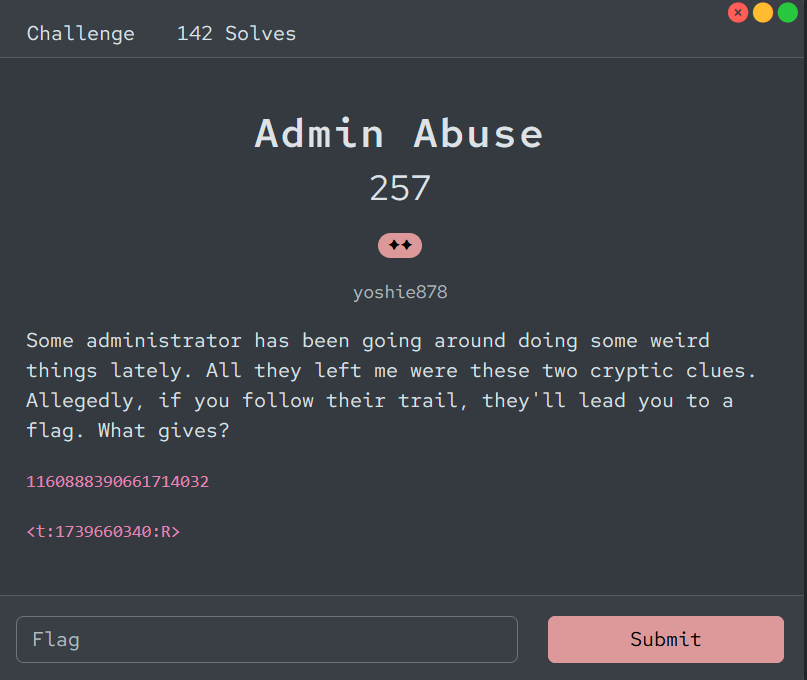
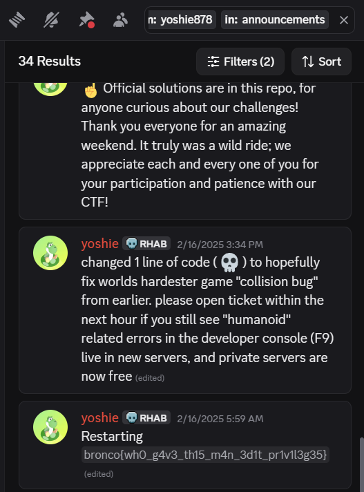

# [Admin Abuse]

* **CTF Name:** Bronco CTF 2026
* **Category:** OSINT
* **Difficulty:** 2 Stars
* **Challenge Author:** yoshie878
* **Writeup Author:** Nakata Christian (n4ct) - TCP1P
* **Date:** July 12, 2026

---

## Challenge Description

---

## 1. Solve Steps

### Step 1: Clue Analysis

We are given 2 cryptic clues in the description:
1. `1160888390661714032`
After a few searches, I found nothing on the internet. But suddenly, I noticed something. Maybe this is a Discord channel ID because I've built a Discord bot before so I'm familiar with this format. Then I searched for this ID in Bronco CTF 2026 official Discord server and found this ID likely belonged to the `announcements` channel. Maybe there's a clue or the flag.
2. `<t:1739660340:R>`
This is a timestamp because the `t` means `time`. Maybe a Unix timestamp? After converting that timestamp, I found it points to `Sat Feb 15 2025 22:59:00 GMT+0000`.

### Step 2: Tracking the Admin's Trail

After I got those 2 clues, I searched for the challenge author's name which is `yoshie878` in the `announcements` channel (`from: yoshie878` `in: announcements`).

### Step 3: Finding the Flag

By scrolling through the results around the timeframe, I found an edited announcement message from `yoshie878` titled "Restarting" and the flag was hidden right in the message.

Flag: `bronco{wh0_g4v3_th15_m4n_3d1t_pr1v1l3g35}`