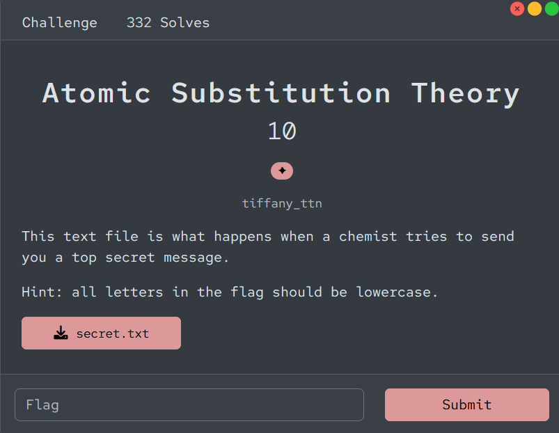

# [Atomic Substitution Theory]

- **CTF Name:** Bronco CTF 2026
- **Category:** Cryptography
- **Difficulty:** 1 Star
- **Challenge Author:** tiffany_ttn
- **Writeup Author:** Nakata Christian (n4ct) - TCP1P
- **Date:** July 12, 2026

---

## Challenge Description



---

## 1. Solve Steps

### Step 1: Clue Analysis

We're given a `.txt` file containing ciphertext-like data.

**secret.txt:**
```plaintext
(4, 17), (2, 16), (2, 15), (4, 9), { , (3, 2, 1), (5, 3), _ , (2, 17), (3, 13, 1), (4, 5), (2, 16), (4, 17, 2), (2, 1, 2), (4, 4, 1), (2, 2, 2), _ , (3, 2, 1), (2, 2, 2), (3, 16), (3, 16), (3, 13, 1), (4, 13, 1), (2, 2, 2), (3, 16), _ , (1, 1), (3, 13, 1), (4, 5), (2, 2, 2), _ , (3, 13, 1), (4, 4, 1), _ , (2, 2, 2), (3, 17, 2), (2, 2, 2), (3, 2, 1), (2, 2, 2), (2, 15), (4, 4, 1), _ , (2, 16), (2, 17), _ , (3, 16), (9, 6), (3, 15), (4, 17, 2), (2, 1, 2), (3, 16), (2, 2, 2), }
```

From the description `This text file is what happens when a chemist tries to send you a top secret message.`, I know that this is something related to chemistry. Then, I thought this is maybe a periodic table code. In the periodic table, row 4 column 17 is `Bromine` or `Br`. Yes, this is a periodic table code. As for the 3-item tuples, they represent `row, column, index`.

### Step 2: Retrieve the Flag

After comparing the ciphertext and the periodic table, I got the flag.

Flag: `bronco{my_favorite_messages_have_at_element_of_suprise}`