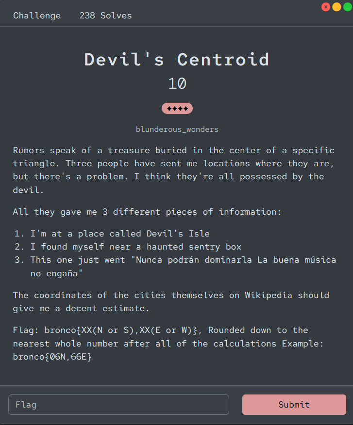
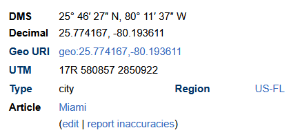
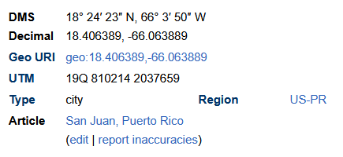
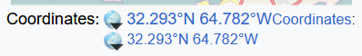

# [Devil's Centroid]

- **CTF Name:** Bronco CTF 2026
- **Category:** OSINT
- **Difficulty:** 4 Stars
- **Challenge Author:** blunderous_wonders
- **Writeup Author:** Nakata Christian (n4ct) - TCP1P
- **Date:** July 11, 2026

---

## Challenge Description

---

## 1. Solve Steps

### Step 1: Clue Analysis

We're given 3 clues that point to specific locations. The overall theme is "Devil's Centroid" and "specific triangle", which strongly suggests we are looking for the vertices of the famous Bermuda Triangle or often called The Devil's Triangle.

Let's break down each clue to find the corresponding cities:

- **Clue 1: "I'm at a place called Devil's Isle"**
  "Isle of Devils" is a historical nickname for Bermuda. The main city and capital of Bermuda is Hamilton.

- **Clue 2: "I found myself near a haunted sentry box"**
  This refers to the famous "Garita del Diablo" (Devil's Sentry Box) located at Castillo San Cristóbal in San Juan, Puerto Rico.

- **Clue 3: "Nunca podrán dominarla La buena música no engaña"**
  This Spanish phrase translates to "They will never be able to tame it. Good music doesn't deceive". I can't find what city this clue is trying to tell us but since the first city is Hamilton and the second city is San Juan, the third city is likely Miami.

So, our three cities forming the triangle are Hamilton (Bermuda), San Juan (Puerto Rico), and Miami (Florida).

### Step 2: Finding Coordinates and Calculating the Centroid

The challenge instructs us to use the coordinates of these cities from Wikipedia and find the centroid (the average of the coordinates).

Let's gather the coordinates (Latitude, Longitude) for each city from Wikipedia. Some Wikipedia pages use the DMS format, so just click the DMS format on Wikipedia to see the decimal format coordinates:

- **Miami:** 25.77° N, 80.19° W

- **San Juan:** 18.40° N, 66.06° W

- **Hamilton:** 32.29° N, 64.78° W

To find the centroid, I calculate the average for the latitudes and the longitudes separately:

**Average Latitude (N):**
(25.77 + 18.40 + 32.29) / 3 = 76.46 / 3 = 25.48

**Average Longitude (W):**
(80.19 + 66.06 + 64.78) / 3 = 211.03 / 3 = 70.34

### Step 3: Formatting the Flag

The challenge's description states "Rounded down to the nearest whole number after all of the calculations Example: bronco{06N,66E}".

- 25.48 rounded down is 25N
- 70.34 rounded down is 70W

Flag: `bronco{25N,70W}`
