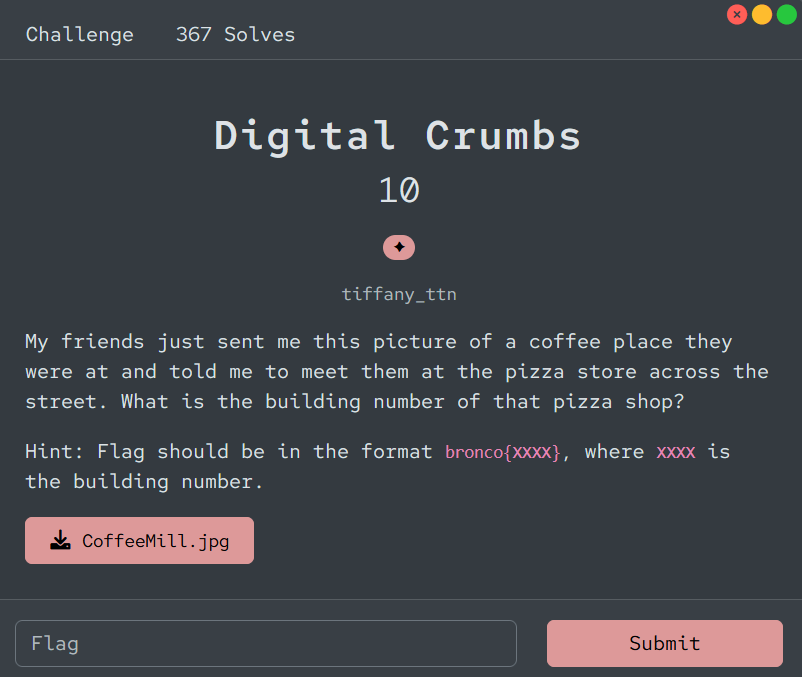
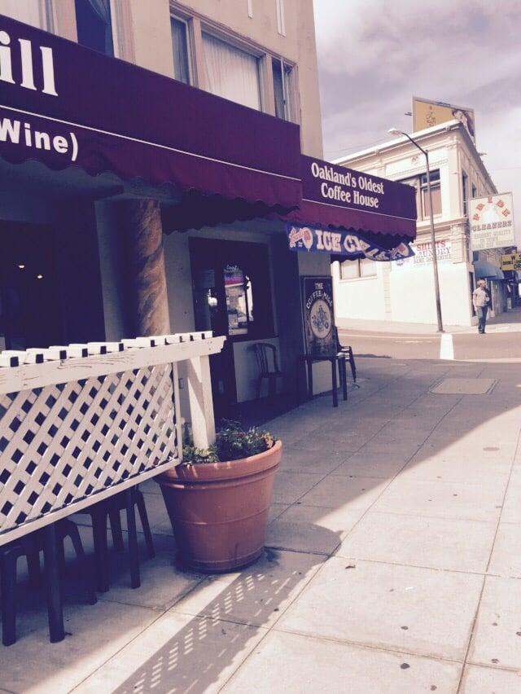
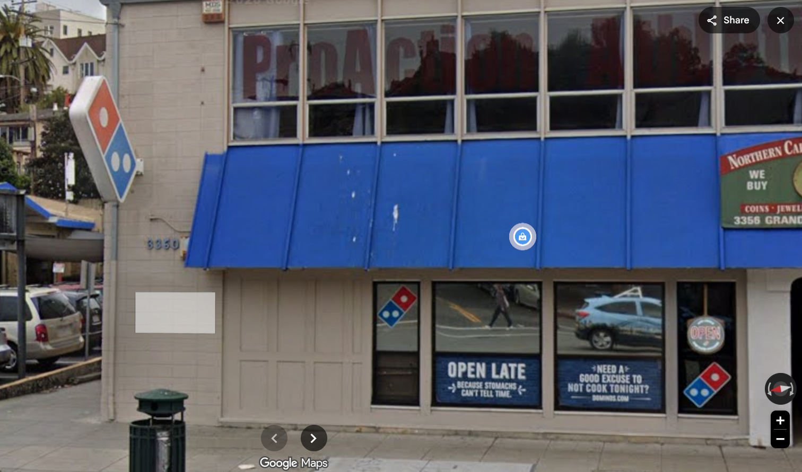

# [Digital Crumbs]

* **CTF Name:** Bronco CTF 2026
* **Category:** OSINT
* **Difficulty:** 1 Star
* **Challenge Author:** tiffany_ttn
* **Writeup Author:** Nakata Christian (n4ct) - TCP1P
* **Date:** July 12, 2026

---

## Challenge Description

---

## 1. Solve Steps

### Step 1: Clue Analysis

We're given 1 image featuring a coffeeshop titled "Oakland's Oldest Coffee House". After doing a Google search with the query `Oakland's Oldest Coffee House`, I found that the coffee shop's name is "The Coffee Mill" located at 3363 Grand Avenue.

### Step 2: Google Maps

Moving onto Google Maps, I search for "The Coffee Mill 3363 Grand Avenue" and found The Coffee Mill. And "the pizza store across the street" is Domino's Pizza with 3360 as the building number.

Flag: `bronco{3360}`