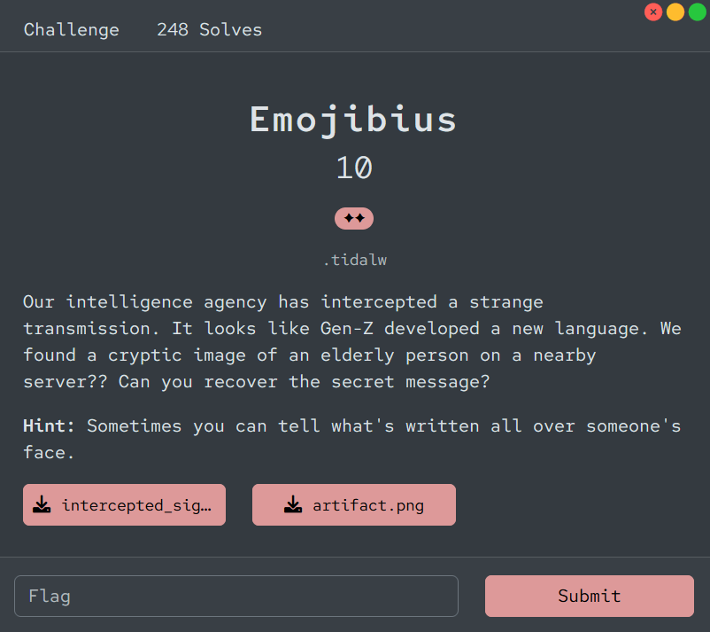

# [Emojibius]

- **CTF Name:** Bronco CTF 2026
- **Category:** Cryptography
- **Difficulty:** 2 Stars
- **Challenge Author:** .tidalw
- **Writeup Author:** Nakata Christian (n4ct) - TCP1P
- **Date:** July 11, 2026

---

## Challenge Description



---

## 1. Solve Steps

### Step 1: Clue Analysis

We're given two files, `artifact.png` and `intercepted_signals.txt`.

**artifact.png**


**intercepted_signals.txt**

```plaintext
🍎🍎 🍎🦊 🍎🍐 🍎🐶 🍎🎈 🍎🍐 🦊🍎 🦊🦊 🦊🍐 🦊🐶 🦊🎈 🍐🍎 🍐🦊 🍐🍐 🍎🦊 🍐🍐 🍎🎈 🍎🦊 🍐🍎 🍎🐶 🍐🐶 🍐🎈 🐶🍎
```

In `artifact.png`, we can see a 5x5 grid containing some characters and a sequence of 5 emojis on the subject's forehead, matching the emojis used in the ciphertext. This immediately brings to mind a Polybius Square cipher, where characters are located using row and column coordinates.

Furthermore, reading the grid left-to-right, top-to-bottom reveals characters that resemble a flag format (`bronco{...}`). By mapping the sequence of emojis on the forehead (🍎, 🦊, 🍐, 🐶, 🎈) as our row and column indicators, we can construct the following substitution table:

|        | 🍎  | 🦊  | 🍐  | 🐶  | 🎈  |
| :----: | :-: | :-: | :-: | :-: | :-: |
| **🍎** |  b  |  r  |  o  |  n  |  c  |
| **🦊** |  {  |  e  |  m  |  0  |  j  |
| **🍐** |  1  |  s  | \_  |  g  |  3  |
| **🐶** |  }  |  a  |  d  |  f  |  h  |
| **🎈** |  i  |  k  |  l  |  p  |  q  |

### Step 2: Retrieve the Flag

With this table, we can decode the ciphertext by splitting each emoji pair and mapping them to the corresponding row and column. For example:

- 🍎🍎 -> row, column -> b
- 🍎🦊 -> row, column -> r
- 🍎🍐 -> row, column -> o
- 🍎🐶 -> row, column -> n
- 🍎🎈 -> row, column -> c

Continuing this process for the entire ciphertext will reveal the hidden message. Since the ciphertext is short, we don't actually need to write a script. But if you want to use the script, here you are.

**Solver Script:**

```python
ciphertext = "🍎🍎 🍎🦊 🍎🍐 🍎🐶 🍎🎈 🍎🍐 🦊🍎 🦊🦊 🦊🍐 🦊🐶 🦊🎈 🍐🍎 🍐🦊 🍐🍐 🍎🦊 🍐🍐 🍎🎈 🍎🦊 🍐🍎 🍎🐶 🍐🐶 🍐🎈 🐶🍎".split()

emojis = ['🍎', '🦊', '🍐', '🐶', '🎈']
grid = [
    ['b', 'r', 'o', 'n', 'c'],
    ['{', 'e', 'm', '0', 'j'],
    ['1', 's', '_', 'g', '3'],
    ['}', 'a', 'd', 'f', 'h'],
    ['i', 'k', 'l', 'p', 'q']
]

flag = ""
for pair in ciphertext:
    row = emojis.index(pair[0])
    col = emojis.index(pair[1])
    flag += grid[row][col]

print(f"Flag: {flag}")
```

Flag: `bronco{em0j1s_r_cr1ng3}`
