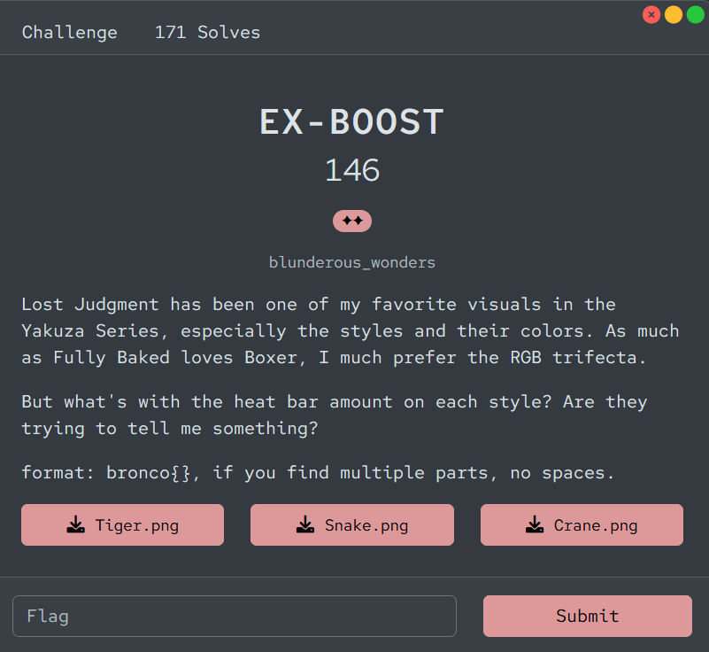
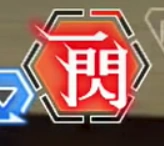
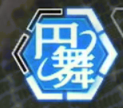
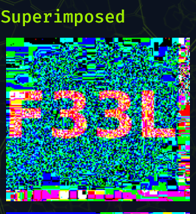
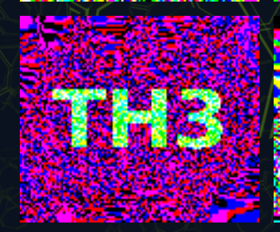
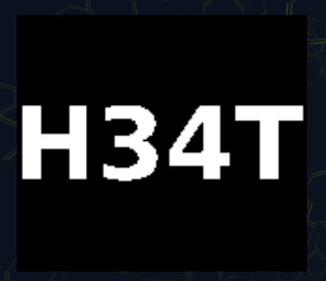

# [EX-BOOST]

* **CTF Name:** Bronco CTF 2026
* **Category:** Forensics
* **Difficulty:** 2 Stars
* **Challenge Author:** blunderous_wonders
* **Writeup Author:** Nakata Christian (n4ct) - TCP1P
* **Date:** July 12, 2026

---

## Challenge Description

---

## 1. Solve Steps

### Step 1: Initial Analysis

We're given 3 images: `Tiger.png`, `Snake.png`, and `Crane.png`.

The challenge description stated `I much prefer the RGB trifecta`, so I thought maybe the flag is hiding in the bit planes. So I used `Aperi Solve` to see the bit planes.

### Step 2: Aperi Solve and the Flag

By uploading the images to Aperi Solve, we can extract the flag part by part.

**Tiger.png (Flag Part 1):**

`F33L`

**Snake.png (Flag Part 2):**

`TH3`

**Crane.png (Flag Part 3):**

`H34T`

Flag: `bronco{F33LTH3H34T}`