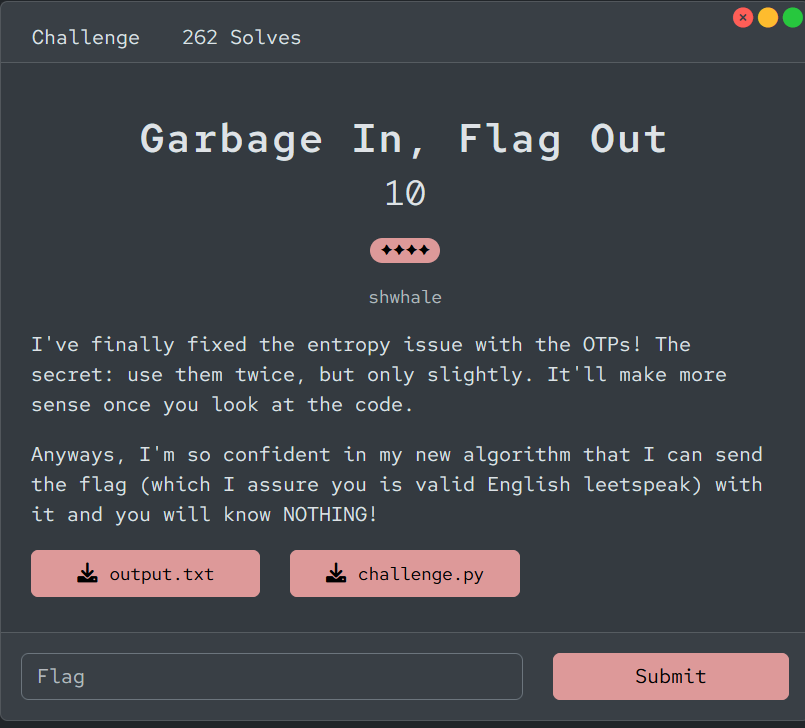

# [Garbage In, Flag Out]

* **CTF Name:** Bronco CTF 2026
* **Category:** Cryptography
* **Difficulty:** 4 Stars
* **Challenge Author:** shwhale
* **Writeup Author:** Nakata Christian (n4ct) - TCP1P
* **Date:** July 11, 2026

---

## Challenge Description



---

## 1. Solve Steps

### Step 1: Initial Analysis

We're given 2 files, `challenge.py` and `output.txt`.

**challenge.py**
```python
import random
import string

FLAG = [REDACTED]
N = len(FLAG)


def scramble(key: bytes):
    nums = []
    for k in key:
        num = 0
        for i in range(8):
            num |= ((k & (1 << i)) >> i) << (7 - i)
        nums.append(num)
    return bytes(nums)


def block_encrypt(key: bytes, string: str):
    keys = [key]

    while len(string) - sum(map(len, keys)) > 0:
        key_ext = []
        for element in keys[-1]:
            newkey = 0
            for i in range(4):
                sub = (element >> (2 * i)) & 3
                sub = (sub & 1) ^ (sub >> 1)
                newkey += sub << (7 - i)

            newkey += random.getrandbits(4)
            key_ext.append(newkey)
        keys.append(bytes(key_ext))

    key = bytes(x for key in keys for x in key)

    output = bytes(key[i] ^ ord(c) for i, c in enumerate(string))
    return output


key = random.randbytes(N)
print("Random garbage:")
real_garb = "".join(random.choices(string.ascii_lowercase, k=2 * N))
garb = block_encrypt(key, real_garb)
print(garb.hex())
print("The flag:")
key = scramble(key)
flag = block_encrypt(key, FLAG)
print(flag.hex())
print("They look equally random, right? Pretty impressive!")
```

**output.txt**
```plaintext
Random garbage:
96dbcaae807788b5e3abae8e91dc467bd6b5291094a33033c7f47fb66cccf6d41b2bc01426033a73f444fa44eb412e3ee249
The flag:
2d4f326d141f0c75e1ff445d23b39880581c09e0585645eab8
They look equally random, right? Pretty impressive!
```

The script encrypts 2 things: a randomly generated string of lowercase letters (`real_garb`) and the flag itself. The encryption uses a custom key expansion where the key is generated block by block.

The critical vulnerability lies in the key expansion algorithm inside the `block_encrypt` function:

```python
    sub = (element >> (2 * i)) & 3
    sub = (sub & 1) ^ (sub >> 1)
    newkey += sub << (7 - i)

newkey += random.getrandbits(4)
```

Notice that only the lower 4 bits of the new key are randomized. The upper 4 bits are entirely deterministic and derived from the previous key block.

Furthermore, the `real_garb` variable is guaranteed to be lowercase letters. In ASCII, all lowercase letters start with the same 3 bits (`011` in binary or hex `0x61` to `0x7a`). This limited character space opens the door for a Known-Plaintext Attack.

### Step 2: Exploitation Strategy

Since we know the first 3 bits of the plaintext, we can instantly deduce the first 3 bits of the initial key block by XOR-ing it with the ciphertext (`garb[0:25]`). For the remaining 5 bits, we only need to bruteforce 26 possibilities (the character `a` to `z`).

For each guessed character:
1. We calculated the theoretical previous key block.
2. We derive the predicted upper 4 bits for the next key block.
3. We validate these predicted bits against the ciphertext of the next block (`garb[25:50]`). Since the next plaintext is also a lowercase letter, the derived key's top 4 bits must correctly align with the `011` binary prefix. Most invalid candidates will be filtered out here.

### Step 3: Solver Script

I wrote a Python script to automate the KPA, filter out the incorrect key candidates, and decrypt the flag payload based on the reversed scrambling logic.

**Solver Script:**
```python
import string

# Hex from output.txt
garb = bytes.fromhex("96dbcaae807788b5e3abae8e91dc467bd6b5291094a33033c7f47fb66cccf6d41b2bc01426033a73f444fa44eb412e3ee249")
flag_enc = bytes.fromhex("2d4f326d141f0c75e1ff445d23b39880581c09e0585645eab8")
N = 25

def scramble_byte(b):
    num = 0
    for i in range(8):
        num |= ((b & (1 << i)) >> i) << (7 - i)
    return num

valid_chars = [ord(c) for c in string.ascii_lowercase]
flag = ""

for i in range(N):
    c1 = garb[i]
    c2 = garb[i + N]
    
    candidates = []
    for p1 in valid_chars:
        k0 = c1 ^ p1
        
        k1_top4 = 0
        for j in range(4):
            sub = (k0 >> (2 * j)) & 3
            sub = (sub & 1) ^ (sub >> 1)
            k1_top4 += sub << (7 - j)
            
        if ((k1_top4 >> 4) ^ (c2 >> 4)) in (6, 7):
            char = chr(flag_enc[i] ^ scramble_byte(k0))
            
            if char in string.printable and char not in ['\n', '\r', '\t', '\x0b', '\x0c']:
                candidates.append(char)
    
    if len(candidates) == 1:
        flag += candidates[0]
    else:
        flag += "[" + "".join(candidates) + "]"

print(f"Flag:{flag}")
```

### Step 4: Extracting the Flag

Running the script gives us the filtered character candidates:

`[bR][rB]o[^n][Sc][_o][{K][^n]0[Dt][_o][Br]4[n^][Td]0[]m]_3[n^][_o][uE][gW]h[}M]`

Since the challenge author assured us he flag is in readable English leetspeak and follows the standard `bronco{...}` format, we can manually trace the correct characters from within the brackets:

- `[bR][rB]o[^n][Sc][_o][{K]` -> `bronco{`
- `[^n]0[Dt]` -> `n0t`
- `[_o][Br]4[n^][Td]0[]m]` -> `r4nd0m`
- `_` -> `_`
- `3[n^][_o][uE][gW]h[}M]` -> `3nough}`

Flag: `bronco{n0t_r4nd0m_3nough}`