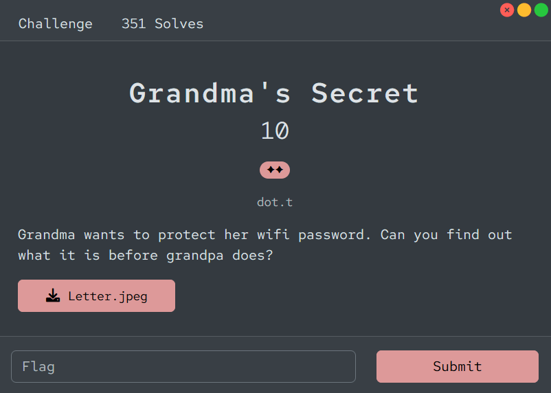
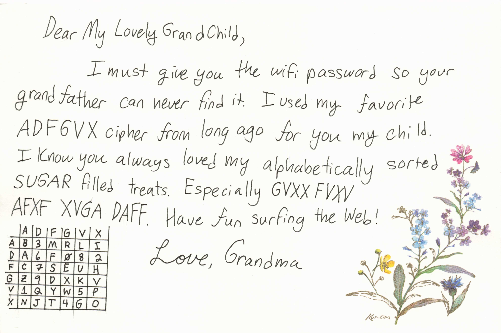
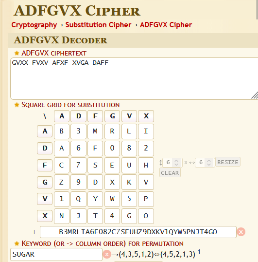

# [Grandma's Secret]

- **CTF Name:** Bronco CTF 2026
- **Category:** Cryptography
- **Difficulty:** 2 Stars
- **Challenge Author:** dot.t
- **Writeup Author:** Nakata Christian (n4ct) - TCP1P
- **Date:** July 11, 2026

---

## Challenge Description

---

## 1. Solve Steps

### Step 1: Clue Analysis

We're given an image of a letter from grandma. From the letter, we got some information:
- Grandma uses the ADFGVX cipher.
- The ciphertext is `GVXX FVXV AFXF XVGA DAFF`.
- The key for this ciphertext is `SUGAR`.
- There's a 6x6 square at the bottom left of the letter.
- The plaintext is related to "SUGAR filled treats".

### Step 2: Decrypt the Ciphertext

I went to `https://www.dcode.fr/adfgvx-cipher` to decrypt this ciphertext. I entered the ciphertext `GVXX FVXV AFXF XVGA DAFF`, the key `SUGAR`, and filled in the 6x6 square for substitutions.

### Step 3: Retrieving the Flag

After filling in all the required fields, I decrypted the ciphertext and got the plaintext `jellydonut`.

Flag: `bronco{jellydonut}`