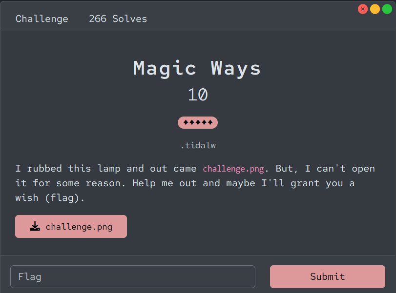
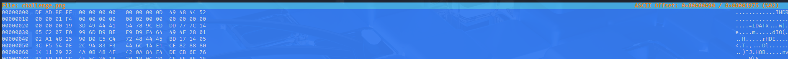

# [Magic Ways]

- **CTF Name:** Bronco CTF 2026
- **Category:** Forensics
- **Difficulty:** 5 Stars
- **Challenge Author:** .tidalw
- **Writeup Author:** Nakata Christian (n4ct) - TCP1P
- **Date:** July 12, 2026

---

## Challenge Description



---

## 1. Solve Steps

### Step 1: Clue Analysis

We're given 1 image file named `challenge.png`. When I opened the image, the image corrupted. Because of the title `Magic Ways`, I know it means magic bytes. So I used `hexeditor` to see the magic bytes.

### Step 2: Hex Analysis

With `hexeditor`, we can see that the first 8 bytes of the image header are corrupted and replaced with `DE AD BE EF 00 00 00 00`. The correct magic bytes for a `.png` file should be `89 50 4E 47 0D 0A 1A 0A`.



Additionally, looking at the IHDR chunk data, the image height was purposely set to `00 00 00 00` (0 pixels), and the original IHDR CRC checksum was also wiped out to `00 00 00 00`. This causes an "Invalid IHDR data" or "CRC error" when opening the file, preventing us from viewing the image or simply guessing the height using standard CRC brute-force tools.

### Step 3: Final Image Fix

Since the original CRC was completely cleared, we cannot brute-force the correct height using the checksum. Instead, we can calculate the real height mathematically by parsing the raw pixel data directly from the `IDAT` chunks.

Knowing the image uses RGB color type (3 bytes per pixel) and has a width of 500 pixels, each uncompressed row (scanline) requires exactly:

(500 x 3) + 1 filter byte = 1501 bytes

By decompressing the total IDAT data and dividing its size by 1501, we can determine the exact height. I created the following minimalist script to patch the header, calculate the correct dimensions, and compute a valid new CRC all at once:

**Solver Script**

```python
import zlib
import struct
import sys

def pngfix(input_file, output_file):
    with open(input_file, "rb") as f:
        data = bytearray(f.read())

    data[:8] = b'\x89PNG\r\n\x1a\n'
    width = struct.unpack('>I', data[16:20])[0]
    scanline_len = 1 + (width * 3)

    offset = 8
    idat_data = bytearray()
    while offset < len(data):
        chunk_len = struct.unpack('>I', data[offset:offset+4])[0]
        chunk_type = data[offset+4:offset+8]

        if chunk_type == b'IDAT':
            idat_data.extend(data[offset+8:offset+8+chunk_len])
        elif chunk_type == b'IEND':
            break

        offset += 12 + chunk_len

    if not idat_data:
        print("IDAT chunk not found")
        sys.exit(1)

    try:
        decompressed = zlib.decompress(idat_data)
    except Exception as e:
        print(f"Decompress failed: {e}")
        sys.exit(1)

    calculated_height = len(decompressed) // scanline_len

    print(f"Width: {width} | Calculated Height: {calculated_height}")

    data[20:24] = struct.pack('>I', calculated_height)
    ihdr_chunk_data = data[12:29]
    new_crc = zlib.crc32(ihdr_chunk_data) & 0xffffffff
    data[29:33] = struct.pack('>I', new_crc)

    with open(output_file, "wb") as f:
        f.write(data)
    print(f"Done: {output_file}")

if __name__ == "__main__":
    infile = sys.argv[1] if len(sys.argv) > 1 else "challenge.png"
    outfile = sys.argv[2] if len(sys.argv) > 2 else "fixed.png"
    pngfix(infile, outfile)
```

### Step 4: Retrieve the Flag

After the hex is fixed, the flag is in the PNG.


Flag: `bronco{wh4t_ar3_mag1c_byt3s}`
