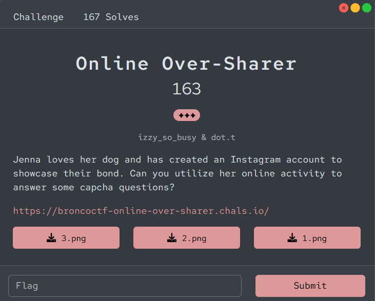
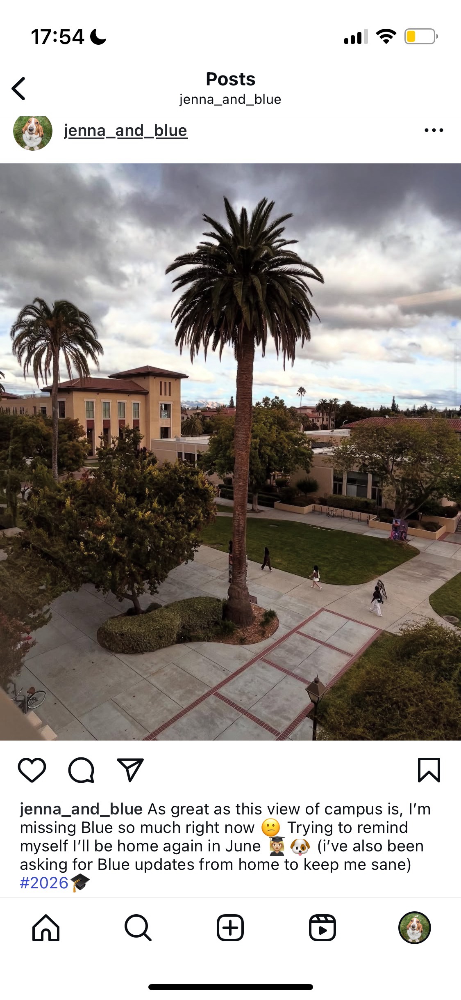
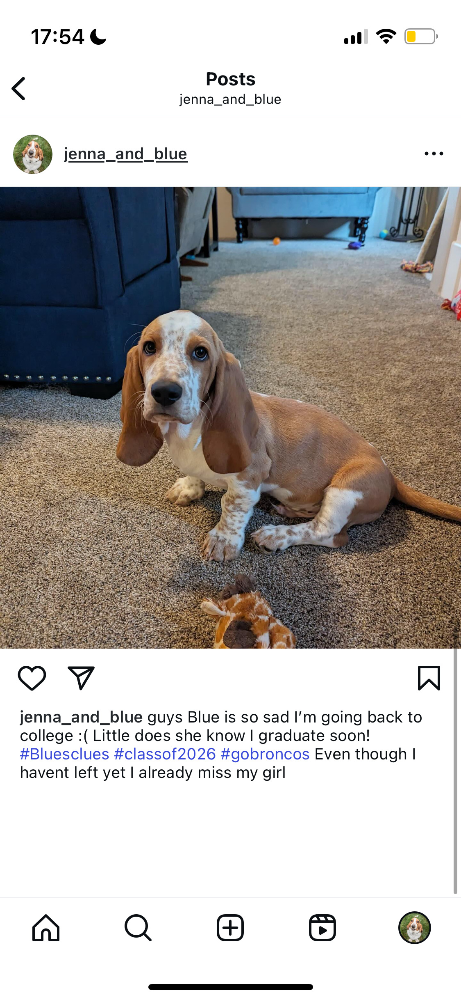
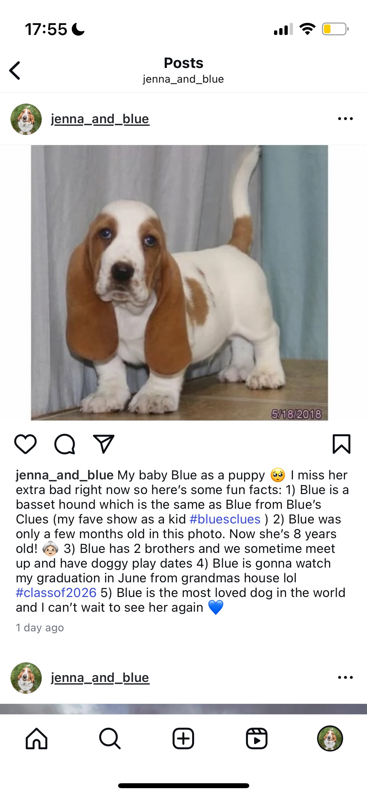
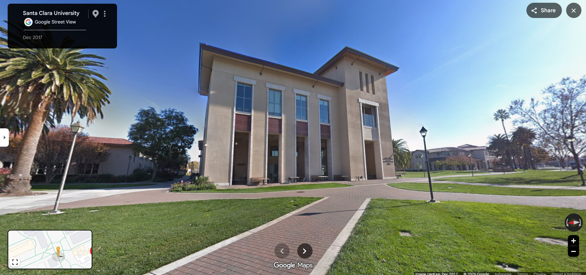
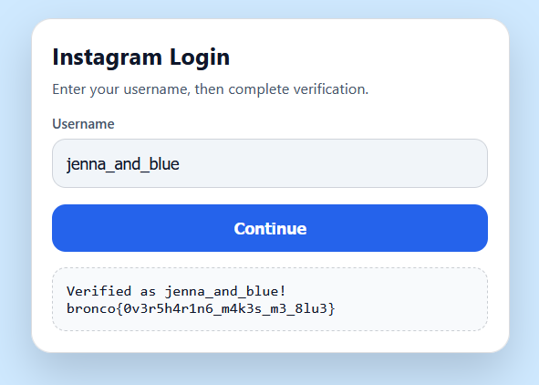

# [Online Over-Sharer]

- **CTF Name:** Bronco CTF 2026
- **Category:** OSINT
- **Difficulty:** 3 Stars
- **Challenge Author:** izzy_so_busy & dot.t
- **Writeup Author:** Nakata Christian (n4ct) - TCP1P
- **Date:** July 12, 2026

---

## Challenge Description

---

## 1. Solve Steps

### Step 1: Clue Analysis

We're given 3 images that look like Instagram posts with very descriptive captions and a link `https://broncoctf-online-over-sharer.chals.io/`. The link points to a custom Instagram login page.

### Step 2: Login

Based on the provided images, we can see that the account owner's username is `jenna_and_blue`. I enter the username `jenna_and_blue` and some verification questions appeared. We have to answer these to get the flag.

### Step 3: Answering the Questions

- What was the breed of your first dog?
On the image `3.png`, we can clearly see the breed of Blue which is `basset hound`.

- When are you graduating? (mm/yyyy)
From `1.png` and `3.png`, we know that Jenna will graduate in June 2026 so the answer is `06/2026`.

- What is the total number of siblings that your dog has?
From `3.png` we know that Blue has `2` brothers.

- What building gives your favorite view of SCU's campus?
This one is a little tricky. The only clue we got from the images provided is a view from a building to another building (`1.png`). So I go to Google Maps to walk around SCU's campus (Santa Clara University) and found the exact building which is Santa Clara University Library

After adjusting the angle, I found that the building Jenna took the picture of this library from is `Kenna Hall`.

- Where will your dog be watching your graduation from?
From `3.png`, we can see that Blue going to watch Jenna's graduation from `grandma's house`.

- Who's the original voice actor of a pink friend in your favorite childhood TV show?
Again, from `3.png` we know that Jenna's favorite childhood TV show is "Blue's Clues". The "pink friend" from Blue's Clues is Magenta. And Magenta is voiced by `Kyalee Chanda`.

### Step 4: Retrieving the Flag

After answering all those questions, we got the flag.

Flag: `bronco{0v3r5h4r1n6_m4k3s_m3_8lu3}`