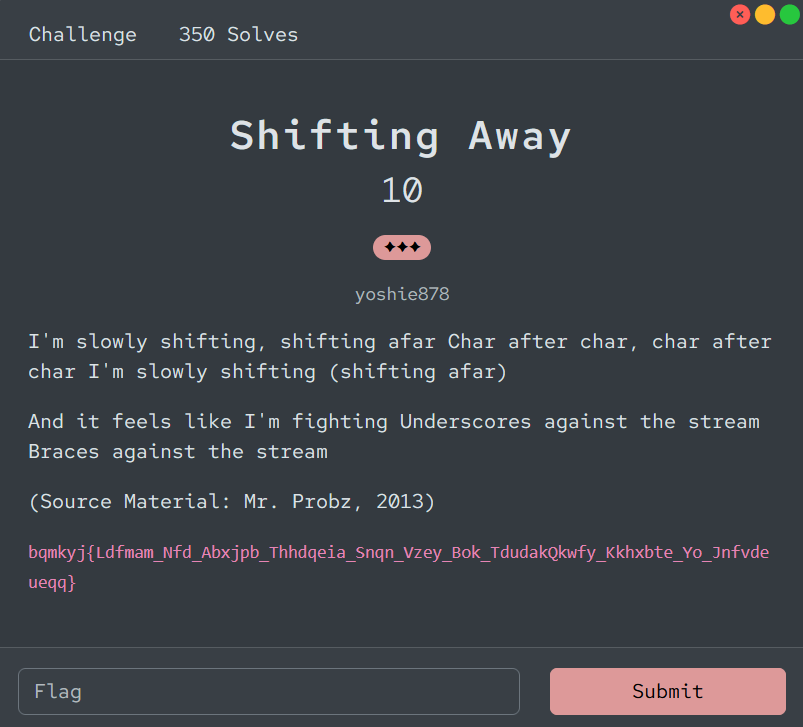

# [Shifting Away]

- **CTF Name:** Bronco CTF 2026
- **Category:** Cryptography
- **Difficulty:** 3 Stars
- **Challenge Author:** yoshie878
- **Writeup Author:** Nakata Christian (n4ct) - TCP1P
- **Date:** July 11, 2026

---

## Challenge Description



---

## 1. Solve Steps

### Step 1: Clue Analysis

From the text, we can break down the encryption mechanism:
- `I'm slowly shifting, shifting afar Char after char, char after char I'm slowly shifting` indicates a Progressive Caesar Cipher, meaning the shift value increases progressively for every character.
- `And it feels like I'm fighting Underscores against the stream Braces against the stream` means that special characters like `_`, `{`, and `}` are not encrypted, but they still advance the shift index (they take up a slot in the stream).

By analyzing the format, the ciphertext starts with `bqmkyj{` which should decrypt to `bronco{`.
- `b` (index 0) -> shift 0 -> `b`
- `q` (index 1) -> shift 1 -> `r`
- `m` (index 2) -> shift 2 -> `o`

This confirms that the decryption formula is plaintext character = ciphertext character + index.

### Step 2: Writing the Decryption Script

Since standard tools like CyberChef freeze the shifting index when encountering non-alphabet characters, I wrote a Python script to handle the custom progressive shift.

**Solver Script:**
```python
ciphertext = "bqmkyj{Ldfmam_Nfd_Abxjpb_Thhdqeia_Snqn_Vzey_Bok_TdudakQkwfy_Kkhxbte_Yo_Jnfvdeueqq}"
plaintext = ""

for i, char in enumerate(ciphertext):
    if char.isalpha():
        if char.isupper():
            start = ord('A')
            plaintext += chr((ord(char) - start + i) % 26 + start)
        else:
            start = ord('a')
            plaintext += chr((ord(char) - start + i) % 26 + start)
    else:
        plaintext += char

print(plaintext)
```

### Step 3: Retrieving the Flag

Running the script successfully decrypts the ciphertext and yields the final plaintext.

Flag: `bronco{Slowly_But_Surely_Shifting_Away_Into_The_PascalSnake_Strings_Of_Characters}`