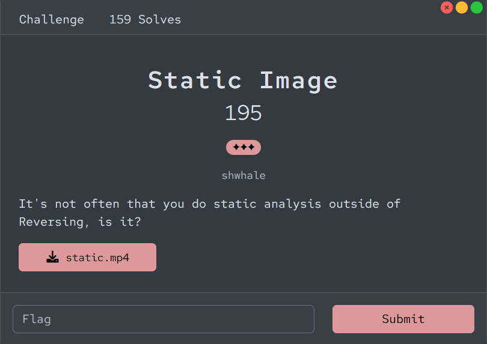
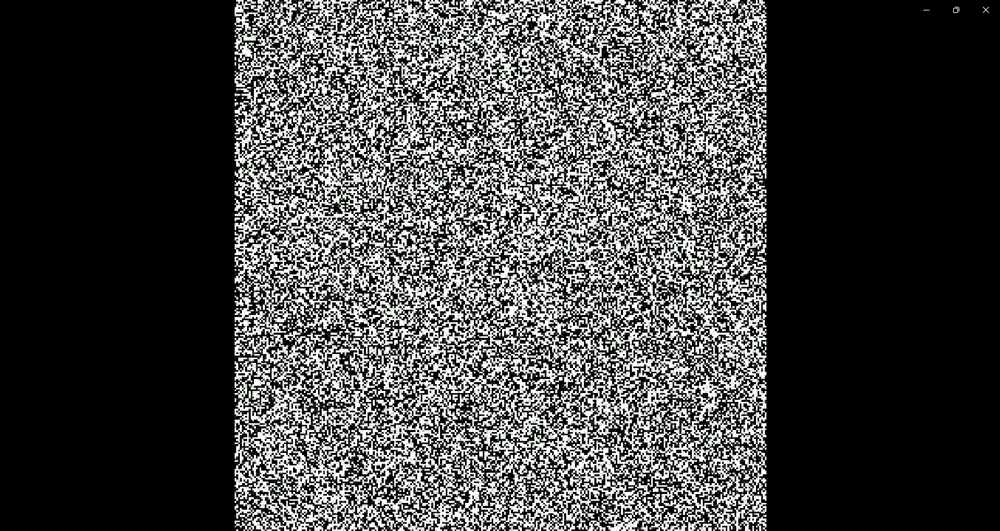

# [Static Image]

* **CTF Name:** Bronco CTF 2026
* **Category:** Forensics
* **Difficulty:** 3 Stars
* **Challenge Author:** shwhale
* **Writeup Author:** Nakata Christian (n4ct) - TCP1P
* **Date:** July 12, 2026

---

## Challenge Description

---

## 1. Solve Steps

### Step 1: Clue Analysis

We are given 1 `.mp4` video file featuring classic lost signal static from a TV.

But, if you look closely, there's a sequence of hidden characters resembling the flag. After a few tries, I finally constructed the flag.

Flag: `bronco{n0w_th4ts_dyn4m1c}`