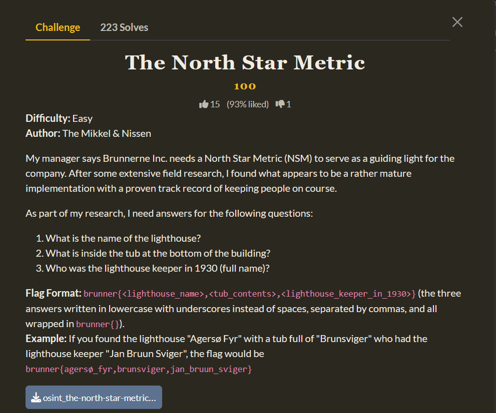
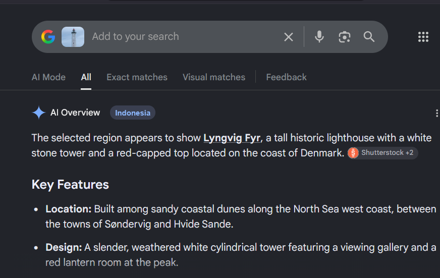
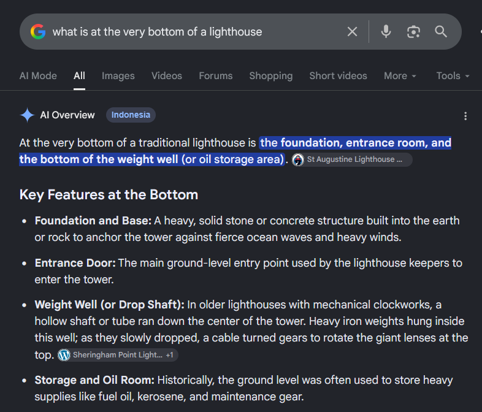
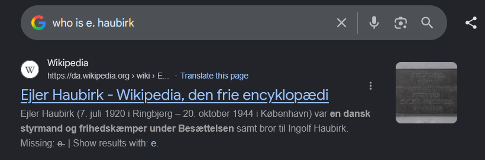

# [The North Star Metric]

* **CTF Name:** BrunnerCTF 2026
* **Category:** OSINT
* **Difficulty:** Easy
* **Writeup Author:** Nakata Christian (n4ct) - TCP1P
* **Date:** August 21, 2026

---

## Challenge Description

---

## 1. Solve Steps

### Step 1: Clue Analysis

We're given an image of a man walking towards a lighthouse. Our goals are to find the name of the lighthouse, the lighthouse's tub contents, and the name of the keeper in 1930.

### Step 2: Name of the Lighthouse

Using Google Lens on the lighthouse gives the name of the lighthouse which is `Lyngvig Fyr`.

### Step 3: In the Tub

If we search "what is in the tub of lyngvig lighthouse", the result will say "mercury bath" or "mercury float", but those aren't the true answer.

So we need to search a bit further. Since I don't really know about the inside of a lighthouse, I need to search for what is this "tub". Search for what is at the very bottom of a lighthouse will give this result.

One of the results caught my attention which is "Weight Well" or "Drop Shaft". Searching for what is inside the weight well will gives our true answer which is `sand`.

### Step 4: The Keeper in 1930

Search directly for the full name of the keeper of Lyngvig Fyr in 1930 will give us "E. Haubirk" instead of the full name. So I searched "who is e. haubirk" and got his full name which is `Ejler Haubirk`.

Flag: `brunner{lyngvig_fyr,sand,ejler_haubirk}`