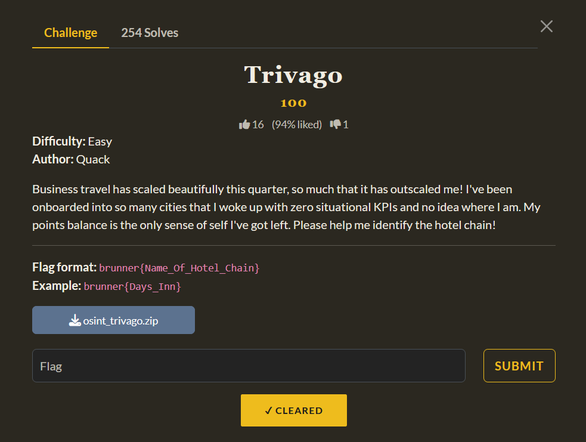
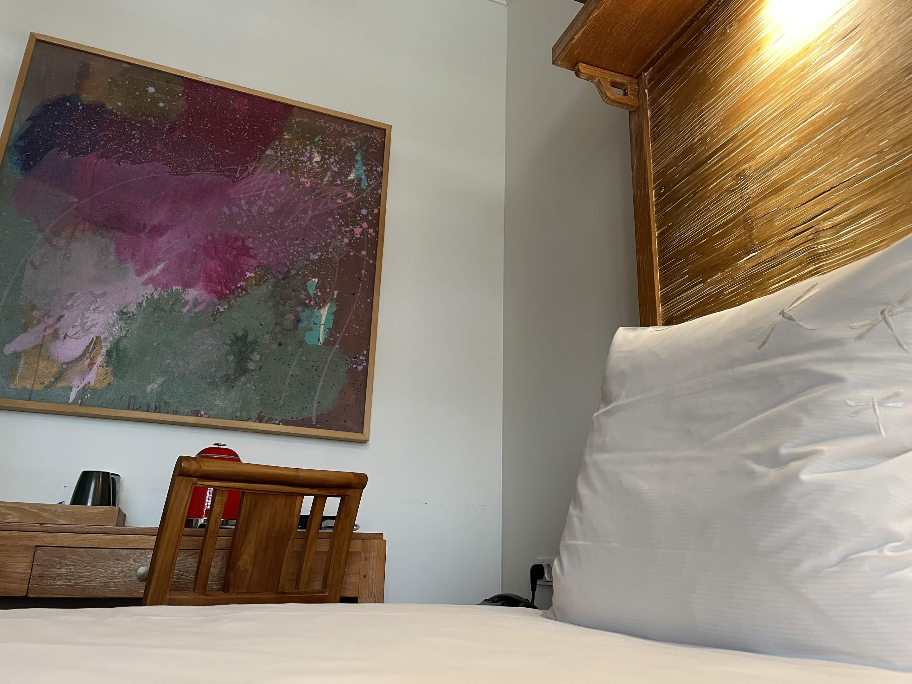
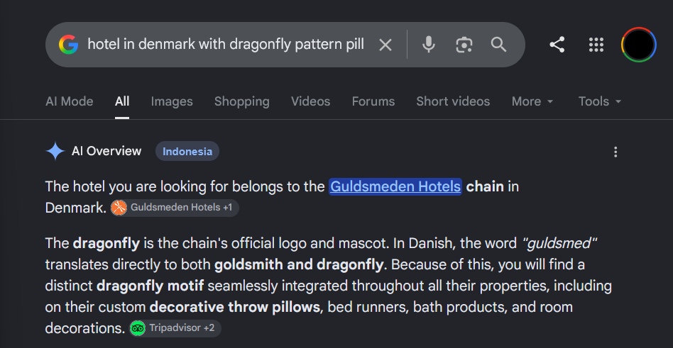
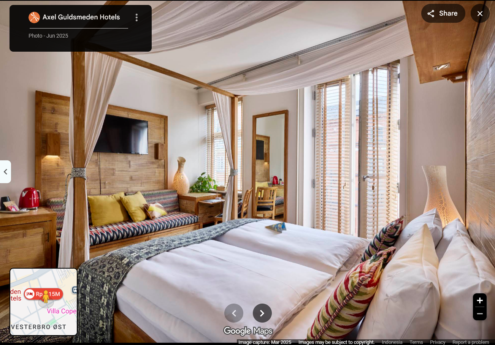

# [Trivago]

* **CTF Name:** BrunnerCTF 2026
* **Category:** OSINT
* **Difficulty:** Easy
* **Writeup Author:** Nakata Christian (n4ct) - TCP1P
* **Date:** August 21, 2026

---

## Challenge Description

---

## 1. Solve Steps

### Step 1: Clue Analysis

We're given an image of a hotel room. If we look closely, we can see a dragonfly pattern on the pillow. Doing a reverse image search using Google Lens with the full image didn't give any clues. The results were instead focused on the painting. Cropping the image to focus on the pillow also didn't give any clues. So we need to search for this on our own.

### Step 2: Google Search

Since Brunner CTF is held by a Danish organization, I searched for hotels in Denmark with a dragonfly pattern pillow and found the "Guldsmeden Hotels" chain in Denmark.

Using Google Maps, we can see that "Axel Guldsmeden Hotel", one of the hotels in the Guldsmeden chain, uses the exact same pillow.

So the flag is the name of the hotel chain which is `Guldsmeden Hotels`. Btw, "guldsmed" is Danish for "dragonfly".

Flag: `brunner{Guldsmeden_Hotels}`