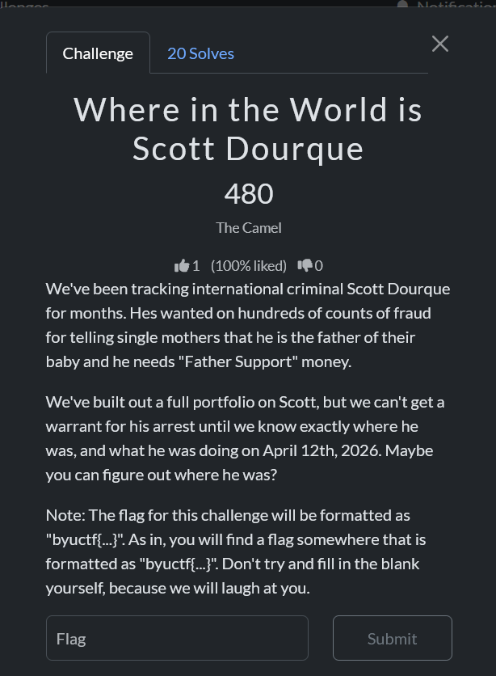
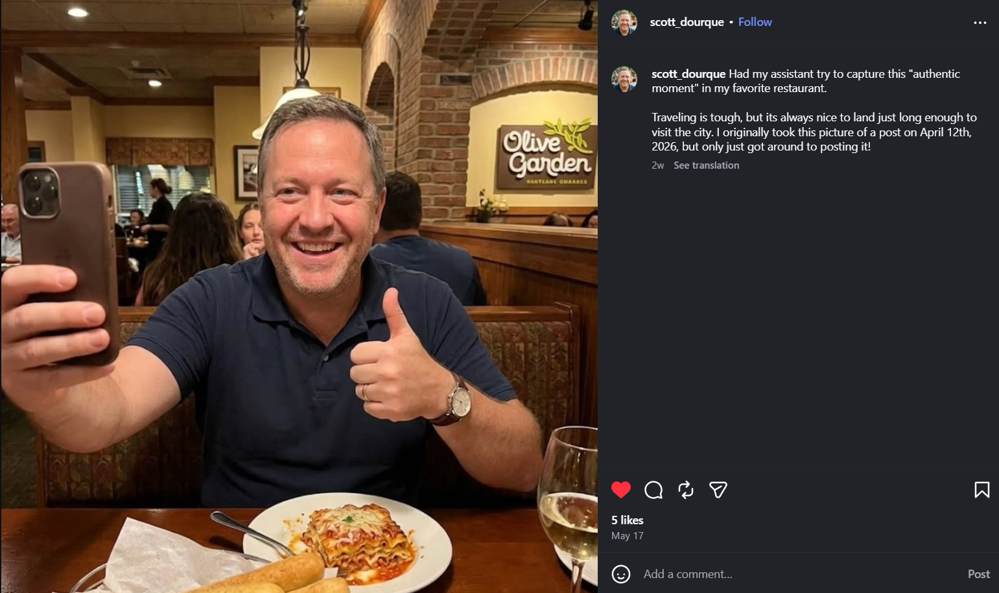
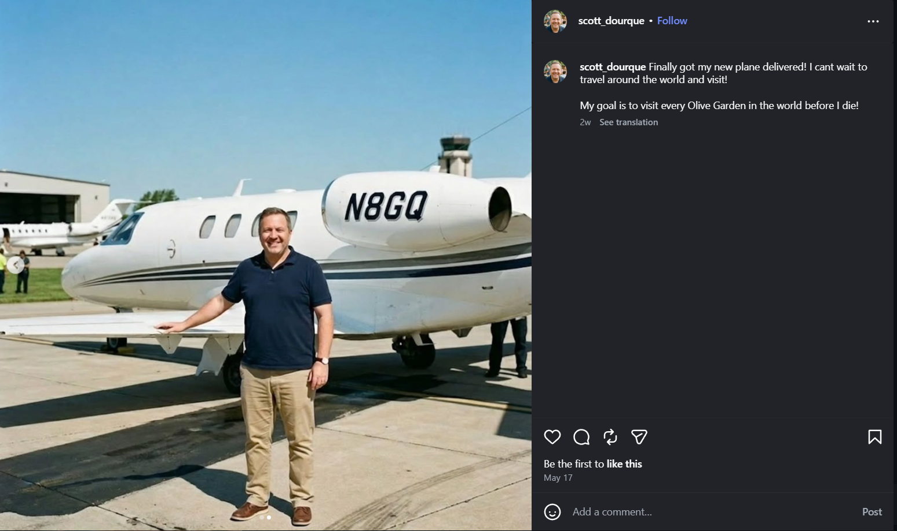
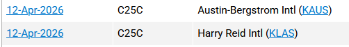
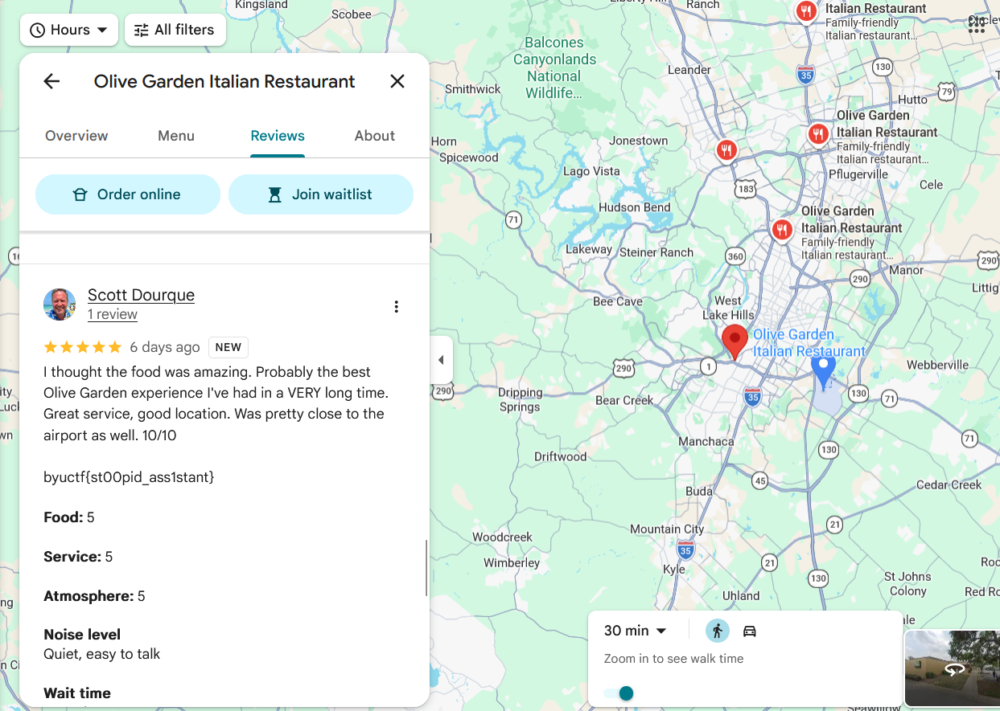

# [Where in the World is Scott Dourque]

- **CTF Name:** byuctf 2026
- **Category:** OSINT
- **Hint:** None
- **Challenge Author:** The Camel
- **Writeup Author:** Nakata Christian (n4ct) - TCP1P
- **Date:** May 31, 2026

---

## Challenge Description

---

### Step 1: Initial Reconnaissance

So, we were given two clues here. First, the target's name is Scott Dourque. Second, he was in a specific location on April 12 2026, and we needed to figure out where he was on that day. I immediately did some Google dorking using `intext:"Scott Dourque"` and found an Instagram account under his name, along with a post featuring a man and an airplane. I then went to Instagram, searched for that account, and found this profile.

The first photo I examined was just an ordinary picture of him at a beach. Nothing interesting. However, the second photo gave me a clue that he traveled to an Olive Garden restaurant on April 12 2026, in a city where he landed "just long enough to visit."

Next was a photo of him visiting Europe. Again, another rabbit hole. I went to the next photo and found a post about him and his new airplane, where he mentioned wanting to visit every Olive Garden in the world. In the next photo of that carousel, I found the plane's tail number, which is N8GQ. With this code, we could track the plane's route and find out which airport it landed at.

### Step 2: Route Tracking

After getting the plane's code, I went to flightaware.com to check its route. I found out that it landed at Austin-Bergstrom International Airport on April 12 2026, confirming that he went to Austin, Texas, on that date.

### Step 3: Google Maps

Connecting all the clues we had:
1. He went to an Olive Garden Restaurant in a specific city on April 12 2026
2. He flew to Austin on April 12 2026
3. He only had "just long enough" time to visit the city

We knew that he went to an Olive Garden in Austin, Texas, near the Austin-Bergstrom International Airport (because he mentioned only having a short amount of time). The question was, which one? There are multiple Olive Garden locations around that airport. Because of his time constraint, I deduced that he went to the one closest to the airport. I then checked the Google Maps reviews for that location and found the flag in a review left by Scott Dourque.

**Flag:** `byuctf{st00pid_ass1stant}`

---

Shoutout to `The Camel` for this amazing OSINT challenge! The step-by-step logic for this challenge is very structured and the story is incredibly well-written. It was only solved by 20 out of 509 teams, and my team is very proud to be one of them, which helped us secure 11th place in the final standings!