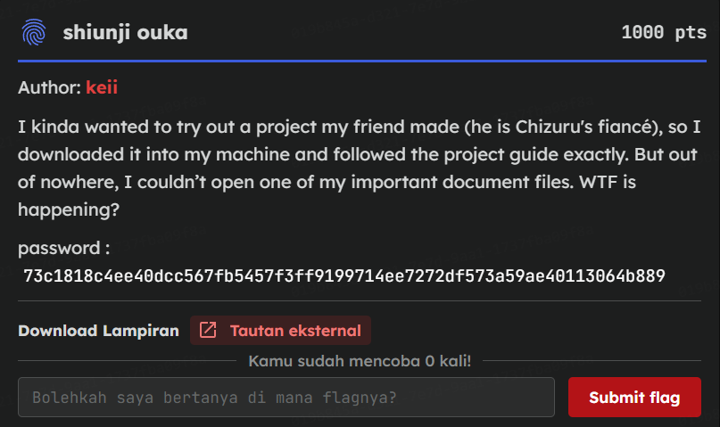
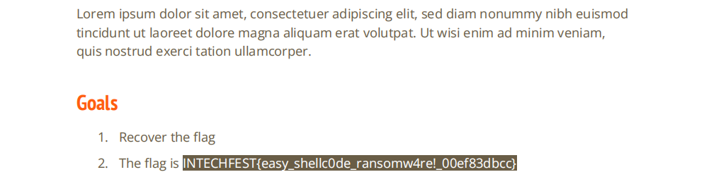

# [Shiunji Ouka]

* **CTF Name:** Intechfest 2025
* **Category:** Forensics
* **Difficulty:** Unknown
* **Hint:** None
* **Challenge Author:** keii (SNI Cybersecurity Team)
* **Writeup Author:** Nakata Christian (n4ctbyte)
* **Date:** January 6, 2026
* **Source:** [Link to Challenge](https://tcp.1pc.tf/games/10/challenges#236-shiunji-ouka)
* **File Source:** [Link to File](https://drive.google.com/file/d/1_NQBSTmxrlTlKRmCQdAtAqNiLVe9ZRW-/view)

---

## Challenge Description



## 1. Executive Summary

**Objective:**
To investigate a compromised virtual machine, identify the malware infection chain and recover a critical PDF document encrypted by a custom ransomware.

**Result:**
The investigation traced the attack vector from Firefox browser history to a malicious GitHub repository. By analyzing the `util.js` dropper and reverse-engineering the `sc0d64` binary (specifically identifying a custom 1224-byte encryption chunk), the file `02-05-2025-15-01-UTC+7_report_general.pdf` was successfully decrypted to reveal the flag: `INTECHFEST{easy_shellc0de_ransomw4re!_00ef83dbcc}`.

**Method:**
The investigation employed Disk Forensics (FTK Imager), Browser Forensics (SQLite database analysis), Malware Analysis (JavaScript deobfuscation), and Reverse Engineering (Assembly/Shellcode analysis) to bypass the obfuscation layers.

---

## 2. Evidence Identification

This section provides details regarding the initial evidence file.

- **Filename:** `shiunji-ouka.ad1`
- **Size:** `235 MB`
- **SHA-256:** `be98a852edc687a5ca4ee4aab6573436f1a2edb1e2953383798cb5a629b0464a`

**Initial Check:**
Verifying file type using signature headers (Magic Bytes).

```bash
$ file shiunji-ouka.ad1             
shiunji-ouka.ad1: data
```

---

## 3. Investigation Steps

### Step 1: Disk Forensics & Victim Identification

The investigation began by mounting the `shiunji-ouka.ad1` image using FTK Imager. Navigating to the user's Documents directory, I located the target file: `02-05-2025-15-01-UTC+7_report_general.pdf`.

**Observation:** The file was corrupt. A hex inspection showed high entropy and a lack of the standard `%PDF-` signature header, indicating a full or partial encryption.

### Step 2: Tracing the Infection Source

To find the entry point, I analyzed the browser history using the Firefox `places.sqlite` database.
- **Finding:** The user visited a GitHub repository named `jonscafe/ctf-book`.
- **Correlation:** This matched the challenge description regarding a "friend's project."

I inspected the repository and found `init.sh` file containing the trigger :
```bash
python3 -m pip install -r requirements.txt
node static/admin/js/util.js
```
This script executes `util.js`, identifying it as the primary malware dropper.

### Step 3: Analyzing the Dropper

The `util.js` file was heavily obfuscated. After deobfuscation, the script revealed a sophisticated staging mechanism.

**Code Breakdown:**
1. **Split Payload:** The script defines a `parts` array containing URLs to four distinct hex strings hosted on Github Gist. This is a common evasion technique to bypass network filters by using legitimate domains.

2. **Reassembly:** It downloads these chunks, stitches them together, and converts the hex string into a binary buffer.

3. **Execution & Cleanup:**
- Writes the buffer to `./sc0d64`.
- Runs `fs.chmodSync('./sc0d64', 493)` (which is 755 in octal) to make it executable.
- Executes the binary using `execFile`.
- Immediately deletes the file using `fs.unlinkSync` to hinder forensic recovery.

### Step 4: The "1224 Byte" Anomaly

At this stage, I attempted tp recover the PDF. Assuming standard ransomware behavior, I tried manually fixing the PDF and decrypting the first 1024 or 4096 bytes (standard block sizes). All attempts failed.

Realizing the encryption logic was non-standard, I extracted the `sc0d64` binary (reconstructed from the Gist URLS) and analyzed it using `objdump` and `ndisasm`.

**Discovery:** Inside the shellcode's logic, I found a spesific immediate value being moved into a register before the encryption loop
```code snippet
mov eax, 0x4c8  ; 0x4c8 (Hex) = 1224 (Decimal)
```
The author deliberately chose 1224 bytes as the specific encryption chunk size. It is not a power of two (unlike 512, 1024, 2048). This custom size was the reason standard recovery attempts failed. The malware wasn't encrypting the whole file or a standard block, but exactly 1224 bytes of data.

### Step 5: Shellcode Deobfuscation (XOR Layer)

Further assembly analysis revelaed that `sc0d64` contained an internal XOR decryption loop to unpack its final payload in memory.

**Assembly Routine:**
```code snippet
00000011  48BBFFCB1C8AF083  mov rbx,0x15f283f08a1ccbff  ; The 64-bit XOR Key
0000001B  48315827          xor [rax+0x27],rbx          ; Decryption Loop
```
Using the key `0x15f283f08a1ccbff`, I decrypted the shellcode layer.

### Step 6: Extracting the Ransomware Core

The decrypted shellcode executed a Python one-liner command. This script contained the core cryptographic logic.

```python
python3 -c '... k=bytes.fromhex("07d4ac3681724a0f21db6703616a8ab2499ba42d0955937c31f22a7de03b5e1f"); ... Cipher(algorithms.AES(k),modes.CBC(iv))...'
```

**Encryption Parameters:**
- **Algorithm:** AES-256-CBC
- **Key:** `07d4ac3681724a0f21db6703616a8ab2499ba42d0955937c31f22a7de03b5e1f`
- **IV:** Stored in the first 16 bytes of the file

### Step 7: Final Decryption

With the correct key and parameters, I wrote a solver to decrypt the file.

```python
from cryptography.hazmat.primitives.ciphers import Cipher, algorithms, modes
from cryptography.hazmat.backends import default_backend
from cryptography.hazmat.primitives import padding

key = bytes.fromhex("07d4ac3681724a0f21db6703616a8ab2499ba42d0955937c31f22a7de03b5e1f")
filename = "02-05-2025-15-01-UTC+7_report_general.pdf"

with open(filename, "rb") as f:
    data = f.read()

iv = data[:16]
ciphertext = data[16:]

cipher = Cipher(algorithms.AES(key), modes.CBC(iv), backend=default_backend())
decryptor = cipher.decryptor()
padded_plaintext = decryptor.update(ciphertext) + decryptor.finalize()

unpadder = padding.PKCS7(128).unpadder()
plaintext = unpadder.update(padded_plaintext) + unpadder.finalize()

with open("recovered_flag.pdf", "wb") as f:
    f.write(plaintext)
```

I opened the `recovered_flag.pdf` and got the flag `INTECHFEST{easy_shellc0de_ransomw4re!_00ef83dbcc}`.



---

## 4. Conclusion

This challenge simulated a realistic infection scenario involving a multi-stage attack. The difficulty lay in the "Persistance" and "Obfuscation" layers:
1. **Persistance:** The dropper `util.js` cleans up the binary, forcing analysts to recover it from the network source (Github).

2. **Obfuscation:** The shellcode used a custom encryption size (1224 bytes) which rendered standard heuristic analysis ineffective. Success required precise low-level reverse engineering to identify this anomaly.