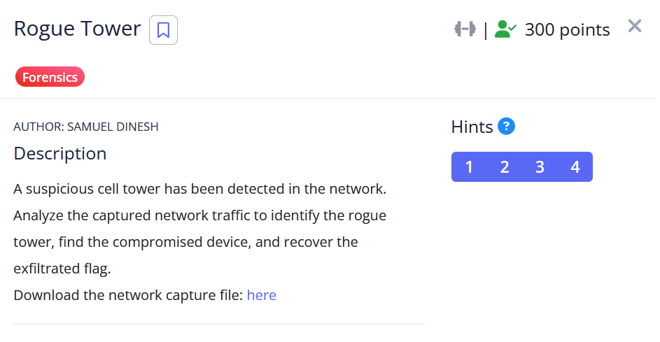

# [Rogue Tower]

- **CTF Name:** picoCTF 2026
- **Category:** Forensics
- **Difficulty:** 300 points
- **Hint:**
  - Look for unauthorized test network broadcasts on UDP port 55000
  - Find the device that connected to the rogue tower by checking HTTP User-Agent headers
  - The encryption key is derived from the victim device's IMSI
  - The exfiltrated data is split across multiple HTTP POST requests
- **Challenge Author:** SAMUEL DINESH
- **Writeup Author:** Nakata Christian (n4ctbyte)
- **Date:** March 13, 2026
- **Source:** [Link to Challenge](https://play.picoctf.org/events/79/challenges/714?category=4&page=1)

---

## Challenge Description



## 1. Executive Summary

**Objective:**
To analyze a network capture (`.pcap`) to identify a rogue cell tower (IMSI Catcher), track the compromised device, and recover exfiltrated data that was chunked and encrypted using a key derived from the victim's IMSI.

**Result:**
The investigation successfully identified the rogue tower IP (`198.51.100.155`) and the correct victim's IMSI (`310410868411126`). By extracting the chunked Base64 payload and executing a Known Plaintext Attack (KPA), it was discovered that the XOR key was derived from the last 8 digits of the IMSI (`68411126`). The decrypted flag is: `picoCTF{r0gu3_c3ll_t0w3r_f068ab34}`.

**Method:**
The methodology involved network traffic analysis using Wireshark and `tshark` (filtering UDP broadcasts and HTTP requests), payload reconstruction, and writing a custom Python script to perform a Known Plaintext Attack (KPA) to reverse the XOR encryption.

---

## 2. Evidence Identification

This section provides details regarding the initial evidence file.

- **Filename:** `rogue_tower.pcap`
- **Size:** `3.2 KB`
- **SHA-256:** `a5ffd348a8e8a31903fb429b8c2c758af5ecbf21076f6de2f768f1715127f7be`

**Initial Check:**
Verifying file type using signature headers (Magic Bytes).

```bash
$ file rogue_tower.pcap
rogue_tower.pcap: pcap capture file, microsecond ts (little-endian) - version 2.4 (Raw IPv4, capture length 65535)
```

---

## 3. Investigation Steps

### Step 1: Locating the Rogue Tower

According to the first hint, the rogue tower broadcasts on `UDP` port `55000`. Applying the Wireshark filter `udp.port == 55000` revealed broadcast packets originating from `198.51.100.155`. The packet data contained strings like `CARR IER: Ver izon PLM N=310410 CELLID= 13323`, confirming this IP acts as the rogue base station.

### Step 2: Tracking the Victim

Next, I filtered for HTTP traffic (`http`) to see which devices connected to the tower. Multiple devices sent `GET /api/register` requests. By inspecting Packet #16 (the registration request for `10.100.246.233`), the victim's User-Agent was revealed:
`User-Agent: MobileDevice/1.0 (IMSI:310410868411126; CELL:92130)`. Target IMSI: `310410868411126`

### Step 3: Extracting the Exfiltrated Payload

The data was exfiltrated in chunks via HTTP POST requests to the rogue tower. I used tshark to quickly extract the raw hex data from these packets (Packets 18-22):

```bash
$ tshark -r rogue_tower.pcap -Y 'http.request.method == "POST" && ip.dst == 198.51.100.155' -T fields -e http.file_data
526c4658586e4a6c64
45314543464e45416d
...
```

Concatenating the hex strings and decoding them resulted in a Base64 string: `RlFXXnJldE1ECFNEAm5RBVpUa0UBRgFEaV4EBwlQUAUCRQ==`

### Step 4: Known Plaintext Attack (KPA)

The hint stated the encryption key is "derived" from the IMSI. Attempting a direct XOR with the full 15-digit IMSI resulted in garbled text.

Knowing this is a picoCTF challenge, the plaintext must begin with `picoCTF{`. Since XOR encryption is reversible (Plaintext XOR Ciphertext = Key), I applied a Known Plaintext Attack using the first 8 bytes of the decoded Base64 payload against the string `picoCTF{`.

The calculation yielded the string: 68411126.
This exactly matches the last 8 digits of the victim's IMSI (310410**868411126**). The "derived" key was simply the tail of the IMSI repeated.

### Step 5: Final Decryption

Using the discovered 8-digit key, I wrote a Python script to decrypt the entire payload.

**Solver Script:**

```python
import base64

hex_data = "526c4658586e4a6c6445314543464e45416d35524256705561305542526746456156344542776c515541554352513d3d"
b64_str = bytes.fromhex(hex_data).decode()
encrypted = base64.b64decode(b64_str)

key = "68411126"

decrypted = "".join(chr(b ^ ord(key[i % len(key)])) for i, b in enumerate(encrypted))
print(f"Flag: {decrypted}")
```

**Terminal Output:**

```plaintext
$ python3 solve.py
Flag: picoCTF{r0gu3_c3ll_t0w3r_f068ab34}
```

---

## 4. Conclusion

This challenge highlights two critical security concepts:

1. Network Spoofing: The danger of Rogue Cell Towers (IMSI Catchers/Stingrays) intercepting mobile traffic by broadcasting stronger signals than legitimate towers.

2. Weak Cryptography: Using predictable, static device identifiers (like a partial IMSI) combined with a simple XOR cipher makes the encryption trivial to break using a Known Plaintext Attack (KPA).
