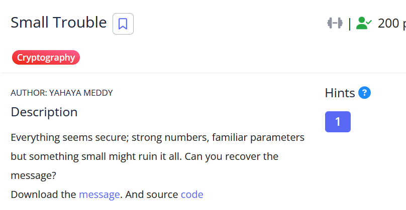

# [Small Trouble]

- **CTF Name:** picoCTF 2026
- **Category:** Cryptography
- **Difficulty:** 200 points
- **Hint:** This might be a job for Boneh-Durfee
- **Challenge Author:** YAHAYA MEDDY
- **Writeup Author:** Nakata Christian (n4ctbyte)
- **Date:** March 14, 2026
- **Source:** [Link to Challenge](https://play.picoctf.org/events/79/challenges/718?category=2&page=1)

---

## Challenge Description



## 1. Executive Summary

**Objective:**
To recover a plaintext message encrypted using RSA, where the public exponent e and modulus N are large, but the private exponent d is suspected to be small.

**Result:**
The investigation identified that the private key d was only 256 bits, while the modulus N was 2096 bits. By applying Wiener's Attack (a specialized case of attacks on small private exponents), the private key was successfully recovered. The decrypted flag is: `picoCTF{sm4ll_d_3d2584a9}`.

**Method:**
The methodology involved source code analysis to determine the bit-length of the parameters, followed by a mathematical check against RSA attack bounds. Instead of the more complex Boneh-Durfee lattice reduction, I utilized a Continued Fractions approach (Wiener's Attack) as a more direct and computationally efficient alternative for the given bit-range.

---

## 2. Evidence Identification

This section provides details regarding the initial evidence file.

- **Filename:** `message.txt`
- **Size:** `1.9 KB`
- **SHA-256:** `00a16153674ff47d2e92b3260a961dfcdb0e443d061891aef1f40f9a9f4c103b`

- **Filename:** `encryption.py`
- **Size:** `502 Bytes`
- **SHA-256:** `48c3a2d603c1a05e240ff16395224b776b23d0a6f1b1f90c949b17108731dedc`

**Initial Check:**
Verifying file type using signature headers (Magic Bytes).

```bash
$ file message.txt
message.txt: ASCII text, with very long lines (635)

$ file encryption.py
encryption.py: Python script, ASCII text executable
```

---

## 3. Investigation Steps

### Step 1: Analyzing the Source Code

By inspecting the provided `encryption.py`, I identified a critical security flaw in the private exponent generation. While the primes p and q are sufficiently large (1048 bits each), the private key d is generated with a much smaller bit-length:

```python
from Crypto.Util.number import getPrime, inverse, bytes_to_long
import random

# Generate two large primes (1048 bits each)
p = getPrime(1048)
q = getPrime(1048)
n = p * q
phi = (p - 1) * (q - 1)

# compute d
d = getPrime(256)

# Compute the public exponent
e = inverse(d, phi)

# Encrypt a flag
flag = b'picoCTF{...}'
m = bytes_to_long(flag)
c = pow(m, e, n)

# Output for the challenge
with open("message.txt", "w") as f:
    f.write(f"n = {n}\n")
    f.write(f"e = {e}\n")
    f.write(f"c = {c}\n")
```

In a secure RSA implementation, d should be close to the size of N. A 256-bit d against a 2096-bit N is a textbook vulnerability.

### Step 2: Extracting Parameters

The output file `message.txt` contained the specific values for this instance:

```plaintext
n = 3980993015101017140353277804369745949706344223334890812840413257071044175973139291856038905399468319530362030870405443017903655374929929825011733964330181337551061274726015170805648591339935699566483704533804413902772334194671185814032757795167276567492610548489766891166023546451221494011601527912413323143640008533569546329046772124896140545774468831882189458647605131344071766512469603284171712833770168967153998797122819825938323489525196597407482515674210085730485950171311356595462370875129472210846138025654237220573246971086221110031195278019873474587710322597773432501095235059971088078096926751790014797097704337356321889
e = 3336497038614663222541921459680551835187913731404732354361770350895041393777650313575506088859422849385970294213215931070595265411244105028409623278013975724125500479919877564207207562572189315593170541926598007670763000263224010236185517132229343161667668429997117301579363090706170019283552359847390040311521617091884426220652237247589452213130475528794167610900761281292390567153221748933849959961895636324991675428047481887984343193310278137379109243220192216924968789976201537337617841164156347418356710488273730184036786730194843318185762453423678066812440979743181541976510807538521163968859836855958692325875567630213728207
c = 1826031079095822845536526213992736069835634421976077836267143793181964583083024760950942723002771287666852728279522910274806690415793596687180742873080830698626932982997385432329275546871401690500831953978994557961462780510004840010773264058566952483483889805568428664825400505121671890223584721114411827697594512296341594773601537519080793749568472726239590091904052247534142381322885597999201255135897334420626115847929127670295300664641023915921412100348810694368790829410468324587518896440574662249893060377916803644769267529820246473511018540449718324002956264174312180181563530270721168751856698020681743829723342459520727632
```

### Step 3: Determining the Optimal Attack Path

The challenge hint suggests using the Boneh-Durfee Attack, which utilizes Lattice Reduction (LLL) and is effective for d < N^0.292.

However, mathematical analysis shows that for a 2096-bit N, the threshold for the simpler Wiener's Attack is d < 1/3 ​N^1/4, which is approximately 524 bits. Since our d is only 256 bits, Wiener's Attack is guaranteed to work. I chose Wiener's Attack over Boneh-Durfee for its computational efficiency and ease of implementation in standard Python.

### Step 4: Automating the Recovery

I implemented a script using Continued Fractions to find the convergents of e/N, which eventually yields the private key d.

**Solver Script:**

```python
def get_cf(n, d):
    res = []
    while d != 0:
        res.append(n // d)
        n, d = d, n % d
    return res

def get_conv(cf):
    res = []
    n0, d0 = 0, 1
    n1, d1 = 1, 0
    for q in cf:
        n2 = q * n1 + n0
        d2 = q * d1 + d0
        res.append((n2, d2))
        n0, d0 = n1, d1
        n1, d1 = n2, d2
    return res

cf = get_cf(e, N)
conv = get_conv(cf)

for k, d in conv:
    if k == 0:
        continue
    if (e * d - 1) % k == 0:
        m = pow(c, d, N)
        h = hex(int(m))[2:]
        if len(h) % 2 != 0:
            h = '0' + h
        try:
            print(bytes.fromhex(h).decode())
            break
        except Exception:
            pass
```

### Step 5: Flag Decryption

Running the script produced the flag immediately:

**Terminal Output:**

```bash
$ python3 a.py
picoCTF{sm4ll_d_3d2584a9}
```

---

## 4. Conclusion

This challenge serves as a reminder that the security of RSA relies on the balance of all parameters, not just the size of the modulus N. Using a small bit-length for the private key d to speed up decryption (efficiency) creates a massive security hole.
