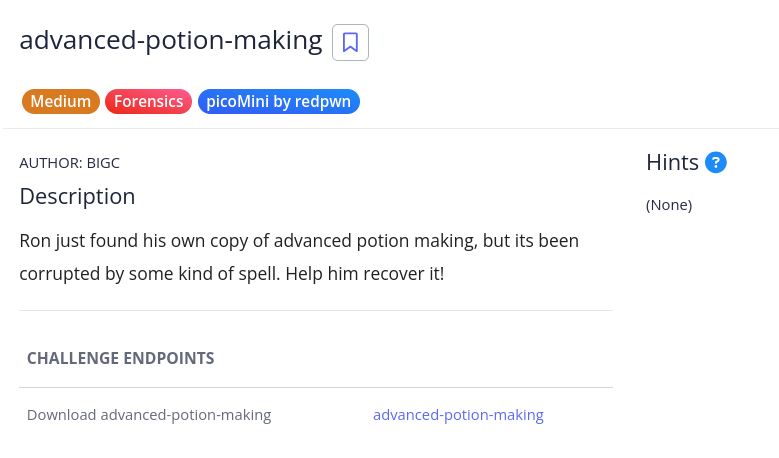
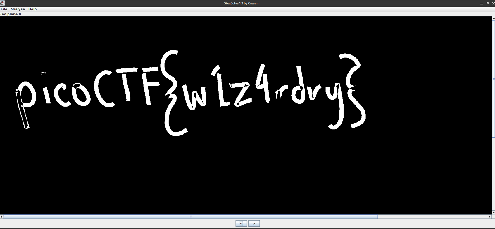

# [advanced-potion-making]

* **CTF Name:** picoMini by redpwn
* **Category:** Forensics
* **Difficulty:** Medium
* **Hint:** None
* **Challenge Author:** BIGC
* **Writeup Author:** Nakata Christian (n4ctbyte)
* **Date:** January 8, 2026
* **Source:** [Link to Challenge](https://play.picoctf.org/practice/challenge/205?category=4&difficulty=2&page=3)

---

## Challenge Description



## 1. Executive Summary

**Objective:**
The goal was to recover a corrupted "potion" file to retrieve a hidden flag. This challenge tested the ability to restore file structures at the byte level and perform advanced Visual Steganography analysis.

**Result:**
Initial identification indicated the file was a PNG image with a corrupted Header and IHDR chunk. After manual hex restoration and applying Least Significant Bit (LSB) recovery via StegSolve, the flag was successfully uncovered: `picoCTF{w1z4rdry}`.

**Method:**
The investigation utilized file signature analysis, hex manipulation, and bit plane isolation.

---

## 2. Evidence Identification

This section provides details regarding the initial evidence file.

- **Filename:** `advanced-potion-making`
- **Size:** `30 KB`
- **SHA-256:** `0c64e6c234853cc90cb7eaf5a9b690c1f9c4660b7d0ade0cb122b478d579d004`

**Initial Check:**
Verifying file type using signature headers (Magic Bytes).

```bash
─$ file advanced-potion-making
advanced-potion-making: data
```

---

## 3. Investigation Steps

### Step 1: Hex Analysis and Signature Repair

Opening the file in `hexedit` revealed a structure closely resembling a PNG format, but with several bytes intentionally corrupted in the header section.

**Initial findings on row `00000000`:**
- **Current Signature:** `89 50 42 11 0D 0A 1A 0A` (incorrect Magic Bytes)
- `00 12 13 14` (Corrupted IHDR length)

**Restoration Process:** I had to perform two critical surgeries on the hex data:
1. **Fixing Magic Bytes:** Changed `42 11` back to the standard PNG values `4E 47`.
2. **Fixing IHDR Length:** Replaced the garbage bytes `00 12 13 14` with the standard 13-byte length `00 00 00 0D`.

**Corrupted Header Row:** `89 50 4E 47 0D 0A 1A 0A 00 00 00 0D 49 48 44 52`

### Step 2: Verification and Red Image Issues

After the fix, the `file` command correctly identified it as a PNG image. However, the image appeared as a solid red block when opened. This indicated that the flag was hidden using steganography within the color channels.

### Step 3: Bit Plane Isolation (StegSolve)

Since the image appeared as a solid red block, I suspected the flag was hidden using LSB (Least Significant Bits) Steganography. In an 8-bit per channel PNG, each pixel's color is represented by values from 0-255. By modifying only the last bit (e.g., changing 255 to 254), the change is invisible to the human eye but digitally detectable.

I used StegSolve.jar to perform Bit Plane Isolation. This technique separates the image into its constituent bit layers.

**Action:** After cycling through various planes, the flag finally became visible on Red Plane 0.

**Observation:** The flag appeared as white, handwritten text against the black background. This specific plane isolation works because the hidden data was only encoded in the 0th bit of the Red channel, effectively filtering out all the noise from solid red filler pixels.



---

## 4. Conclusion

Success in this challenge required a deep understanding of the PNG File Format specification. It proved that manual byte-level manipulation is often necessary when automated forensic tools fail to recognize corrupted data.