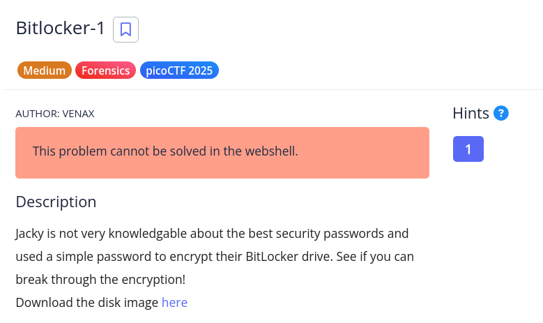

# [Bitlocker-1]

* **CTF Name:** picoCTF 2025
* **Category:** Forensics
* **Difficulty:** Medium
* **Hint:** Hash cracking
**Challenge Author:** VENAX
* **Writeup Author:** Nakata Christian (n4ctbyte)
* **Date:** January 20, 2026
* **Source:** [Link to Challenge](https://play.picoctf.org/practice/challenge/453?category=4&difficulty=2&page=1)

---

## Challenge Description



## 1. Executive Summary

**Objective:**
To decrypt a BitLocker-protected disk image by identifying the encryption method and performing a targeted dictionary attack to recover the user password.

**Result:**
The investigation successfully identified the volume as a BitLocker-encrypted disk. By extracting the VMK (Volume Master Key) and utilizing a dictionary attack with the `rockyou.txt` wordlist, the password "jacqueline" was recovered. The flag was found inside a `flag.txt` file within the decrypted volume: `picoCTF{us3_b3tt3r_p4ssw0rd5_pl5!_3242adb1}`.

**Method:**
The methodology involved low-level disk analysis (`hexdump`), hash extraction (`bitlocker2john`), password cracking (`hashcat`), and forensic mounting (`dislocker` and `mount`).

---

## 2. Evidence Identification

This section provides details regarding the initial evidence file.

- **Filename:** `bitlocker-1.dd`
- **Size:** `100 MB`
- **SHA-256:** `add47efefc22ef879b08aa5f0d4654ff05854ba67f77c27aed28ab29fd079cea`

**Initial Check:**
Verifying file type using signature headers (Magic Bytes).

```bash
$ file bitlocker-1.dd
bitlocker-1.dd: DOS/MBR boot sector, code offset 0x58+2, OEM-ID "-FVE-FS-", sectors/cluster 8, reserved sectors 0, Media descriptor 0xf8, sectors/track 63, heads 255, hidden sectors 124499968, FAT (32 bit), sectors/FAT 8160, serial number 0, unlabeled; NTFS, sectors/track 63, physical drive 0x1fe0, $MFT start cluster 393217, serial number 02020454d414e204f, checksum 0x41462020
```

---

## 3. Investigation Steps

### Step 1: Metadata and Hash Extraction

I used `bitlocker2john` to scan the image and extract the Volume Master Key (VMK) hashes required for cracking.

**Command:**
```bash
$ bitlocker2john -i bitlocker-1.dd > bitlocker.txt
```

The output revealed a user password hash with an extremely high iteration count 1.048.576, indicating that a brute-force attempt would be computationally expensive.

### Step 2: Targeted Dictionary Attack

Following the challenge hint that "Jacky" used a simple password, I prepared a dictionary attack using the top 10.000 entries from the `rockyou.txt` wordlist.

**Command:**
```bash
$ head -n 10000 /usr/share/wordlists/rockyou.txt > dict.txt
$ hashcat -m 22100 -a 0 bitlocker.txt dict.txt -w 3
```

Hashcat successfully cracked the password `jacqueline`.

### Step 3: Volume Decryption

With the recovered password, I used `dislocker` to decrypt the volume. This creates a virtual NTFS/FAT file representing the unencrypted data.

**Command:**
```bash
$ sudo mkdir -p decrypted_output
$ sudo dislocker -V bitlocker-1.dd -ujacqueline -- decrypted_output
```

### Step 4: Mounting and Flag Recovery

I mounted the decrypted virtual file to a local mount point to explore the filesystem.

**Command:**
```bash
$ sudo mkdir -p mnt_bitlocker
$ sudo mount -o loop decrypted_output/dislocker-file mnt_bitlocker
$ cat mnt_bitlocker/flag.txt
picoCTF{us3_b3tt3r_p4ssw0rd5_pl5!_3242adb1}
```

---

## 4. Conclusion

This challenge highlights the importance of password complexity in full-disk encryption. Even robust encryption like BitLocker can be bypassed if the user employs a predictable password found in common wordlists.

1. **Iteration Defense:** The high iteration count (over 1 million) effectively defends against low-end hardware brute-forcing by limiting cracking speeds to approximately 10 H/s per core.

2. **Forensic workflow:** Successful recovery requires a multi-step process: identifying signatures, extracting metadata hashes, cracking passwords, and mounting virtual FUSE filesystems.