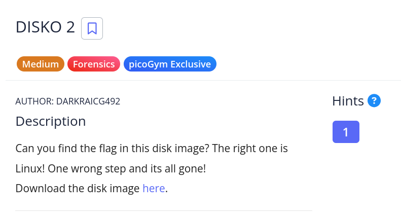

# [Disko-2]

* **CTF Name:** picoCTF
* **Category:** Forensics
* **Difficulty:** Medium
* **Hint:** How can you extract/isolate a partition?
* **Author:** Nakata Christian (n4ctbyte)
* **Date:** December 30, 2025
* **Source:** [Link to Challenge](https://play.picoctf.org/practice/challenge/506?category=4&page=2)

---

## Challenge Description



## 1. Executive Summary

**Objective:**
To conduct a forensic investigation on a disk image artifact (`.dd`) to recover hidden information, specifically validating correct partition data against potential decoys.

**Result:**
The investigation successfully recovered the flag `picoCTF{4_P4Rt_1t_i5_055dd175}` located within the Linux partition.

**Method:**
The analysis involved MBR inspection (`file`), partition isolation (`dd`), and targeted string extraction to bypass obfuscation attempts (decoy flags).

---

## 2. Evidence Identification

This section provides details regarding the initial evidence file.

- **Filename:** `disko-2.dd`
- **Size:** `100 MB`
- **SHA-256:** `a11528ea2110eccf6d9a3479d04e3742a3c0344b319df08af87132b1b8740d75`

**Initial Check:**
Verifying file type using signature headers (Magic Bytes).

```bash
$ file disko-2.dd
disko-2.dd: DOS/MBR boot sector; partition 1 : ID=0x83, start-CHS (0x0,32,33), end-CHS (0x3,80,13), startsector 2048, 51200 sectors; partition 2 : ID=0xb, start-CHS (0x3,80,14), end-CHS (0x7,100,29), startsector 53248, 65536 sectors
```

---

## 3. Investigation Steps

### Step 1: Decompression

The initial evidence was provided as a compressed GZIP archive. The first step was to decompress the file to obtain the raw disk image (`.dd`).

**Command:**

```bash
gzip -d disko-2.dd.gz
```

### Step 2: String Analysis (Initial Triage)

A static analysis was performed using `strings` to quickly identify potential flag artifacts.

**Command:**

```bash
strings disko-2.dd | grep "pico"
```

**Observation:** The output produced a large volume of "decoy" flags sharing a repeating pattern (4_P4Rt_1t_i5 -> "A Part It Is")

```
picoCTF{4_P4Rt_1t_i5_5d70d515}
picoCTF{4_P4Rt_1t_i5_17d555d0}
...
picoCTF{4_P4Rt_1t_i5_5dd15750}
```

### Step 3: Partition Extraction

From the initial `file` analysis, two partitions were identified:

1. **Partition 1:** Linux (ID=0x83) - Start Sector 2048
2. **Partition 2:** FAT32 (ID=0xb) - Start Sector 53248

The challenge description explicitly hints: _The right one is Linux!_. Based on this investigative lead and the hint to _"isolate a partition"_, I targeted Partition 1 for extraction.

**Command:**

```bash
dd if=disko-2.dd of=partition1.img bs=512 skip=2048 count=51200
```

**Explanation:** I used `dd` to carve out the partition based on the sector information retrieved from the `file` command:
* `if/of`: Input File (`disko-2.dd`) and Output File (`partition1.img`)
* `bs=512`: Sets the block size to 512 bytes
* `skip=2048`: Skips the first 2048 sectors to reach the start of Partition 1
* `count=51200`: Copies exactly 51200 sectors (the length of Partition 1)

### Step 4: Final Flag Recovery

After isolating the Linux partition into `partition1.img`, I performed string analysis on this specific artifact. Unlike the full disk scan which was filled with decoys, this isolated search immediately revealed the valid flag.

**Command:**

```bash
strings partition1.img | grep 'pico'
```

**Output:**

```
picoCTF{4_P4Rt_1t_i5_055dd175}
```

---

## 4. Conclusion

The challenge demonstrated the importance of partition analysis in digital forensics. A superficial string search on the raw disk image resulted in false positives (decoys). By correctly interpreting the partition table (MBR) and following the challenge intelligence ("The right one is Linux."), I successfully isolated the correct partition and recovered the hidden flag.
