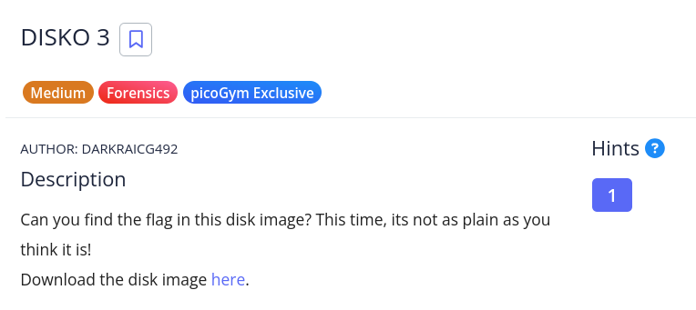

# [Disko-3]

* **CTF Name:** picoCTF (picoGym Exclusive)
* **Category:** Forensics
* **Difficulty:** Medium
* **Hint:** How will you search and extract files in a partition?
* **Challenge Author:** DARKRAICG492
* **Writeup Author:** Nakata Christian (n4ctbyte)
* **Date:** January 9, 2026
* **Source:** [Link to Challenge](https://play.picoctf.org/practice/challenge/507?category=4&difficulty=2&page=1)

---

## Challenge Description



## 1. Executive Summary

**Objective:**
To perform a forensic analysis on a provided disk image (`disko-3.dd`) and recover a hidden flag.

**Result:**
The flag was successfully located within a compressed Gzip file hidden deep inside the system log directory structure (`/log/apt/`). The flag recovered is: `picoCTF{n3v3r_z1p_2_h1d3_654235e0}`.

**Method:**
The investigation utilized Static Disk Analysis (FTK Imager) to browse the FAT32 filesystem and identify anomalies in standard system directories.

---

## 2. Evidence Identification

This section provides details regarding the initial evidence file.

- **Filename:** `disko-3.dd`
- **Size:** `100 MB`
- **SHA-256:** `881c847516658c633296bb8d35f0e66c2a527206693d1575c358142efcdad8d1`

**Initial Check:**
Verifying file type using signature headers (Magic Bytes).

```bash
─$ file disko-3.dd             
disko-3.dd: DOS/MBR boot sector, code offset 0x58+2, OEM-ID "mkfs.fat", Media descriptor 0xf8, sectors/track 32, heads 8, sectors 204800 (volumes > 32 MB), FAT (32 bit), sectors/FAT 1576, serial number 0x49838d0b, unlabeled
```

---

## 3. Investigation Steps

### Step 1: Disk Mounting and Initial Analysis

The raw disk image `disko-3.dd` was loaded into FTK Imager for static analysis. Initial inspection revealed a single partition with a FAT32 filesystem.

### Step 2: Filesystem Traversal

Following standard forensic triage procedures, I explored the root directory and navigated through the system folders.

**Path Traversal:** `disko-3.dd` > `NONAME [FAT 32]` > `[root]` > `log` > `apt`

### Step 3: Flag Discovery

Inside the `apt` directory, which typically stores package manager logs, an anomalous file named `flag.gz` was identified.

**Observation:** FTK Imager's recursive expansion capability allowed for the inspection of the compressed file's contents without requiring manual extraction to the host system. By simply expanding `flag.gz` within the FTK interface, a file named `flag` was visible.

Upon clicking the nested `flag` file, the plain text flag was revealed in the preview :
`picoCTF{n3v3r_z1p_2_h1d3_654235e0}`

---

## 4. Conclusion

The challenge serves as a fundamental exercise in navigating disk images and recognizing out-of-place files within a standard directory structure. The flag's message, "never zip to hide," ironically highlights that simple compression is not an effective anti-forensic measure against a systematic manual inspection.