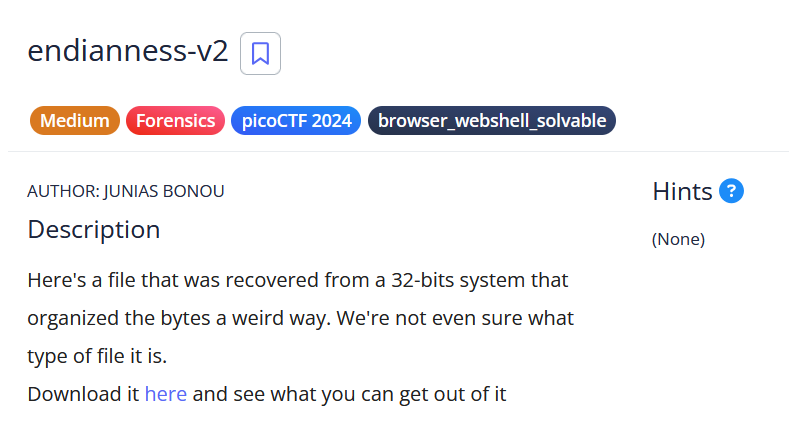
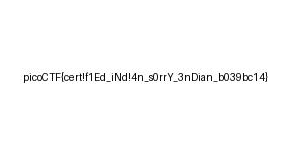

# [endianness-v2]

* **CTF Name:** picoCTF 2024
* **Category:** Forensics, browser_webshell_solvable
* **Difficulty:** Medium
* **Hint:** None
* **Challenge Author:** JUNIAS BONOU
* **Writeup Author:** Nakata Christian (n4ctbyte)
* **Date:** February 3, 2026
* **Source:** [Link to Challenge](https://play.picoctf.org/practice/challenge/415?category=4&difficulty=2&page=1&search=)

---

## Challenge Description



## 1. Executive Summary

**Objective:**
Restore a binary file corrupted by a 32-bit Little-Endian byte-swapping structure.

**Result:**
By reversing the byte order of every 4-byte block (32-bit) throughout the file, I successfully recovered a JPG image containing the flag: `picoCTF{cert!f1Ed_iNd!4n_s0rrY_3nDian_b039bc14}`.

**Method:**
The investigation utilized hex analysis to identify magic bytes and Python scripting to automate the byte-swapping process across the entire file.

---

## 2. Evidence Identification

This section provides details regarding the initial evidence file.

- **Filename:** `challengefile`
- **Size:** `3.4 KB`
- **SHA-256:** `f14017c78c60dcda2f04884798b2cf4c6de697461886fc916f87e37345abcce2`

**Initial Check:**
Verifying file type using signature headers (Magic Bytes).

```bash
$ file challengefile
challengefile: data
```

---

## 3. Investigation Steps

### Step 1: Endianness Analysis

**Understanding Endianness:**
Endianness refers to the order in which bytes are stored in computer memory. There are two main types:

- **Big-Endian**: The most significant byte (MSB) is stored at the smallest memory address (similar to how we read numbers).
- **Little-Endian:** The least significant byte (LSB) stored first.

**Why the file was corrupted:** The challenge file originated from a 32-bit systems, meaning it processes data in 4-byte (32-bit) words. The hex dump revealed the header as `E0 FF D8 FF` instead of the standard JPG `FF D8 FF E0`.

This indicated a Little-Endian 32-bit storage pattern where each 4-byte block was completely reversed:

- **Standard (Big-Endian/Network Order):** `FF D8 FF E0`
- **As Found (Little-Endian 32-bit):** `E0 FF D8 FF`

Because the entire file followed this pattern, every single 4-byte segment including the data and the footer had to be swapped back to its original order for the image to be renderable.

### Step 2: Automated Recovery

To fix the entire file, I wrote a Python script to iterate through the binary and swap the bytes for every 32-bit block.

```python
with open("challengefile", "rb") as f:
    data = f.read()

fixed_data = b"".join([data[i:i+4][::-1] for i in range(0, len(data), 4)])

with open("flag.jpg", "wb") as f:
    f.write(fixed_data)
```

### Step 3: Verification

After running the script, I verified the new file.

```bash
$ file flag.jpg     
flag.jpg: JPEG image data, JFIF standard 1.01, aspect ratio, density 1x1, segment length 16, baseline, precision 8, 300x150, components 3
```

### Step 4: Flag Recovery

Opening the restored `flag.jpg` revealed a clear image containing the flag string.



---

## 4. Conclusion

This challenge highlights the importance of understanding data representation at the memory level (Endianness). Forensic failure to read a file is often not due to data loss, but rather an incorrect interpretation of byte order between the source system and the analysis environment.