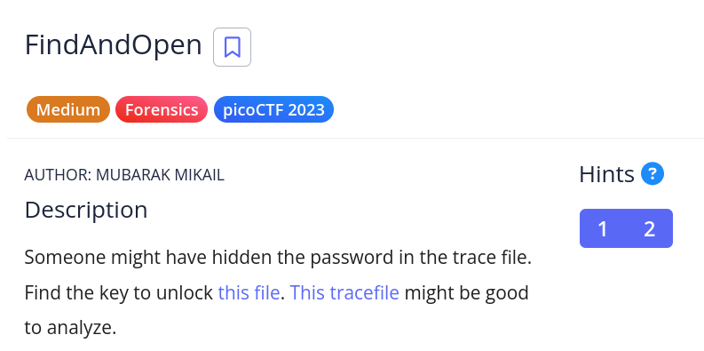

# [FindAndOpen]

* **CTF Name:** picoCTF
* **Category:** Forensics, pcap
* **Difficulty:** Medium
* **Hint:**
    * 1: Download the pcap and look for the password or flag.
    * 2: Don't try to use a password cracking tool, there are easier ways here.
* **Challenge Author:** MUBARAK MIKAIL
* **Writeup Author:** Nakata Christian (n4ctbyte)
* **Date:** January 6, 2026
* **Source:** [Link to Challenge](https://play.picoctf.org/practice/challenge/348?category=4&difficulty=2&page=2)

---

## Challenge Description



## 1. Executive Summary

**Objective:**
To analyze a network capture file to retrieve a hidden decryption key required to unlock an encrypted ZIP archive.

**Result:**
The flag `picoCTF{R34DING_LOKd_fil56_succ3ss_cbf2ebf6}` was successfully recovered from a file inside `flag.zip` after extracting it using a password found within Ethernet frame trailers.

**Method:**
Initial analysis was performed using my custom-built automated tools. While the tool identified the file structure, it failed to locate the flag due to non-standard data placement. Manual inspection via Wireshark revealed fragmented Base64 strings hidden in Ethernet trailers, which served as the decryption password.

---

## 2. Evidence Identification

This section provides details regarding the initial evidence file.

- **Filename:** `dump.pcap` & `flag.zip`
- **Size:** `7.3 KB` & `231 Bytes`
- **SHA-256:** `766696dc344a2100f41048d7bf806e6eecb03b02c8216de0732d547740cfa0d4` & `74884c3f9bcbc721188264d79dd5ec1b17f5d3dc67d9f996ed7b285c718306a3`

**Initial Check:**
Verifying file type using signature headers (Magic Bytes).

```bash
$ file dump.pcap  
dump.pcap: pcap capture file, microsecond ts (little-endian) - version 2.4 (Ethernet, capture length 262144)

$ file flag.zip     
flag.zip: Zip archive data, made by v3.0 UNIX, extract using at least v1.0, last modified Mar 16 2023 02:40:02, uncompressed size 45, method=store
```

---

## 3. Investigation Steps

### Step 1: Automated Triage

I first deployed my custom forensics tool to perform recursive extraction and string scanning. 

**Observation:** The tool detected the presence of `flag.zip` but could not find any plaintext flags or password candidates in the standard TCP/UDP streams. This indicated that the secret was likely hidden in a lower abstraction layer or via a non-standard protocol.

### Step 2: Manual Layer-2 Inspection

Switching to Wireshark, I inspected the frames manually. I noticed that several packets contained unusual data in the Ethernet II trailer/padding section.

**Observation:** In Packet No.70, I noticed unusual data within the Ethernet II frame trailer. This specific frame held a Base64-encoded string.

### Step 3: Decoding the Secret

I extracted and decoded the Base64 string `VGhpcyBpcyB0aGUgc2VjcmV0OiBwaWNvQ1RGe1IzNERJTkdfTE9LZF8=` found in the Ethernet trailer of packet 70.

**Result:** The string decoded to: `This is the secret: picoCTF{R34D1NG_LOKd_`.

### Step 4: Final Extraction

The decoded string was used as the password to decrypt `flag.zip`.

**Command:**
```bash
$ unzip flag.zip
# Enter password: picoCTF{R34DING_LOKd_
replace flag? y
extracting: flag
```

**Final Output:** After unzipping, I read the resulting `flag` file to get the final flag.

**Command:**
```bash
$ cat flag
picoCTF{R34DING_LOKd_fil56_succ3ss_cbf2ebf6}
```

---

## 4. Conclusion

The challenge utilized the Ethernet trailer (Layer 2) to hide a decryption key, effectively bypassing many standard forensic tools that focus on Layer 4 and above. This highlights the importance of manual inspection of "ignored" packet regions when automated tools fail to find clues in the payload.