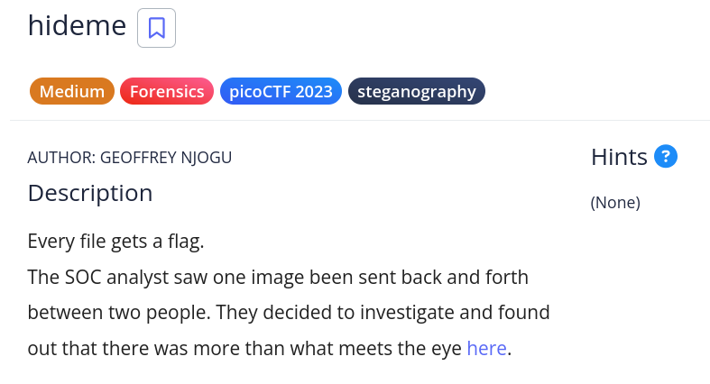

# [hideme]

* **CTF Name:** picoCTF
* **Category:** Forensics, Steganography
* **Difficulty:** Medium
* **Hint:** None
* **Challenge Author:** GEOFFREY NJOGU
* **Writeup Author:** Nakata Christian (n4ctbyte)
* **Date:** December 30, 2025
* **Source:** [Link to Challenge](https://play.picoctf.org/practice/challenge/350?category=4&page=3)

---

## Challenge Description



## 1. Executive Summary

**Objective:**
To analyze a PNG image artifact (`flag.png`) suspected of containing hidden data (steganography).

**Result:**
The investigation successfully recovered a hidden directory containing a secondary image with the flag `picoCTF{Hiddinng_An_imag3_within_@n_ima9e_ad9f6587}`.

**Method:**
The analysis involved file signature verification (`file`), metadata inspection (`exiftool`), and extraction of embedded files using `binwalk`.

---

## 2. Evidence Identification

This section provides details regarding the initial evidence file.

- **Filename:** `flag.png`
- **Size:** `42 KB`
- **SHA-256:** `44dd9d5711b44d0516f3d03a543e3b540473d802306de1715f0a261d0fb5772a`

**Initial Check:**
Verifying file type using signature headers (Magic Bytes).

```bash
$ file flag.png
flag.png: PNG image data, 512 x 504, 8-bit/color RGBA, non-interlaced
```

---

## 3. Investigation Steps

### Step 1: Xdg-Open

**Command:**
```bash
xdg-open flag.png
```

**Observation:** The image is a picoCTF logo.

### Step 2: String Analysis

A static analysis was performed using `strings` to quickly identify potential flag artifacts.

**Command:**

```bash
strings flag.png | grep "pico"
```

**Observation:** The lack of output indicates no human-readable 'pico' strings are present.

### Step 3: Exiftool Analysis

I examined the file metadata using `exiftool` to check for any comments or hidden tags containing the flag.

**Command:**

```bash
exiftool flag.png | grep "pico"
```

**Observation:** The lack of output indicates no relevant metadata contains the string "pico".

### Step 4: Binwalk

I thought maybe there is another file within this image so I used `binwalk` to extract it.

**Command:**

```bash
binwalk -e flag.png
```

**Observation:** Just like I thought, the extraction result has a folder named "secret".

### Step 5: Final Flag Recovery

After I extracted using `binwalk`, I opened the "secret" folder and found another png named "flag.png" in there. I opened the image using `xdg-open flag.png` and found the flag.

**Command:**

```bash
cd secret
xdg-open flag.png
```

**Output:**

```
picoCTF{Hiddinng_An_imag3_within_@n_ima9e_ad9f6587}
```

---

## 4. Conclusion

The challenge demonstrated a classic steganography technique where an archive (Zip) is appended to an image file. While standard visual inspection (`xdg-open`) and string analysis failed, analyzing the file structure with `binwalk` successfully identified and extracted the hidden payload, allowing for the recovery of the flag.