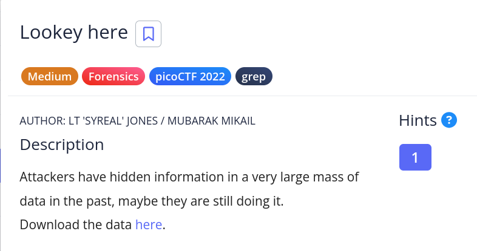

# [Lookey here]

* **CTF Name:** picoCTF
* **Category:** Forensics, grep
* **Difficulty:** Medium
* **Hint:** Download the file and search for the flag based on the known prefix.
* **Challenge Author:** MUBARAK MIKAIL/LT 'SYREAL' JONES
* **writeup Author:** Nakata Christian (n4ctbyte)
* **Date:** January 6, 2026
* **Source:** [Link to Challenge](https://play.picoctf.org/practice/challenge/279?category=4&difficulty=2&page=2)

---

## Challenge Description



## 1. Executive Summary

**Objective:**
To locate and extract a hidden flag within a large text file containing the entire novel "Anthem" by Ayn Rand.

**Result:**
The flag `picoCTF{gr3p_15_@w3s0m3_4c479940}` was successfully identified.

**Method:**
The challenge was solved using a custom automated forensic tool. Due to the large volume of narrative text, the tool utilized system-level optimized filtering to bypass the noise and instantly isolate the flag pattern.

---

## 2. Evidence Identification

This section provides details regarding the initial evidence file.

- **Filename:** `anthem.flag.txt`
- **Size:** `107 KB`
- **SHA-256:** `9dcf77725cd1e9fd01536d9c60a6cc7cb612e269c7339de1967f2e6bb86c8f4f`

**Initial Check:**
Verifying file type using signature headers (Magic Bytes).

```bash
$ file anthem.flag.txt
anthem.flag.txt: Unicode text, UTF-8 text
```

---

## 3. Investigation Steps

### Step 1: Automated Triage

I deployed my custom forensics tool to scan the target. Because the file is a long text document, the tool's optimized string scanner was used to pre-filter the data.

**Observation:** The tool successfully ignored thousands of lines of narrative text and captured the flag by filtering for the `picoCTF` header and valid curly brace patterns.

**Output:**
```bash
════════════════════════════════════════════════════════════
🚩   INSTANT FLAG FINDER   🚩
════════════════════════════════════════════════════════════
✨ Decoded Hit: Atbash: we think that the men of picoCTF{gr3p_15_@w3s0m3_4c479940}
✨ Direct Hit: we think that the men of picoCTF{gr3p_15_@w3s0m3_4c479940}
✨ Decoded Hit: ROT13: we think that the men of picoCTF{gr3p_15_@w3s0m3_4c479940}
✨ Decoded Hit: XOR(key=0x20): WETHINKTHATTHEMENOFPICOctf[GRPWSMC]
════════════════════════════════════════════════════════════
```

### Step 2: Manual Breakdown (Walkthrough)

To understand how the flag was hidden, a manual analysis was conducted. This challenge demonstrates the "Needle in a Haystack" concept where the flag is stored in plaintext but buried within massive amounts of irrelevant data.

**A. Identifying the Noise:**
Reading the file manually would be inefficient as it contains hundreds of lines of text from a novel designed to hide the flag from visual inspection.

**B. Manual Extraction:**
Since the flag format is known to start with pico, the grep utility can be used to scan the file content directly.

**Command:**
```bash
$ cat anthem.flag.txt | grep 'pico'
we think that the men of picoCTF{gr3p_15_@w3s0m3_4c479940}
```

---

## 4. Conclusion

The challenge Lookey here highlights the importance of automated filtering when dealing with large datasets. While the flag was not obfuscated, its placement within a large volume of text was meant to discourage manual discovery. The use of a custom automated tool with pre-filtering proved to be the most efficient strategy for rapid identification.