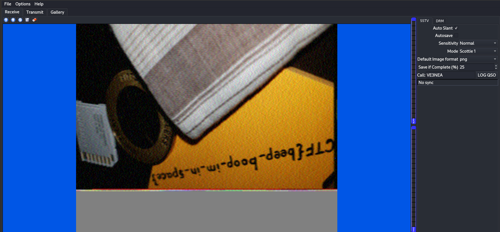

# [m00nwalk]

- **CTF Name:** picoCTF 2019
- **Category:** Forensics
- **Difficulty:** Medium
- **Hint:**
    * 1. How did pictures from the moon landing get sent back to Earth?
    * 2. What is the CMU mascot?, that might help select a RX option
- **Challenge Author:** JOON
- **Writeup Author:** Nakata Christian (n4ctbyte)
- **Date:** January 12, 2026
- **Source:** [Link to Challenge](https://play.picoctf.org/practice/challenge/26?category=4&difficulty=2&page=4)

---

## Challenge Description


## 1. Executive Summary

**Objective:**
To analyze a mysterious audio file in `.wav` format containing patterned noise, and extract a hidden visual message embedded within the audio frequencies.

**Result:**
The investigation successfully identified a Slow Scan Television (SSTV) signal. By manually configuring the decoder to the Scottie 1 mode, the original image was reconstructed, revealing the flag: `picoCTF{beep_boop_im_in_space}`.

**Method:**
The investigation utilized QSSTV for signal decoding and PulseAudio routing to process the raw audio stream into a visual output.

---

## 2. Evidence Identification

This section provides details regarding the initial evidence file.

- **Filename:** `message.wav`
- **Size:** `11 MB`
- **SHA-256:** `216ed27656d05c7d06ae3acada8ab86116a2053f6b8e6c8df5a2b214813beba2`

**Initial Check:**
Verifying file type using signature headers (Magic Bytes).

```bash
$ file message.wav
message.wav: RIFF (little-endian) data, WAVE audio, Microsoft PCM, 16 bit, mono 48000 Hz
```

---

## 3. Investigation Steps

### Step 1: Identifying the Signal Type

Based on the challenge hints referencing lunar missions and the distinct sound of the audio, the file was identified as an SSTV transmission. This protocol was famously used by the Apollo 11 mission to transmit images from the moon.

### Step 2: Signal Decoding via QSSTV

To decode the signal, I utilized QSSTV, an open-source Linux utility designed for receiving and transmitting SSTV signals.

**Installation:**
```bash
$ sudo apt update && sudo apt install qsstv -y
```

**Decoding Process:**
1. **Audio Routing:** Configured the system to route the playback of message.wav directly into the QSSTV input stream via PulseAudio Volume Control.

2. **Protocol Detection:** The decoder was set to Scottie 1 mode to ensure optimal synchronization with the frequency shifts found in the source file.

3. **Reconstruction:** As the audio played, the software reconstructed the image line-by-line by mapping specific frequencies to color values and horizontal scan lines.

### Step 3: Flag Retrieval

The resulting image displayed a retro-style visual with a yellow field containing the flag. Despite the analog distortion typical of this transmission type, the text remained legible.



**Flag:** `picoCTF{beep_boop_im_in_space}`
---

## 4. Conclusion

The challenge highlights the use of legacy analog transmission protocols as a method for steganography. By recognizing the auditory signature of SSTV and utilizing proper signal decoding software, the hidden visual layer was successfully recovered.
