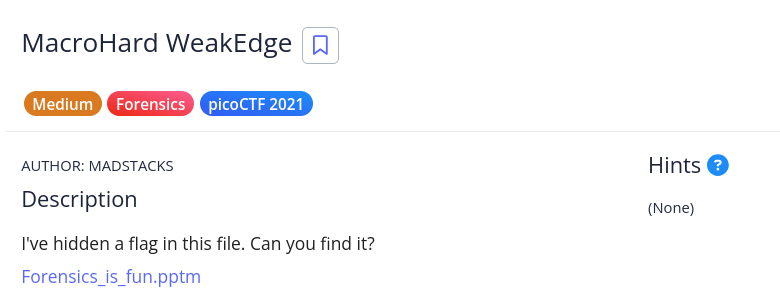

# [MacroHard WeakEdge]

- **CTF Name:** picoCTF 2021
- **Category:** Forensics
- **Difficulty:** Medium
- **Hint:** None
- **Challenge Author:** MADSTACKS
- **Writeup Author:** Nakata Christian (n4ctbyte)
- **Date:** January 14, 2026
- **Source:** [Link to Challenge](https://play.picoctf.org/practice/challenge/130?category=4&difficulty=2&page=3)

---

## Challenge Description



## 1. Executive Summary

**Objective:**
To investigate a suspicious Microsoft PowerPoint Macro-Enabled Presentation (`.pptm`) and retrieve a hidden flag concealed within its internal directory structure.

**Result:**
The investigation discovered a hidden file named `hidden` located deep within the PowerPoint's system folders. The file contained an obfuscated Base64 string where characters were separated by spaces. After cleaning and decoding the string, the flag was retrieved: `picoCTF{D1d_u_kn0w_ppts_r_z1p5}`.

**Method:**
The process involved OOXML Structure Analysis (unzipping), Recursive Directory Exploration, String De-obfuscation (`tr` utility), and Base64 Decoding.

---

## 2. Evidence Identification

This section provides details regarding the initial evidence file.

- **Filename:** `Forensics_is_fun.pptm`
- **Size:** `98 KB`
- **SHA-256:** `7cf2cf6a69a9734305e408465eb617a83dab0f77ed0bab4caee137ea0d0e64a2`

**Initial Check:**
Verifying file type using signature headers (Magic Bytes).

```bash
$ file Forensics_is_fun.pptm
Forensics_is_fun.pptm: Microsoft PowerPoint 2007+
```

---

## 3. Investigation Steps

### Step 1: Deconstructing the OOXML Container

Modern Office documents are essentially ZIP archives. To inspect the hidden parts of the presentation that aren't visible in the PowerPoint UI, I used `binwalk` to extract the contents.

**Command:**
```bash
$ binwalk -e Forensics_is_fun.pptm
```

### Step 2: Recursive Directory Exploration

Once extracted, I navigated through the directory structure. While standard searches for "flag" or ".txt" yielded no results, a recursive listing (`ls -R`) revealed an unusual file in a system-related subdirectory.

**Target Location:** `ppt/slideMasters/hidden`

**Command:**
```bash
$ cd ppt/slideMasters
$ ls
hidden  _rels  slideMaster1.xml
```
The file named `hidden` is highly suspicious as it is not part of the standard PowerPoint XML Schema.

### Step 3: Analyzing and Cleaning the Payload

Checking the file type and content of `hidden`:
```bash
$ file hidden
hidden: ASCII text, with no line terminators

$ cat hidden
Z m x h Z z o g c G l j b 0 N U R n t E M W R f d V 9 r b j B 3 X 3 B w d H N f c l 9 6 M X A 1 f Q
```

**Observation:** The string appears to be Base64 encoded, but it has been obfuscated by inserting a space between every character. This prevents standard decoders from recognizing the format immediately.

### Step 4: Decoding the Flag

To retrieve the flag, I utilized the `tr` utility to delete all spaces (`tr -d " "`), piped the clean string into the `base64` decoder, and successfully revealed the plaintext.

**Command:**
```bash
$ cat hidden | tr -d " " | base64 -d
picoCTF{D1d_u_kn0w_ppts_r_z1p5}
```

---

## 4. Conclusion

This challenge reinforces the fundamental forensic concept that Office documents are containers (ZIPs) that can hide arbitrary data. Attackers or challenge creators can place data in system folders (like `slideMasters`) that typical users never see. Furthermore, it demonstrates a simple but effective manual obfuscation technique (character spacing) to bypass automated string detection.