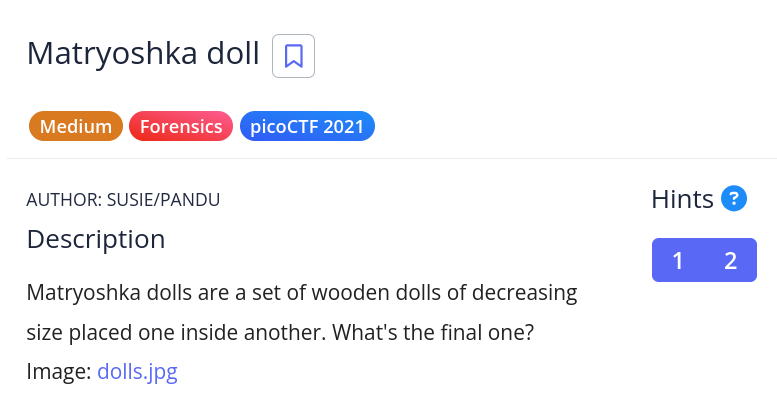

# [Matryoshka Doll]

* **CTF Name:** picoCTF
* **Category:** Forensics
* **Difficulty:** Medium
* **Hint:**
    * 1: Wait, you can hide files inside files? But how do you find them?
    * 2: Make sure to submit the flag as picoCTF{XXXXX}
* **Challenge Author:** SUSIE/PANDU
* **Writeup Author:** Nakata Christian (n4ctbyte)
* **Date:** December 31, 2025
* **Source:** [Link to Challenge](https://play.picoctf.org/practice/challenge/129?category=4&difficulty=2&page=3)

---

## Challenge Description



## 1. Executive Summary

**Objective:**
To recover a hidden flag embedded within a "Matryoshka doll" style nested file structure starting from a single JPG image (`dolls.jpg`).

**Result:**
The flag `picoCTF{LL9lb1dR4QbGe4l4iWCvGq9pdtwt7392}` was successfully recovered after recursively extracting hidden archives from four layers of nested images.

**Method:**
The investigation relied on `binwalk` to identify and extract hidden Zip archives appended to image files. This process was repeated iteratively (Layer 1 -> Layer 4) until the final `flag.txt` was revealed.

---

## 2. Evidence Identification

This section provides details regarding the initial evidence file.

- **Filename:** `dolls.jpg`
- **Size:** `637 KB`
- **SHA-256:** `d3d924436bf76c25d237ef2f6ea20b14bae6ef364ad99f0af67d7d30773e9e96`

**Initial Check:**
Verifying file type using signature headers (Magic Bytes).

```bash
$ file dolls.jpg
dolls.jpg: PNG image data, 594 x 1104, 8-bit/color RGBA, non-interlaced
```

---

## 3. Investigation Steps

### Step 1: Layer 1 Extraction (dolls.jpg)

**Command:**
```bash
binwalk -e dolls.jpg
```

**Observation:** Binwalk detected a zip archive at offset 0x4286C containing a directory `base_images` and a file named `2_c.jpg`.

**Action:** I navigated into the extracted directory to investigate the new file.

```bash
cd _dolls.jpg.extracted/base_images
ls
# Output: 2_c.jpg
```

### Step 2: Layer 2 Extraction (2_c.jpg)

Suspecting a recursive pattern as hinted by the challenge name "Matryoshka", I performed the same analysis on the newly extracted image.

**Command:**
```bash
binwalk -e 2_c.jpg
```

**Observation:** Another zip archive was found hidden inside `2_c.jpg`, containing `3_c.jpg`.

**Action:** I navigated deeper into the nested structure.

```bash
cd _2_c.jpg.extracted/base_images
ls
# Output: 3_c.jpg
```

### Step 3: Layer 3 Extraction (3_c.jpg)

I continued the extraction process on the third image.

**Command:**
```bash
binwalk -e 3_c.jpg
```

**Observation:** Binwalk revealed yet another nested image, `4_c.jpg`.

**Action:**
```bash
cd _3_c.jpg.extracted/base_images
ls
# Output: 4_c.jpg
```

### Step 4: Final Layer and Flag Discovery (4_c.jpg)

I analyzed the image `4_c.jpg`.

**Command:**
```bash
binwalk -e 4_c.jpg
```

**Observation:** This time, instead of another image, binwalk extracted a text file named `flag.txt` inside the archive.

**Action:** I read the content of the flag file.

```bash
cd _4_c.jpg.extracted
cat flag.txt
```

**Output:**
```
picoCTF{LL9lb1dR4QbGe4l4iWCvGq9pdtwt7392}
```

---

## 4. Conclusion

The challenge implemented a recursive steganography technique, hiding files within files in a nested manner analogous to a Matryoshka doll. By methodically using `binwalk` to extract each layer, I successfully traversed the depth of the file structure (dolls -> 2_c -> 3_c -> 4_c) to retrieve the final flag. While this process was performed manually to verify each step, `binwalk` also offers a recursive extraction mode (`-M` or `--matryoshka`) which could automate this entire chain in a single command.