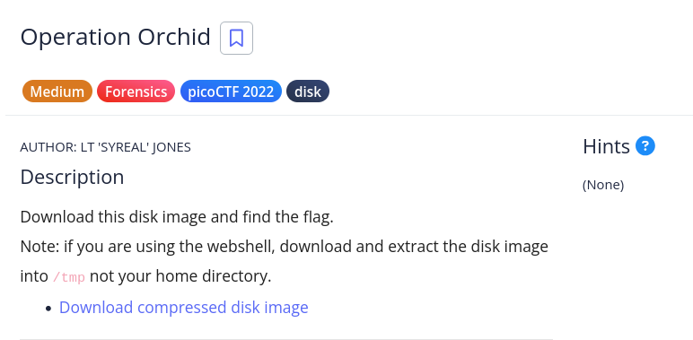

# [Operation Orchid]

* **CTF Name:** picoCTF 2022
* **Category:** Forensics, disk
* **Difficulty:** Medium
* **Hint:** None
* **Challenge Author:** LT 'SYREAL' JONES
* **Writeup Author:** Nakata Christian (n4ctbyte)
* **Date:** January 21, 2026
* **Source:** [Link to Challenge](https://play.picoctf.org/practice/challenge/285?category=4&difficulty=2&page=2)

---

## Challenge Description



## 1. Executive Summary

**Objective:**
To investigate a disk image, identify encrypted files, and recover the flag by tracing the user's command history.

**Result:**
The investigation identified an ecrypted file `flag.txt.enc` in the `disk.flag.img > Partition 3 > NONAME [ext4] > [root] > root` directory. By analyzing the `.ash_history` file, the encryption password `unbreakablepassword1234567` was recovered. Decrypting the file revealed the flag: `picoCTF{h4un71ng_p457_0a710765}`.

**Method:**
The methodology involved disk forensics (FTK Imager), artifact analysis (`.ash_history`), and cryptographic decryption (OpenSSL).

---

## 2. Evidence Identification

This section provides details regarding the initial evidence file.

- **Filename:** `disk.flag.img`
- **Size:** `400 MB`
- **SHA-256:** `3811cc6783ceb0f986ebbfe08d2a74f5c2b4f6bd335cb34aec232e90a80979f0`

**Initial Check:**
Verifying file type using signature headers (Magic Bytes).

```bash
$ file disk.flag.img            
disk.flag.img: DOS/MBR boot sector; partition 1 : ID=0x83, active, start-CHS (0x0,32,33), end-CHS (0xc,223,19), startsector 2048, 204800 sectors; partition 2 : ID=0x82, start-CHS (0xc,223,20), end-CHS (0x19,159,6), startsector 206848, 204800 sectors; partition 3 : ID=0x83, start-CHS (0x19,159,7), end-CHS (0x32,253,11), startsector 411648, 407552 sectors
```

---

## 3. Investigation Steps

### Step 1: Disk Exploration

Using FTK Imager, I navigated to the `disk.flag.img > Partition 3 [199 MB] > NONAME [ext4] > [root] > root` directory. I located two significant files: `.ash_history` and `flag.txt.enc`.

### Step 2: Recovering the Encryption Key

I inspected the `.ash_history` file, which revealed the exact command used by the user to encrypt the flag: `openssl aes256 -salt -in flag.txt -out flag.txt.enc -k unbreakablepassword1234567`.

### Step 3: Decryption and Flag Recovery

I exported `flag.txt.enc` and executed the decryption command.

**Command:**
```bash
$ openssl aes256 -d -salt -in flag.txt.enc -out flag.txt -k unbreakablepassword1234567                         
*** WARNING : deprecated key derivation used.
Using -iter or -pbkdf2 would be better.
bad decrypt
40D7EBB9D17F0000:error:1C800064:Provider routines:ossl_cipher_unpadblock:bad decrypt:../providers/implementations/ciphers/ciphercommon_block.c:107:
```

**Flag:**
```bash
$ cat flag.txt     
picoCTF{h4un71ng_p457_0a710765} 
```

---

## 4. Conclusion

This challenge demonstrates that even strong encryption can be compromised if the password and command history are not properly cleared from the system artifacts.