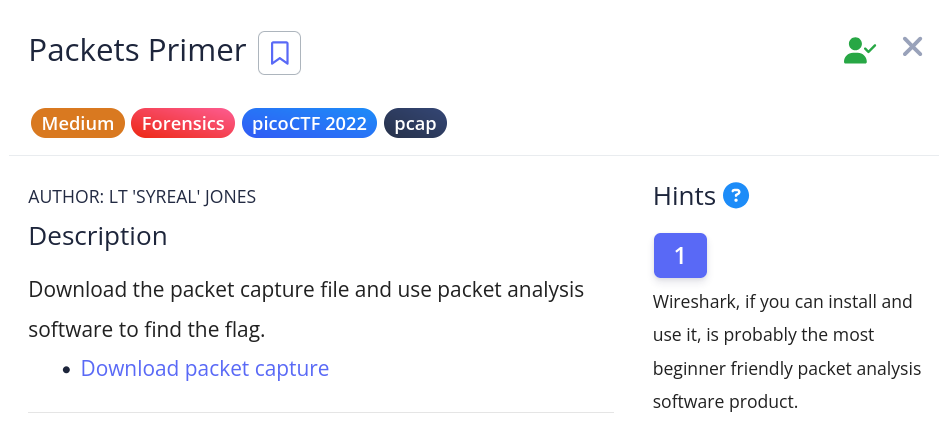

# [Packets Primer]

* **CTF Name:** picoCTF
* **Category:** Forensics, pcap
* **Difficulty:** Medium
* **Hint:** Wireshark, if you can install and use it, is probably the most beginner friendly packet analysis software product.
* **Challenge Author:** LT 'SYREAL' JONES
* **Writeup Author:** Nakata Christian (n4ctbyte)
* **Date:** December 30, 2025
* **Source:** [Link to Challenge](https://play.picoctf.org/practice/challenge/286?category=4&page=3)

---

## Challenge Description



## 1. Executive Summary

**Objective:**
To analyze a network capture file (`.pcap`) to find a hidden flag.

**Result:**
The flag `picoCTF{p4ck37_5h4rk_ceccaa7f}` was successfully recovered from a TCP stream.

**Method:**
Initial standard `string` analysis failed due to obfuscation (spaces between characters). The flag was visually identified using Wireshark's "Follow TCP Stream" feature and subsequently extracted via command line by sanitizing the output with `tr`.

---

## 2. Evidence Identification

This section provides details regarding the initial evidence file.

- **Filename:** `network-dump.flag.pcap`
- **Size:** `778 Bytes`
- **SHA-256:** `35d0bfae1a7c7decb32a081da30a1f46d94279a893149fbaf71e79c9378e9f91`

**Initial Check:**
Verifying file type using signature headers (Magic Bytes).

```bash
$ file network-dump.flag.pcap
network-dump.flag.pcap: pcap capture file, microsecond ts (little-endian) - version 2.4 (Ethernet, capture length 262144)
```

---

## 3. Investigation Steps

### Step 1: String Analysis

I attempted a standard static analysis to find the flag quickly.

**Command:**
```bash
strings network-dump.flag.pcap | grep 'pico'
```

**Observation:** The command returned no results. This suggests the flag is either encrypted, split, or formatted in a way that breaks the string continuity.

### Step 2: Protocol Analysis

I opened the file in Wireshark to inspect the packet streams. I noticed TCP traffic and decided to inspect the data payload.

**Action:** Right-click on TCP -> Follow -> TCP Stream.

**Observation:** The stream contained the flag, but it was obfuscated with spaces between every character: `p i c o C T F { p 4 c k 3 7 _ 5 h 4 r k _ c e c c a a 7 f }`. This explains why `grep 'pico'` failed in Step 1.

### Step 3: Automated Extraction

To extract the flag cleanly without manually typing it, I refined my initial command. I used `tr -d " "` to delete all spaces from the strings output before piping it to grep.

**Command:**

```bash
strings network-dump.flag.pcap | tr -d " " | grep 'pico'
```

**Explanation:**
* `strings`: Extracts printable characters
* `tr -d " "`: Deletes all whitespace characters, reconstructing the broken flag
* `grep 'pico'`: Searches for the flag pattern in the sanitized text

**Output:**
```
picoCTF{p4ck37_5h4rk_ceccaa7f}
```

---

## 4. Conclusion

The challenge hid the flag in plain sight within a TCP stream but obfuscated it by inserting spaces between characters to bypass simple string searches. Visual inspection via Wireshark identified the pattern, and command-line tools (`tr`) were used to sanitize and extract the final flag efficiently.