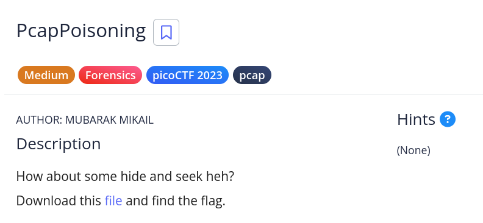

# [PcapPoisoning]

* **CTF Name:** picoCTF
* **Category:** Forensics, pcap
* **Difficulty:** Medium
* **Hint:** None
* **Author:** Nakata Christian (n4ctbyte)
* **Date:** January 6, 2026
* **Source:** [Link to Challenge](https://play.picoctf.org/practice/challenge/362?category=4&difficulty=2&page=1)

---

## Challenge Description



## 1. Executive Summary

**Objective:**
To extract a hidden flag from a network capture file heavily saturated with poisoned or decoy traffic

**Result:**
The flag `picoCTF{P64P_4N4L7S1S_SU55355FUL_5b6a6061}` was successfully identified.

**Method:**
The challenge was initially solved using a custom forensic tool, which successfully identified the flag instantly by cutting through the noise. To provide a clear technical breakdown, a manual walkthrough using CLI tools is documented below to explain the packet structure and the "poisoning" technique used.

---

## 2. Evidence Identification

This section provides details regarding the initial evidence file.

- **Filename:** `trace.pcap`
- **Size:** `105 KB`
- **SHA-256:** `cd1034e456207b467d4a2933f12d3746247b9bbcdac7475fe2ef0a2cf3838899`

**Initial Check:**
Verifying file type using signature headers (Magic Bytes).

```bash
$ file trace.pcap   
trace.pcap: pcap capture file, microsecond ts (little-endian) - version 2.4 (Raw IPv4, capture length 65535)
```

---

## 3. Investigation Steps

### Step 1: Automated Triage

I first deployed my custom forensics tool to perform an instant string analysis and deep sweep.

**Observation:** The tool successfully identified the flag in plaintext almost instantaneously, ignoring over 1,500 `[SYN]` packets specifically designed to confuse manual packet analysis.

**Output:**
```bash
════════════════════════════════════════════════════════════
🚩  INSTANT FLAG FINDER  🚩
════════════════════════════════════════════════════════════
✨ ROT13: picoCTF{P64P_4N4L7S1S_SU55355FUL_5b6a6061}@~
✨ Plain: picoCTF{P64P_4N4L7S1S_SU55355FUL_5b6a6061}@~
✨ ROT5: iBwaWNvQ1RGe1Flag is close=@~
✨ [!] Decoded from udp stream 0: ROT13: iBwaWNvQ1RGe1Flag is close=
✨ [!] Decoded from udp stream 0: ROT18: iBwaWNvQ1RGe1Flag is close=
✨ XOR(key=0x20): PICOctf[ppnlsssufulBA]^
✨ Plain: iBwaWNvQ1RGe1Flag is close=@~
✨ [!] Flag found in tcp stream 1: b6a6061}
✨ iBwaWNvQ1RGe1Flag is close=
✨ ROT13: iBwaWNvQ1RGe1Flag is close=@~
✨ Despaced: iBwaWNvQ1RGe1Flagisclose=@~
✨ [!] Flag found in udp stream 0: iBwaWNvQ1RGe1Flag is close=
✨ ROT18: iBwaWNvQ1RGe1Flag is close=@~
✨ [!] Decoded from udp stream 0: XOR(key=0x20): IbWAwnVqrgEfLAGISCLOSE
✨ [!] Decoded from udp stream 0: ROT5: iBwaWNvQ1RGe1Flag is close=
✨ XOR(key=0x20): IbWAwnVqrgEfLAGISCLOSE^
════════════════════════════════════════════════════════════
```

### Step 2: Manual Breakdown (Walkthrough)

While the automated tool provided an instant solution, the following manual steps explain how the flag is hidden within the pcap structure.

**A. Analyzing the Obfuscation:**
Upon opening the file in Wireshark, the traffic is dominated by thousands of TCP packets directed at various ports. This "Traffic Poisoning" is designed to overwhelm an analyst attempting to follow individual streams manually.

**B. Manual Extraction:**
The flag can be extracted manually from the raw binary data of the pcap by filtering with `strings`.

**Command:**
```bash
$ strings trace.pcap | grep 'pico'
picoCTF{P64P_4N4L7S1S_SU55355FUL_5b6a6061}@~
```

---

## 4. Conclusion

The "Poisoning" in this challenge refers to the intentional saturation of the PCAP with irrelevant scanning traffic to hide a single plaintext secret. While manual analysis remains a fundamental skill, the use of custom automated tools proves to be the most efficient strategy for bypassing information overload in modern CTF forensics.