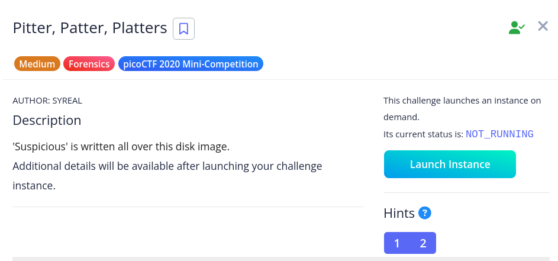

# [Pitter, Patter, Platters]

* **CTF Name:** picoCTF 2020 Mini-Competition
* **Category:** Forensics
* **Difficulty:** Medium
* **Hint:**
    * 1. It may help to analyze this image in multiple ways: as a blob, and as an actual mounted disk.
    * 2. Have you heard of slack space? There is a certain set of tools that now come with Ubuntu that I'd recommend for examining that disk space phenomenon...
**Challenge Author:** SYREAL
* **Writeup Author:** Nakata Christian (n4ctbyte)
* **Date:** January 20, 2026
* **Source:** [Link to Challenge](https://play.picoctf.org/practice/challenge/87?category=4&difficulty=2&page=4)

---

## Challenge Description



## 1. Executive Summary

**Objective:**
To extract hidden information from a disk image by focusing on storage areas that are not logically allocated by the filesystem.

**Result:**
The investigation successfully identified a suspicious text file (`suspicious-file.txt`). While the logical content of the file provided no direct flag, an analysis of the slack space using The Sleuth Kit revealed a hidden flag string stored in reverse. The recovered flag is: `picoCTF{b3_5t111_my_p4t_f2136893}`.

**Method:**
The methodology involved command line forensics (The Sleuth Kit - `fls` and `icat`) and string manipulation (reversing).

---

## 2. Evidence Identification

This section provides details regarding the initial evidence file.

- **Filename:** `suspicious.dd.sda1`
- **Size:** `32 MB`
- **SHA-256:** `2cac88b71fcc1474b6f25a3cac95d0f87e7eb33516f4be501e6a8fff615f1bf7`

**Initial Check:**
Verifying file type using signature headers (Magic Bytes).

```bash
$ file suspicious.dd.sda1                         
suspicious.dd.sda1: Linux rev 1.0 ext3 filesystem data, UUID=fc168af0-183b-4e53-bdf3-9c1055413b40 (needs journal recovery)
```

---

## 3. Investigation Steps

### Step 1: Filesystem Navigation

I used `fls` to recursively list the directory contents directly from the raw image file.

**Command:**
```bash
$ fls -r suspicious.dd.sda1 | grep -i "suspicious"
r/r 12: suspicious-file.txt
```

### Step 2: Logical Data Inspection

Checking the standard file content for any potential clues.

**Command:**
```
$ icat suspicious.dd.sda1 12
Nothing to see here! But you may want to look here -->
```

This output confirms the data is not in the logical file body, suggesting a deep dive into the slack space.

### Step 3: Slack Space Extraction

Slack space is the unused area within a cluster or block that remains after the actual file data ends. This area is ignored by standard OS commands like `cat`.

I extracted the slack space from Inode 12 into a binary file:

**Command:**
```bash
$ icat -s suspicious.dd.sda1 12 > slack_data.bin
$ cat slack_data.bin
}3986312f_3<_|Lm_111t5_3b{FTCocip
```

### Step 4: String Reconstruction

The extracted string starts with `}398...` and ends with `{FTCocip}`, which is the characteristic picoCTF flag format in reverse. I used the `rev` utility to restore the original string.

**Command:**
```bash
$ cat slack_data.bin | rev
picoCTF{b3_5t111_my_p4t_f2136893}
```

---

## 4. Conclusion

This case demonstrates a fundamental anti-forensics technique where data is hidden in areas typically overlooked by the operating system.

1. **Power of CLI Tools:** Tools like `icat -s` allow investigators to retrieve invisible data that standard file readers cannot see.

2. **Block Characteristic:** Even small files occupy a full block, leaving ample room for malicious or hidden data insertion.