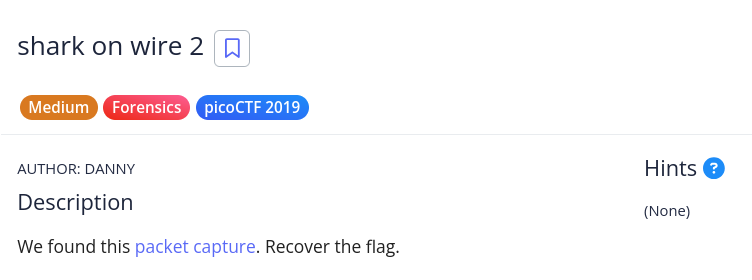
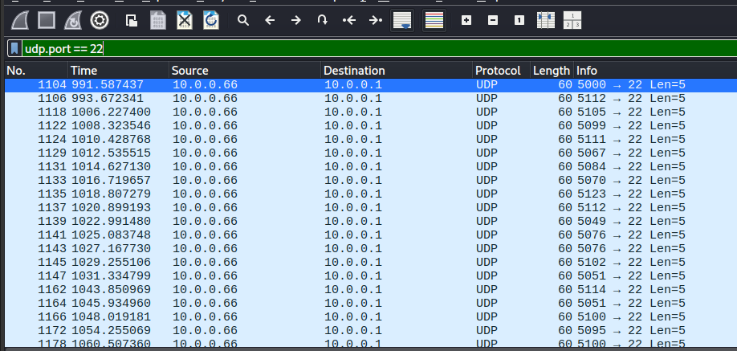

# [shark on wire 2]

* **CTF Name:** picoCTF 2019
* **Category:** Forensics
* **Difficulty:** Medium
* **Hint:** None
* **Challenge Author:** DANNY
* **Writeup Author:** Nakata Christian (n4ctbyte)
* **Date:** January 12, 2026
* **Source:** [Link to Challenge](https://play.picoctf.org/practice/challenge/84?category=4&difficulty=2&page=4)

---

## Challenge Description



## 1. Executive Summary

**Objective:**
To investigate a network capture file (`.pcap`) and recover a hidden flag by identifying a covert communication channel used for data exfiltration.

**Result:**
The investigation revealed that the flag was hidden within the UDP Source Ports of packets destined for Port 22. By subtracting an offset of 5000 from these port numbers and converting the result to ASCII, the flag was successfully retrieved: `picoCTF{p1LLf3r3d_data_v1a_st3g0}`.

**Method:**
The process involved Initial String Analysis, Manual Stream Investigation, Protocol Filtering in Wireshark, and Custom Python Scripting using the `scapy` library.

---

## 2. Evidence Identification

This section provides details regarding the initial evidence file.

- **Filename:** `capture.pcap`
- **Size:** `110 KB`
- **SHA-256:** `fe93e5022a8a1cfe68de4a283ddf96fa7a7f6449433fec755e0d82ce86635444`

**Initial Check:**
Verifying file type using signature headers (Magic Bytes).

```bash
$ file capture.pcap    
capture.pcap: pcap capture file, microsecond ts (little-endian) - version 2.4 (Ethernet, capture length 262144)
```

---

## 3. Investigation Steps

### Step 1: Initial Analysis and Decoys (Failed Attempts)

The investigation began with standard reconnaissance techniques, which initially led to several dead ends:
1. **String Analysis:** Running `strings` on the capture file yielded multiple results starting with `picoCTF{...}`, such as `picoCTF{StaT31355e...}`. However, these were identified as decoys.

2. **UDP Stream Investigation:** Using Wireshark's "Follow UDP Stream" feature and manually switching between streams revealed even more decoy flags. None of the application layer payloads contained the valid flag.

### Step 2: Protocol Filtering and Anomaly Detection

After realizing the payloads were distractions, the focus shifted to identifying anomalous packet headers. By applying a filter in Wireshark, I discovered a series of UDP packets targeting Destination Port 22.

**Filter:**
```bash
udp.port == 22
```



### Step 3: Port Metadata Analysis

Upon inspecting the packets filtered by Port 22, I noticed the Source Ports were in a suspicious range.
    * **Packet 1:** Source Port 5112
    * **Packet 2:** Source Port 5105
    * **Packet 3:** Source Port 5099

By subtracting an offset of 5000 from these port numbers, the resulting decimal values mapped perfectly to ASCII characters:

    * 5112 − 5000 = 112 ('p')
    * 5105 − 5000 = 105 ('i')
    * 5099 − 5000 = 99 ('c')

### Step 4: Automated Extraction

To efficiently reconstruct the entire flag, I wrote a Python script using the `scapy` library to iterate through the filtered packets.

**Script:**
```python
from scapy.all import *

packets = rdpcap('capture.pcap')
flag = ""

for pkt in packets:
    if UDP in pkt and pkt[UDP].dport == 22:
        char_code = pkt[UDP].sport - 5000
        flag += chr(char_code)

print(f"Flag: {flag}")
```

**Command and Output:**
```bash
$ python3 a.py
Flag: picoCTF{p1LLf3r3d_data_v1a_st3g0}
```

---

## 4. Conclusion

This challenge demonstrates the use of Covert Channels within transport layer metadata. It highlights that initial findings like `strings` can be deceptive decoys, and a thorough forensic investigation must look beyond the payload to analyze header anomalies.
