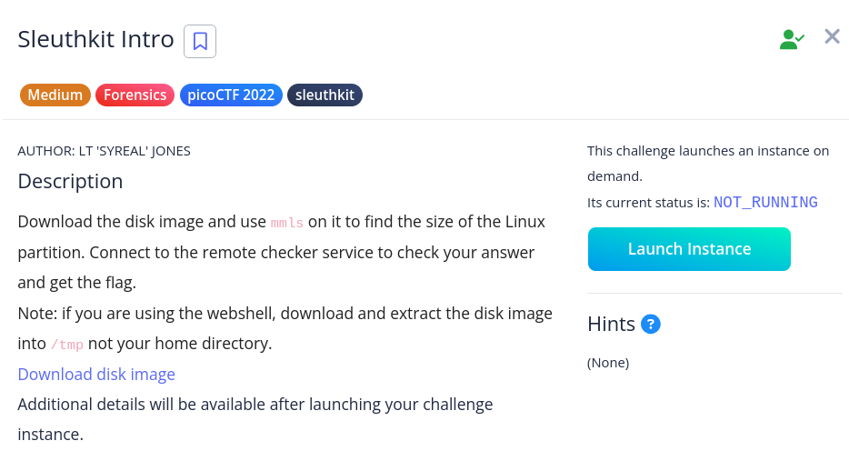

# [Sleuthkit Intro]

* **CTF Name:** picoCTF 2022
* **Category:** Forensics, sleuthkit
* **Difficulty:** Medium
* **Hint:** None
* **Challenge Author:** LT 'SYREAL' JONES
* **Writeup Author:** Nakata Christian (n4ctbyte)
* **Date:** January 21, 2026
* **Source:** [Link to Challenge](https://play.picoctf.org/practice/challenge/301?category=4&difficulty=2&page=2)

---

## Challenge Description



## 1. Executive Summary

**Objective:**
To identify the size of a specific partition within a disk image using command line forensics tools.

**Result:**
By utilizing the `mmls` tool from The Sleuth Kit (TSK), the length of the Linux partition was identified as 202752 sectors. Providing this value to the challenge instance successfull retrieved the flag: `picoCTF{mm15_f7w!}`.

**Method:**
The methodology involved partition table analysis using `mmls` and remote service interaction via `nc`.

---

## 2. Evidence Identification

This section provides details regarding the initial evidence file.

- **Filename:** `disk.img`
- **Size:** `100 MB`
- **SHA-256:** `4d3661a9c98b80f834146967e5446a88c427830aa8101b768e6ae88172e2a61d`

**Initial Check:**
Verifying file type using signature headers (Magic Bytes).

```bash
$ file disk.img         
disk.img: DOS/MBR boot sector; partition 1 : ID=0x83, active, start-CHS (0x0,32,33), end-CHS (0xc,190,50), startsector 2048, 202752 sectors
```

---

## 3. Investigation Steps

### Step 1: Connecting to the Challenge

The challenge provides a netcat instance that asks for a specific technical detail: "What is the size of the Linux partition in the given disk image?".

### Step 2: Partition Table Analysis

I used the `mmls` command to examine the layout of the provided disk image.

**Command:**
```bash
$ mmls disk.img      
DOS Partition Table
Offset Sector: 0
Units are in 512-byte sectors

      Slot      Start        End          Length       Description
000:  Meta      0000000000   0000000000   0000000001   Primary Table (#0)
001:  -------   0000000000   0000002047   0000002048   Unallocated
002:  000:000   0000002048   0000204799   0000202752   Linux (0x83)
```

The length column for the Linux partition explicitly states 202752.

### Step 3: Flag Retrieval

I submitted the partition length to the remote server.

**Interaction:**
```bash
$ nc saturn.picoctf.net 52304
What is the size of the Linux partition in the given disk image?
202752
Great work!
picoCTF{mm15_f7w!}
```

---

## 4. Conclusion

This challenge reinforces the utility of The Sleuth Kit for quick, command-line-based disk analysis. Understanding how to read partition tables is fundamental skill in digital forensics.